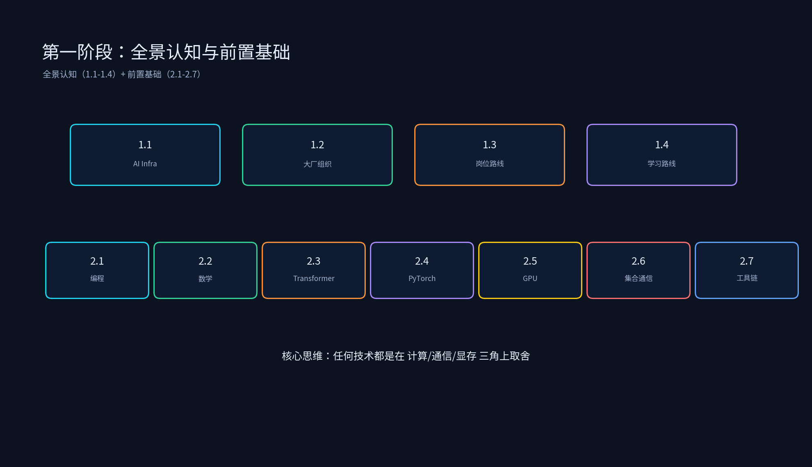

# 第一阶段：全景认知与前置基础



本阶段是 AI Infra 课程的起点：第一章建立全景认知（什么是 AI Infra、大厂组织、岗位路线、学习路线），第二章补齐前置基础（编程、数学、Transformer、PyTorch、GPU 硬件、集合通信、工程工具链）。

## 目录结构

```
第一阶段：全景认知与前置基础/
├── 第一章：AI Infra 全景认知
│   ├── 1.1_什么是AI_Infra/          # 定义、五大方向、不可能三角
│   ├── 1.2_大厂AI_Infra组织架构/     # NVIDIA/字节/阿里/百度/自动驾驶
│   ├── 1.3_AI_Infra岗位路线图/       # 级别、薪资、能力要求
│   └── 1.4_学习路线总览/             # 路线图 + 取舍思维总纲
├── 前置基础（1.5-1.11）
│   ├── 1.5_编程语言基础/             # Python 进阶 / C++ / pybind11 / Linux
│   ├── 1.6_数学基础/                 # 线代 / 概率 / 微积分（工程向）
│   ├── 1.7_Transformer架构详解/      # Attention / FFN / RoPE / LN / MHA→MLA
│   ├── 1.8_PyTorch框架/              # autograd / Module / checkpoint / profiler
│   ├── 1.9_GPU硬件概论/              # SM / Tensor Core / 存储层次 / Memory Wall
│   ├── 1.10_集合通信基础/             # 原语 / Ring/Tree / NCCL / NVLink vs IB
│   └── 1.11_工程工具链/               # gdb/perf/nsys/ncu / Git / 芯片入门
├── README.md
├── tools/
│   └── generate_foundation_diagrams.py
└── 简历项目/
    └── 简历项目.md                    # 基础自查清单
```

每个子专题目录下都有 `images/` 演示图；重新生成：

```bash
source /data/liyangyang/qwen35_env/bin/activate
python /data/liyangyang/ai_infra/01_第一阶段：全景认知与前置基础/tools/generate_foundation_diagrams.py
```

## 运行环境

已在 `qwen35_env` 中验证：`torch`、`numpy`、`matplotlib`。

## 运行示例

```bash
source /data/liyangyang/qwen35_env/bin/activate
cd /data/liyangyang/ai_infra/01_第一阶段：全景认知与前置基础

python 1.1_什么是AI_Infra/infra_tradeoff_calc.py
python 1.2_大厂AI_Infra组织架构/org_landscape.py
python 1.3_AI_Infra岗位路线图/career_roadmap.py
python 1.4_学习路线总览/learning_path_checklist.py
python 1.5_编程语言基础/python_advanced_demo.py
python 1.6_数学基础/math_foundations.py
python 1.7_Transformer架构详解/attention_complexity.py
python 1.8_PyTorch框架/pytorch_infra_demo.py
python 1.9_GPU硬件概论/gpu_spec_compare.py
python 1.10_集合通信基础/collective_comm_calc.py
python 1.11_工程工具链/toolchain_check.py
```

## 课程目标

1. 建立 AI Infra 全景认知：五大方向、不可能三角、大厂版图、岗位路线。
2. 掌握学习总纲：任何技术都问"牺牲了什么，换取了什么"。
3. 补齐前置基础：Python/C++、工程数学、Transformer、PyTorch、GPU 硬件、集合通信、工具链。
4. 能进行基础量化心算：GEMM FLOPs、训练显存、KV Cache、通信耗时、roofline 拐点。
