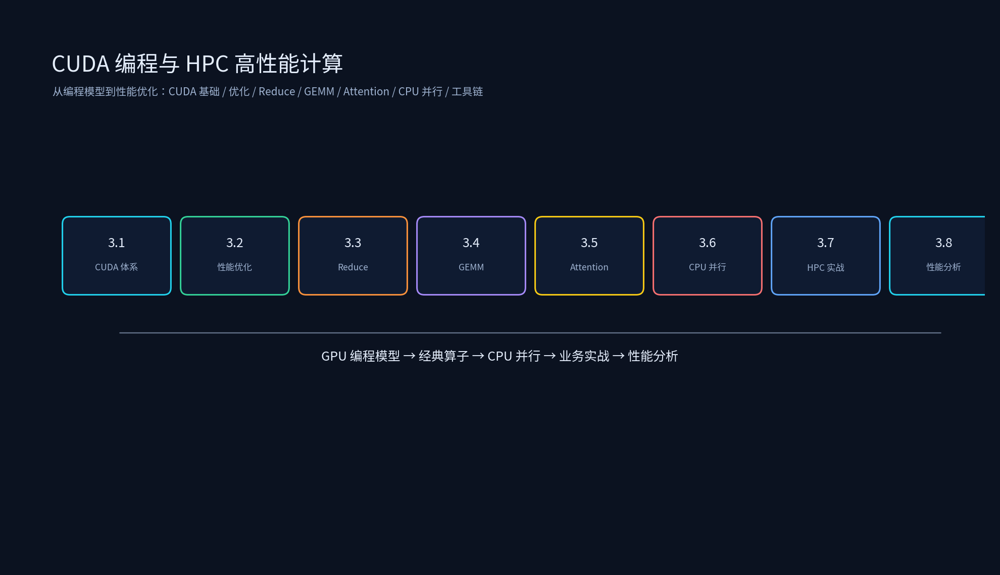

# 第二章：CUDA 编程与 HPC 高性能计算



本专题从 CUDA 编程体系到 HPC 高性能算子开发，覆盖 GPU 编程模型、性能优化基础、经典算子实现（Reduce/GEMM）、Attention 算子、CPU 多线程并行、HPC 业务算子实战、性能分析工具链，以及 Triton 编程与 Hopper/Blackwell 新特性（2024 后主流技术栈）。

## 目录结构

```
CUDA编程与HPC高性能计算/
├── 2.1_CUDA编程体系/
│   ├── 2.1_CUDA编程体系.md
│   └── thread_indexing.cu
├── 2.2_CUDA性能优化基础/
│   ├── 2.2_CUDA性能优化基础.md
│   └── coalesced_vs_stride.cu
├── 2.3_经典算子实现-Reduce/
│   ├── 2.3_经典算子实现-Reduce.md
│   └── reduce.cu
├── 2.4_经典算子实现-GEMM/
│   ├── 2.4_经典算子实现-GEMM.md
│   └── sgemm_tiled.cu
├── 2.5_Attention算子/
│   ├── 2.5_Attention算子.md
│   └── flash_attention_sim.py
├── 2.6_多线程并行优化/
│   ├── 2.6_多线程并行优化.md
│   └── openmp_numa_simd.cpp
├── 2.7_HPC算子开发实战/
│   ├── 2.7_HPC算子开发实战.md
│   └── bev_fusion_sim.py
├── 2.8_性能分析工具链/
│   ├── 2.8_性能分析工具链.md
│   └── roofline_calc.py
├── 2.9_Triton编程实战/
│   ├── 2.9_Triton编程实战.md
│   ├── triton_softmax_demo.py
│   └── triton_vs_cuda_decision.py
├── 2.10_Hopper与Blackwell新特性/
│   ├── 2.10_Hopper与Blackwell新特性.md
│   ├── gpu_generation_compare.py
│   └── warp_specialization_sim.py
├── README.md
├── tools/
│   └── generate_cuda_hpc_diagrams.py
└── 简历项目/
    └── 简历项目.md
```

每个子专题目录下都有 `images/` 演示图；如需重新生成或改配色，运行：

```bash
source /data/qwen35_env/bin/activate
python /data/ai_infra/02_CUDA编程与HPC高性能计算/tools/generate_cuda_hpc_diagrams.py
```

## 运行环境

已在 `qwen35_env` 中安装/验证：

- `matplotlib==3.10.9`
- `numpy==2.2.6`
- `nvcc` 编译器（CUDA 工具链）

激活环境：

```bash
source /data/qwen35_env/bin/activate
```

CUDA C++ 代码使用 `nvcc` 编译，CPU 代码使用 `g++` 编译。

## 运行示例

```bash
source /data/qwen35_env/bin/activate
cd /data/ai_infra/02_CUDA编程与HPC高性能计算

# CUDA kernel
nvcc -o /tmp/thread_indexing 2.1_CUDA编程体系/thread_indexing.cu && /tmp/thread_indexing
nvcc -o /tmp/coalesced_vs_stride 2.2_CUDA性能优化基础/coalesced_vs_stride.cu && /tmp/coalesced_vs_stride
nvcc -o /tmp/reduce 2.3_经典算子实现-Reduce/reduce.cu && /tmp/reduce
nvcc -o /tmp/sgemm_tiled 2.4_经典算子实现-GEMM/sgemm_tiled.cu && /tmp/sgemm_tiled

# Python simulation
python 2.5_Attention算子/flash_attention_sim.py
python 2.7_HPC算子开发实战/bev_fusion_sim.py
python 2.8_性能分析工具链/roofline_calc.py
python 2.9_Triton编程实战/triton_softmax_demo.py
python 2.9_Triton编程实战/triton_vs_cuda_decision.py
python 2.10_Hopper与Blackwell新特性/gpu_generation_compare.py
python 2.10_Hopper与Blackwell新特性/warp_specialization_sim.py

# CPU
nvcc -Xcompiler -fopenmp -O3 -march=native -o /tmp/openmp_numa_simd 2.6_多线程并行优化/openmp_numa_simd.cpp && /tmp/openmp_numa_simd
# 或 g++ -O3 -fopenmp -march=native -o /tmp/openmp_numa_simd 2.6_多线程并行优化/openmp_numa_simd.cpp && /tmp/openmp_numa_simd

# 重新生成图片
python tools/generate_cuda_hpc_diagrams.py
```

## 课程目标

1. 理解 CUDA 编程模型：Grid/Block/Thread、线程索引、内存层级、Warp 执行。
2. 掌握 CUDA 性能优化基础：合并访问、共享内存、Warp Shuffle、Occupancy、同步与原子操作。
3. 手写 Reduce 算子，理解从原子加 → 共享内存 → Warp Shuffle → 多级归约的演进。
4. 手写 GEMM 算子，理解 Tiling、Shared Memory、Tensor Core/WMMA，以及与 cuBLAS 的差距。
5. 理解 FlashAttention、Flash-Decoding、PagedAttention、FlashInfer 的原理与应用。
6. 掌握 CPU 多线程优化：OpenMP、NUMA 感知、SIMD 向量化。
7. 了解 HPC 算子开发实战：分块、向量化、流水线、多平台差异、业务算子、训练算子、跨平台迁移。
8. 熟练使用 Nsight Systems、Nsight Compute、PyTorch Profiler、Roofline 模型分析性能。
9. 掌握 Triton 编程：tile 级编程模型、fused kernel 开发、autotune，以及 Triton vs 手写 CUDA 的选型决策。
10. 理解 Hopper/Blackwell 新特性：TMA、Thread Block Cluster、Warp Specialization、FP8/FP4 Tensor Core、NVL72，及其对 kernel 开发与并行策略的影响。
11. 能把 CUDA/HPC 项目写成有分层、有指标、有证据的简历 bullet。
