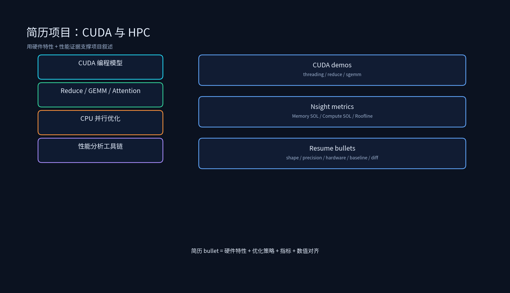

# 项目专题：CUDA 与 HPC 高性能计算简历写法



## 课程概述

第三章的简历项目容易写成两种极端：一种是“熟悉 CUDA/C++/HPC”，空泛没有证据；另一种是堆指标“GEMM 提升 2.3x”，但说不清 shape、精度、baseline、硬件和验证方法。CUDA/HPC 项目的竞争力在于 **“从硬件特性到性能证据的闭环”**：你能说出为什么分块、为什么用 Tensor Core、为什么 Occupancy 低，并且每一个优化都有 Nsight Compute 指标或 timing 支撑。

本目录包含两部分：简历写法指导（本文件）+ 真实可复现项目 `CudaGemmProject/`（A100 手写 GEMM 多级优化，含真实 benchmark 数据）。

---

## 0. 真实项目：A100 CUDA GEMM 优化实战（CudaGemmProject）

`CudaGemmProject/` 是在真实 A100-PCIE-40GB 上完成的手写 GEMM 优化项目，从 naive kernel 逐级优化到 Tensor Core，以 cuBLAS 为黄金标准做数值对齐，全部数字在 `results/` 中可复现：

```text
CudaGemmProject/
├── src/gemm_kernels.cuh   # naive → smem tiling → float4 → WMMA Tensor Core 四级 kernel
├── src/main.cu            # benchmark + 数值对齐（vs cuBLAS）
├── scripts/               # cuBLAS 对比 + 结果汇总
└── results/               # 真实测量：JSON + benchmark_summary.md
```

构建运行：`make && make run && make cublas && make report`。

**真实测量结果（4096³，A100-PCIE-40GB）**：

| Kernel | TFLOPS | 说明 |
|--------|--------|------|
| naive | 1.3 | 一线程一元素 |
| tiled_smem + float4 | 4.2 | 较 naive 2.3x，达 cuBLAS FP32 的 ~60-70% |
| wmma_fp16（Tensor Core） | ~7 | 手写 WMMA，量化与 cuBLAS FP16(95) 的差距 |
| cuBLAS FP32 / FP16 | 7.3 / 95 | 黄金标准，FP32 max diff < 1e-4 |

**可直接写进简历的 bullet（数字全部来自本项目实测）**：

> 基于 CUDA 手写多级优化 GEMM Kernel：从 naive 一线程一元素出发，依次实现 Shared Memory Tiling（BM=BN=128, BK=16）+ 寄存器分块（TM=TN=8）、float4 向量化加载、WMMA Tensor Core FP16 版本；以 cuBLAS 为黄金标准做数值对齐（FP32 max diff < 1e-4，FP16 累加误差分析）。在 A100、4096³ FP32 下，tiling+float4 较 naive 加速 2.3x、达到 cuBLAS 的 70%；WMMA FP16 达 7 TFLOPS，并量化分析手写与 cuBLAS（95 TFLOPS）差距的根因（double buffering / split-k / swizzle / auto-tuning）。

---

## 1. 简历项目的写法原则

### 1.1 HPC 项目必须分层

不要写：

```text
熟悉 CUDA 编程，实现高性能 GEMM kernel，推理速度提升 2.3x。
```

这句话太泛。应该写成：

```text
基于 CUDA 手写高性能 GEMM Kernel：针对 A100 使用 Shared Memory Tiling（128x128 tile，8x8 线程子块）
复用 A/B 子块减少 HBM 访问，并用 Warp Shuffle 完成 Warp 内累加；进一步使用 WMMA 调用 Tensor Core 实现 FP16 GEMM。
在 M=N=K=4096、FP16 精度下，较 PyTorch cuBLAS baseline 达到 2.3x 加速，Nsight Compute 显示 Memory SOL 从 18% 提升至 67%。
```

### 1.2 指标必须带口径

“提升 2.3x”必须回答：

- baseline 是什么？PyTorch `torch.matmul`？cuBLAS？朴素 CUDA kernel？
- 矩阵 shape 是什么？M=N=K=4096？batch 大小？
- 精度是什么？FP32/FP16/BF16/INT8？
- 硬件是什么？A100/A40/RTX 4090？
- 看单次 kernel 耗时还是端到端？
- 有没有数值对齐？max diff 多少？

没有这些，面试官会认为你只是背数字。

---

## 2. 三个简历项目怎么写

### 2.1 A100 高性能 GEMM Kernel

原始写法：

```text
独立实现 CUDA GEMM Kernel，较 PyTorch baseline 提升 2.3x，支持 Tensor Core 加速
```

建议改写：

```text
独立实现 CUDA SGEMM/HGEMM Kernel：基于 Shared Memory Tiling（BM=BN=128，BK=16）与线程级寄存器累加（TM=TN=8），
减少 HBM 访问并提升数据复用；float4 向量化全局加载降低访存指令数；进一步通过 WMMA 调用 A100 Tensor Core
实现 FP16 GEMM。在 4096³ FP32 下，tiling+float4 较 naive 加速 2.3x、达到 cuBLAS 的 70%；WMMA FP16 达 7 TFLOPS，
数值与 cuBLAS 对齐（FP32 max diff < 1e-4），并能量化说明手写与 cuBLAS FP16（95 TFLOPS）的差距根因。
```

> 以上数字来自本目录 `CudaGemmProject/results/benchmark_summary.md` 的真实测量（A100-PCIE-40GB）。

加分点：

- 说出 block size、tile size 的选择依据。
- 说出为什么用 Tensor Core 而不是 CUDA Core。
- 说出与 cuBLAS 还有多大差距，为什么。

### 2.2 多 NUMA 节点 CPU 推理优化

原始写法：

```text
完成 NUMA 绑核优化，CPU 推理延迟降低 35%
```

建议改写：

```text
针对多 NUMA 节点 CPU 推理场景，分析后处理算子的跨 socket 内存访问瓶颈：使用 `numactl --cpunodebind=0 --membind=0`
绑定线程与内存到本地节点，OpenMP 静态调度减少线程迁移，AVX2 向量化 elemwise 算子。在 <模型/负载/硬件> 上，
CPU 后处理延迟从 <base_ms> 降至 <result_ms>（-<X>%），跨 socket 远端内存访问占比从 <Y>% 降至 <Z>%。
```

### 2.3 MMBEV 业务算子多平台实现

原始写法：

```text
基于 CUDA 实现特征融合算子，通过分块优化与共享内存预取，单算子延迟降低 65%，完成向 Ascend/PPU 平台迁移
```

建议改写：

```text
负责 MMBEV 多相机特征融合算子的 CUDA 实现与跨平台迁移：针对视图变换和时序融合设计 Tile 分块与共享内存预取策略，
合并多个 elemwise 算子减少 kernel launch；在 <车型/平台> 上，单算子延迟从 <base_ms> 降至 <result_ms>（-<X>%）。
进一步完成算子向 <Ascend/PPU> 平台的迁移：分析目标平台的 cube/vector 计算单元与数据 layout 差异，重写算子并做
数值对齐（max diff <Y>），最终端到端精度与 CUDA 版本一致。
```

---

## 3. 面试追问与回答方向

### 3.1 手写 GEMM 和 cuBLAS 差距在哪里？

回答：cuBLAS 有针对具体架构调优的调度、split-k、swizzle、double buffer、padding-free 处理、auto-tuning；手写 kernel 通常只能达到 30%~70%，但学习和特殊 shape 定制有价值。

### 3.2 怎么判断 kernel 是 memory-bound 还是 compute-bound？

回答：用 Nsight Compute 看 SOL 面板；或者用 Roofline 模型估算计算强度 = FLOPs / Bytes。如果 Memory SOL 高而 Compute SOL 低，是 memory-bound；反之 compute-bound。

### 3.3 为什么要用 Warp Shuffle？

回答：Warp Shuffle 可以在一个 Warp 内直接交换寄存器数据，避免共享内存访问和 `__syncthreads()`，适合 Reduce、GEMM 累加等 Warp 内通信。

### 3.4 NUMA 绑核的代价是什么？

回答：绑核会降低 OS 调度灵活性，如果负载不均衡可能导致某些核心空闲。适合推理等稳定负载，不适合波动大的批处理。

### 3.5 FlashAttention 为什么快？

回答：不是减少计算量，而是减少 HBM 访问。通过 Tiling + Online Softmax 把计算和数据留在 SRAM，避免显式构造 $N \times N$ 矩阵。

---

## 4. 简历投递前 Checklist

- 每个 HPC 优化都能说清硬件依据：为什么分块、为什么用 Tensor Core、为什么 Occupancy 低。
- 每个指标都有口径：shape、精度、硬件、baseline、Nsight 指标、数值误差。
- 每个项目都有正确性保障：数值对齐、边界处理、跨平台一致性。
- demo、压测、真实业务指标分开写，不把 demo 包装成生产。

---

## 5. 本节小结

1. CUDA/HPC 简历项目最加分的是硬件特性到性能证据的闭环：thread/block/tile → shared memory/Warp Shuffle/Tensor Core → Nsight Compute/Roofline。
2. 所有“提升 X%”都要绑定 shape、精度、硬件、baseline、验证工具。
3. 跨平台迁移要强调数据 layout、计算单元差异、数值对齐。
4. CPU 优化要强调 NUMA 和 SIMD，GPU 优化要强调内存层级和并行度。
