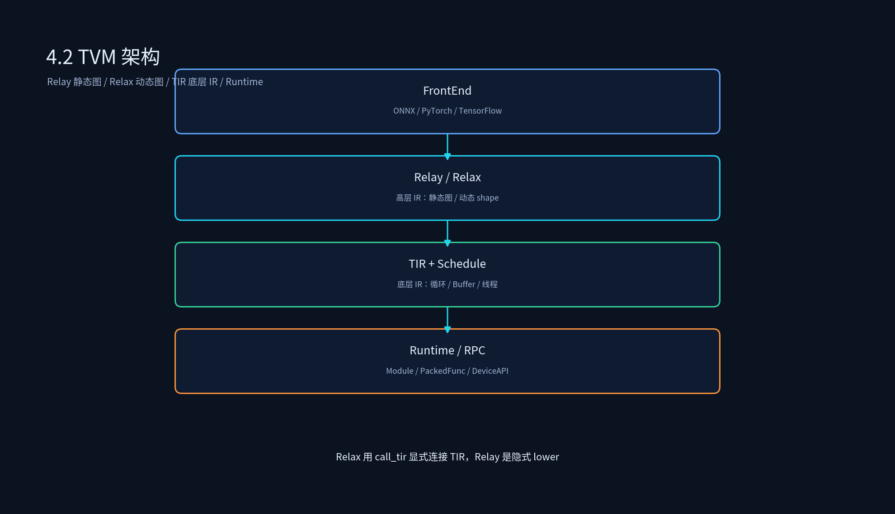

# 3.2 TVM 架构拆解

## 课程概述

TVM 是学术界和工业界最成熟的 AI 编译器之一。它的架构不是单层 IR，而是**多层 IR + 多阶段优化**的组合：高层用 Relay/Relax 描述图结构，底层用 TIR 描述循环与存储，运行时通过统一的 PackedFunc 和 DeviceAPI 执行。

很多初学者学 TVM 时容易混淆 Relay、Relax、TIR 三者的边界。本节把 TVM 的架构骨架拆开：Relay 负责静态图、Relax 负责动态特性、TIR 负责底层调度与代码生成、Runtime 负责执行。理解这四层关系，是后续 Pass 开发、后端迁移、编译耗时优化的基础。

学完本节后，你应该能够：

- 画出 TVM 的四层架构图，并说明每层职责。
- 用 Relay 构造一个静态图函数，并解释其类型系统。
- 用 Relax 构造一个动态 shape 模型，并指出与 Relay 的关键差异。
- 解释 TIR 的 Buffer、Loop、Block、Thread 等核心抽象。
- 说明 TVM Runtime 的 Module、PackedFunc、DeviceAPI 机制。

---

## 1. TVM 整体架构

TVM 架构可以粗略分为四层：

```text
┌─────────────────────────────────────────┐
│            TVM Runtime / RPC             │  执行引擎
├─────────────────────────────────────────┤
│   TIR (Tensor IR) + TE/Schedule/TensorIR │  底层 IR + 调度原语
├─────────────────────────────────────────┤
│      Relax（动态图） / Relay（静态图）      │  高层 IR
├─────────────────────────────────────────┤
│  FrontEnd：ONNX / PyTorch / TensorFlow     │  前端解析
└─────────────────────────────────────────┘
```

数据流转：

```text
ONNX / PyTorch 模型
  → FrontEnd 解析为 Relay 或 Relax
  → MiddleEnd Pass 优化高层 IR
  → Lower 到 TIR
  → Schedule 优化 / Codegen 生成 CUDA/LLVM 代码
  → Runtime 加载执行
```



---

## 2. Relay：静态图 IR

Relay 是 TVM 的函数式静态图 IR，适合 CNN、BERT 等静态 shape 模型。它引入了两个关键概念：

- **函数式表达式**：计算图是嵌套的表达式，无副作用。
- **强类型系统**：每个表达式都有明确的类型和 shape，便于编译期优化。

### 2.1 构造一个简单计算图

```python
import tvm
from tvm import relay

# 定义输入和参数
x = relay.var("x", shape=(1, 784), dtype="float32")
w = relay.var("w", shape=(784, 128), dtype="float32")
b = relay.var("b", shape=(128,), dtype="float32")

# 构建图：y = relu(x @ w + b)
fc = relay.nn.dense(x, w)
out = relay.nn.bias_add(fc, b)
out = relay.nn.relu(out)

func = relay.Function([x, w, b], out)
mod = tvm.IRModule.from_expr(func)
mod = relay.transform.InferType()(mod)
print(mod)
```

输出结构大致为：

```text
def @main(%x: Tensor[(1, 784), float32],
          %w: Tensor[(784, 128), float32],
          %b: Tensor[(128), float32]) {
  %0 = nn.dense(%x, %w, units=128) /* ty=Tensor[(1, 128), float32] */
  %1 = nn.bias_add(%0, %b)          /* ty=Tensor[(1, 128), float32] */
  nn.relu(%1)                       /* ty=Tensor[(1, 128), float32] */
}
```

### 2.2 Relay 的特点

- **静态 shape**：所有张量维度在编译期已知。
- **函数式**：无变量赋值，用 let binding 表达中间结果。
- **Pass 丰富**：TVM 早期积累的优化 Pass 大多基于 Relay。
- **对动态 shape 和控制流支持较弱**：dynamic shape 需要用 VM 或 bucket 编译 workaround。

### 2.3 Relay 模块结构

```text
IRModule
  ├── GlobalVar @main
  ├── Function (params, body, ret_type)
  ├── Expression
  │     ├── Var / Constant / Call / Tuple / TupleGetItem
  │     └── Let / Function / If
  └── Type
        ├── TensorType (shape, dtype)
        └── FuncType (arg_types, ret_type)
```

---

## 3. Relax：动态特性支持

Relax 是 TVM 新一代 IR，支持动态 shape、控制流、动态算子，适合 LLM/MoE 等推理场景。

### 3.1 为什么需要 Relax

| 场景 | Relay | Relax |
| ---- | ----- | ----- |
| 动态 shape | 弱，需 VM 或 bucket | 原生支持 |
| 控制流 | 有限 | 原生支持 if/while |
| 大模型 | 笨重 | 设计目标 |
| 算子语义 | 函数式 | 绑定式 + call_tir |
| Pass 写法 | ExprMutator | BlockBuilder + builder.get() |

### 3.2 构造一个动态 shape 模型

```python
from tvm import relax
from tvm.relax.frontend import nn

class MLP(nn.Module):
    def __init__(self):
        self.w = nn.Parameter((128, 64), "float32")
        self.b = nn.Parameter((64,), "float32")

    def forward(self, x: nn.Tensor):
        # x 的 shape 可以是动态的，例如 (n, 128)
        x = nn.matmul(x, self.w)
        x = nn.add(x, self.b)
        return nn.relu(x)

model = MLP()
mod, params = model.export_tvm(
    spec={"forward": {"x": nn.spec.Tensor(["batch", 128], "float32")}}
)
print(mod)
```

### 3.3 Relax 的关键抽象

- **BindingBlock**：顺序执行的绑定块，支持变量赋值。
- **Var / DataflowVar**：普通变量与数据流变量区分。
- **call_tir**：显式调用 TIR PrimFunc，是 Relax 与 TIR 的桥梁。
- **StructInfo**：描述张量 shape、dtype、符号变量关系。

```text
R.func["forward"](
  x: R.Tensor(("batch", 128), dtype="float32")
) -> R.Tensor(("batch", 64), dtype="float32") {
  with R.dataflow():
    lv: R.Tensor(("batch", 64), dtype="float32") = R.matmul(x, w)
    out: R.Tensor(("batch", 64), dtype="float32") = R.add(lv, b)
    R.output(out)
  return out
}
```

### 3.4 call_tir：Relax 与 TIR 的连接

```python
from tvm import relax, tir, TVMBackend

@tvm.register_func("tvm.relax.matmul")
def matmul_relax(x, w):
    # Relax 层描述图结构
    # 底层调用 TIR PrimFunc 实现具体调度
    return relax.call_tir("matmul_tir", [x, w], out_sinfo=...)
```

call_tir 让 Relax 保持高层抽象，同时把具体计算下放到 TIR 层优化。

---

## 4. TIR：底层张量 IR

TIR 是 TVM 的底层 IR，描述循环、buffer、线程、存储等细节。后端 Codegen 基于 TIR 生成 CUDA/LLVM 代码。

### 4.1 核心抽象

| 抽象 | 含义 | 示例 |
| ---- | ---- | ---- |
| Buffer | 多维张量存储 | `A = tir.decl_buffer((1024,), "float32")` |
| Loop | 循环嵌套 | `for i in range(1024)` |
| Block | TensorIR 调度单元 | `with tir.block("B")` |
| Thread | 线程绑定 | `threadIdx.x`, `blockIdx.x` |
| PrimFunc | TIR 函数 | 可被 Relax 通过 call_tir 调用 |

### 4.2 从 TE 生成 TIR

```python
from tvm import te, tir, tvm

A = te.placeholder((1024,), name="A")
B = te.compute((1024,), lambda i: A[i] + 1, name="B")
s = te.create_schedule(B.op)

# 生成 TIR
func = tvm.lower(s, [A, B])
print(tvm.ir.IRModule.from_expr(func))
```

输出结构大致为：

```c
primfn(A_1: handle, B_1: handle) -> () {
  attr_dict = {"global_symbol": "main", "tir.noalias": True}
  A = A_1
  B = B_1
  for (i: int32, 0, 1024) {
    B[i] = (A[i] + 1f)
  }
}
```

### 4.3 TensorIR Schedule

TensorIR 提供了一系列调度原语，用于优化循环和内存访问：

```python
from tvm import tir, TVMScript
from tvm.tir import Schedule

sch = tir.Schedule(func)
# 分块、向量化、绑定线程
i = sch.get_loops("B")
io, ii = sch.split(i, factors=[32, 32])
sch.bind(io, "blockIdx.x")
sch.bind(ii, "threadIdx.x")
```

---

## 5. TVM Runtime：执行引擎

TVM Runtime 负责加载编译产物、管理内存、发射 kernel。核心模块：

```text
Module：加载 .so / .tar / .aom
PackedFunc：统一函数调用接口
DeviceAPI：CPU / CUDA / ROCm / OpenCL
Object：NDArray、Module、String 等对象系统
```

### 5.1 加载编译产物

```python
import tvm

# 加载编译产物并运行
mod = tvm.runtime.load_module("model.so")
ex = mod.get_function("main")
out = ex(input_ndarray)
```

### 5.2 Module 与 PackedFunc

```text
lib.so
  ├── tvm.nd.array 创建
  ├── tvm.runtime.Module 加载
  └── PackedFunc: 函数名 → 函数指针
```

PackedFunc 是 TVM Runtime 的核心抽象，允许 C++、Python、RPC 之间统一调用函数。

---

## 6. TVM 四层协作示例

```text
PyTorch 模型
  → from_pytorch 解析为 Relay
  → relay.transform.FoldConstant() 常量折叠
  → relay.transform.FuseOps() 算子融合
  →  lower 到 TIR
  → TIR schedule 优化
  → CodegenCUDA 生成 .cu
  → nvcc 编译为 .so
  → TVM Runtime 加载执行
```

```python
from tvm import relay

mod, params = relay.frontend.from_pytorch(scripted_model, shape_list)
mod = relay.transform.FoldConstant()(mod)
mod = relay.transform.FuseOps()(mod)

with tvm.transform.PassContext(opt_level=3):
    lib = relay.build(mod, target="cuda", params=params)
lib.export_library("model.so")
```

---

## 7. 代码实践

### 7.1 运行示例

代码文件：`3.2_TVM架构拆解/tvm_ir_compare.py`

```bash
cd /data/ai_infra/03_AI编译器
/data/qwen35_env/bin/python 3.2_TVM架构拆解/tvm_ir_compare.py
```

运行后会分别打印：静态 shape Linear 模块、动态 shape Linear 模块、以及经过后端编译的 Tiny 模块的 build 结果。

> 环境说明：当前 `qwen35_env` 中安装的是官方 pip 版 `apache-tvm 0.25.0`，仅包含 Relax。课程理论部分仍介绍 Relay 与 Relax 的对比，供理解 TVM 演进历史。

### 7.2 实验建议

- 把同一个 PyTorch 模型分别用 Relay 和 Relax 前端解析，对比 IR 输出。
- 观察 TIR 中的 `for` 循环和 `threadIdx.x` 绑定。
- 用 `tvm.runtime.load_module` 加载一个 TVM 产物，调用 `main` 函数。

---

## 8. 常见误区

### 8.1 “Relay 和 Relax 只是同一层 IR 的不同写法”

错。Relay 是静态图函数式 IR，Relax 是支持动态 shape 和命令式绑定的 IR。Relax 的算子通过 `call_tir` 显式连接 TIR，而 Relay 是隐式 lower。

### 8.2 “TIR 只是打印出来的 C 代码”

TIR 是可被调度和分析的 IR。Codegen 前可以对 TIR 做 split、reorder、vectorize、bind thread 等优化，这些优化直接影响最终性能。

### 8.3 “Runtime 只负责加载 .so”

TVM Runtime 还提供跨语言调用（PackedFunc）、跨设备内存管理（NDArray）、RPC 等功能。理解 Runtime 是部署和调试的基础。

---

## 9. 本节小结

1. TVM 架构四层：**前端 → Relay/Relax → TIR → Runtime**。
2. **Relay** 是静态图函数式 IR，强类型、Pass 丰富，适合 CNN/BERT。
3. **Relax** 是动态图 IR，支持动态 shape、控制流、call_tir，适合 LLM/MoE。
4. **TIR** 是底层 IR，描述循环、buffer、线程，后端 Codegen 和 Schedule 的核心。
5. **Runtime** 提供 Module、PackedFunc、DeviceAPI，负责产物加载与执行。

---

## 10. 课后思考

1. 为什么 Relay 对动态 shape 支持弱？动态 shape 会破坏哪些优化？
2. Relax 的 `call_tir` 相比 Relay 的隐式 lower 有什么优势和代价？
3. TIR 的 Block 抽象为什么对自动调度（MetaSchedule）很重要？
4. 如果你要新增一个自定义算子，应该在 TVM 的哪一层注册？为什么？
5. TVM Runtime 的 PackedFunc 机制为什么能实现 Python 与 C++ 之间的无缝调用？
