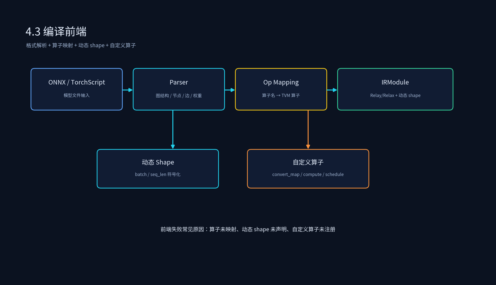

# 3.3 编译前端

## 课程概述

编译前端是 AI 编译器的入口。它负责把来自不同训练框架的模型（ONNX、TorchScript、TensorFlow 等）解析成统一的中间表示（IR），并解决动态 shape、算子映射、自定义算子注册等关键问题。

前端的好坏直接决定后续中端优化和后端代码生成能否顺利进行。一个典型的前端失败案例：ONNX 模型里有一个 PyTorch 自定义算子，前端没有注册映射，导致整个模型无法编译。本节把前端拆成三块：ONNX/TorchScript 图解析、动态 shape 处理、算子映射与自定义算子注册。

学完本节后，你应该能够：

- 用 TVM 的 `relay.frontend.from_onnx` 和 `from_pytorch` 解析模型。
- 解释 ONNX 模型中的 shape、dtype、initializer 如何映射到 TVM IR。
- 处理动态 batch 和动态 sequence length，并说明 Relay 与 Relax 的不同策略。
- 注册一个自定义算子，让前端能正确解析不支持的框架算子。

---

## 1. 前端在编译 Pipeline 中的位置

```text
ONNX / TorchScript / TensorFlow 模型
  → 前端解析
        ├── 图结构提取：节点、边、输入输出
        ├── 算子映射：把框架算子映射到 TVM 算子
        ├── 权重处理：initializer / parameter → TVM Constant
        ├── 动态 shape 处理：确定哪些维度是符号变量
        └── 自定义算子注册：处理不支持的算子
  → 输出：Relay / Relax IRModule
```



---

## 2. ONNX 图解析

ONNX 是模型交换的事实标准。TVM 的 ONNX 前端把 ONNX 的 GraphProto 转换为 Relay 计算图。

### 2.1 解析流程

```text
onnx.load("model.onnx")
  → 提取 GraphProto
  → 遍历 node，建立输入输出拓扑
  → 对每个 node，查 convert_map 表得到 TVM 算子
  → 处理 initializer 为 Constant
  → 处理输入 shape/dtype，创建 Relay Var
  → 构建 Function 和 IRModule
  → InferType
```

### 2.2 代码示例

```python
import onnx
from tvm import relay

# 加载 ONNX 模型
onnx_model = onnx.load("resnet18.onnx")

# 解析为 Relay
mod, params = relay.frontend.from_onnx(
    onnx_model,
    shape={"input": [1, 3, 224, 224]},
    dtype={"input": "float32"},
)

# 补全类型信息
mod = relay.transform.InferType()(mod)
print(mod)
```

### 2.3 处理 ONNX 的 opset 版本

ONNX 算子语义随 opset 版本变化。TVM 前端需要针对不同 opset 做适配：

```python
from tvm.relay.frontend.onnx import ONNXOpConverter

class MyConverter(ONNXOpConverter):
    @classmethod
    def _impl_v13(cls, inputs, attr, params):
        # opset 13 的实现
        return relay.nn.bias_add(inputs[0], inputs[1])
```

---

## 3. TorchScript 图解析

TorchScript 是 PyTorch 的静态图表示。TVM 通过 `relay.frontend.from_pytorch` 解析。

### 3.1 解析流程

```text
torch.jit.trace(model, example_input)
  → 得到 scripted model
  → 遍历 graph nodes
  → 对每个 ATen 算子，查映射表
  → 处理 parameters 为 Constant
  → 构建 Relay Function
```

### 3.2 代码示例

```python
import torch
from tvm import relay

# 准备 PyTorch 模型和示例输入
model = torch.hub.load("pytorch/vision", "resnet18", pretrained=True)
model.eval()
example_input = torch.randn(1, 3, 224, 224)

# 导出 TorchScript
scripted = torch.jit.trace(model, example_input)

# 解析为 Relay
mod, params = relay.frontend.from_pytorch(
    scripted,
    shape_list=[("input", example_input.shape)],
)
mod = relay.transform.InferType()(mod)
print(mod)
```

### 3.3 TorchScript 与 ONNX 的对比

| 特性 | ONNX | TorchScript |
| ---- | ---- | ----------- |
| 通用性 | 跨框架 | 主要面向 PyTorch |
| 动态控制流 | 较弱 | 原生支持 if/loop |
| 自定义算子 | 需要自定义 op | 可以直接导出 aten 算子 |
| 调试难度 | 可视化工具多 | 需要看 ATen 图 |

---

## 4. 动态 Shape 处理

大模型推理中，batch size、sequence length 都是动态变化的。前端需要决定：哪些维度编译期已知，哪些维度用符号变量表示。

### 4.1 Relay 的动态 shape 策略

Relay 静态 shape 为主，动态 shape 需要 workaround：

- **固定 shape 编译**：为每个常见 batch size 单独编译一个产物。
- **bucket 编译**：预编译几个 bucket 尺寸，运行时选择最近的。
- **VM 模式**：用 Relay VM 支持动态 shape，但性能不如全静态编译。

```python
# bucket 编译示例
shapes = {
    "input": [1, 3, 224, 224],
    # 运行时发现 batch=8，则复用该产物或重新编译
}
```

### 4.2 Relax 的原生动态 shape

Relax 支持符号变量，是处理动态 shape 的推荐方式。

```python
from tvm import relax
from tvm.relax.frontend import nn

class DecodeStep(nn.Module):
    def forward(self, x: nn.Tensor):
        # x: [batch, seq_len, hidden] 中 seq_len 是动态符号
        return nn.softmax(x, axis=-1)

model = DecodeStep()
mod, params = model.export_tvm(
    spec={"forward": {"x": nn.spec.Tensor([1, "seq_len", 768], "float32")}}
)
```

Relax 动态 shape 的关键点：

- 用符号变量（如 `n`, `s`）表示未知维度。
- 在 TIR 层用 `tir.Var` 表示动态维度，Codegen 时生成动态调度代码。
- Runtime 层根据实际输入 shape 选择或重新编译 kernel。

### 4.3 动态 shape 的难点

- 内存规划：编译期不知道具体尺寸，峰值显存难以精确估算。
- 算子融合：动态维度可能破坏某些融合模式。
- 后端支持：某些后端（如 TensorRT）对动态 shape 支持有限，需要 explicit batch/profile。

---

## 5. 算子映射与自定义算子注册

### 5.1 算子映射表

前端维护一个映射表，把框架算子名映射到 TVM 算子。

```text
ONNX 算子名          TVM 算子
Conv                nn.conv2d
MatMul              nn.matmul / nn.dense
BatchNormalization  nn.batch_norm
Reshape             reshape
Cast                cast
Softmax             nn.softmax
```

### 5.2 自定义算子注册（Relay）

当遇到 TVM 未支持的算子时，需要注册自定义算子。

```python
import tvm
from tvm import relay, topi

# 注册 custom_op 的 compute 和 schedule
@relay.op.register_op_attr("custom_op", "FTVMCompute")
def compute_custom_op(attrs, inputs, output_type):
    return [topi.custom(inputs[0])]

@relay.op.register_op_attr("custom_op", "FTVMSchedule")
def schedule_custom_op(attrs, outs, target):
    return topi.cuda.schedule_injective(outs)

# 前端解析时把 ONNX 算子名映射到 custom_op
relay.frontend.onnx.convert_map["CustomOp"] = relay.op.get("custom_op")
```

### 5.3 自定义算子注册（Relax）

Relax 中自定义算子通常通过 `call_pure_packed` 或 `call_tir` 实现。

```python
from tvm import relax

@relax.op.register_op("relax.custom_op")
def custom_op(x):
    return relax.call_pure_packed(
        "tvm.contrib.custom_op",
        x,
        sinfo_args=relax.TensorStructInfo(x.shape, x.dtype),
    )

# 在 Relax 前端中注册映射
relax.frontend.torch.op_mapping["aten::custom_op"] = custom_op
```

---

## 6. 代码实践

### 6.1 运行示例：解析 ONNX 并查看 IR

代码文件：`3.3_编译前端/frontend_onnx_inspect.py`

```bash
cd /data/ai_infra/03_AI编译器
/data/qwen35_env/bin/python 3.3_编译前端/frontend_onnx_inspect.py
```

运行后会生成 `3.3_编译前端/sample.onnx` 并打印解析后的 Relax IR。

### 6.2 自定义算子注册

代码文件：`3.3_编译前端/custom_op_registration.py`

```bash
/data/qwen35_env/bin/python 3.3_编译前端/custom_op_registration.py
```

运行后会演示如何在 Relax 中通过 `call_pure_packed` 注册自定义算子，并导出包含该算子的 Relax IR。

> 环境说明：Relax 的自定义算子推荐通过 `call_pure_packed` / `call_tir` 调用底层 TIR/外部函数，而不是像 Relay 那样注册 `FTVMCompute`。

### 6.3 实验建议

- 找一个包含动态 batch 的 ONNX 模型，分别用 Relay bucket 和 Relax 动态符号编译，对比产物数量。
- 在 ONNX 模型里人为添加一个 TVM 不支持的算子，注册自定义算子后重新编译。
- 比较 `from_onnx` 和 `from_pytorch` 对同一个 PyTorch 导出模型的 IR 差异。

---

## 7. 常见误区

### 7.1 “前端只是格式转换”

前端还要处理 shape 推断、dtype 统一、权重常量转换、动态维度符号化、算子语义对齐。格式转换只是最表层的工作。

### 7.2 “动态 shape 直接交给 Runtime”

完全动态 shape 在编译期无法做内存规划和算子融合，会牺牲性能。Relax 的做法是保留部分编译期知识（符号关系），而不是完全 Runtime 化。

### 7.3 “自定义算子只需要写 kernel”

自定义算子需要在**前端、IR、compute/schedule、后端**四层都注册。只写 kernel 不注册映射，前端解析时就会失败。

---

## 8. 本节小结

1. 前端是 AI 编译器的入口，负责把不同框架模型解析为统一 IR。
2. ONNX 和 TorchScript 是两大主流输入格式，各有优劣。
3. 动态 shape 处理是前端难点：Relay 用 bucket/VM workaround，Relax 原生支持符号变量。
4. 自定义算子需要在前端、IR、compute、schedule、后端都完成注册。

---

## 9. 课后思考

1. 为什么 ONNX 的 `Reshape` 形状信息必须编译期已知？Relax 如何处理可变 shape？
2. 如果 ONNX 算子语义与 TVM 算子语义不完全一致，前端应该如何处理？
3. 动态 shape 会给中端 Pass 和后端 Codegen 带来哪些挑战？
4. 自定义算子注册时，为什么 Relay 和 Relax 的注册方式不同？
5. 你会在什么场景下选择 TorchScript 而不是 ONNX 作为输入格式？
