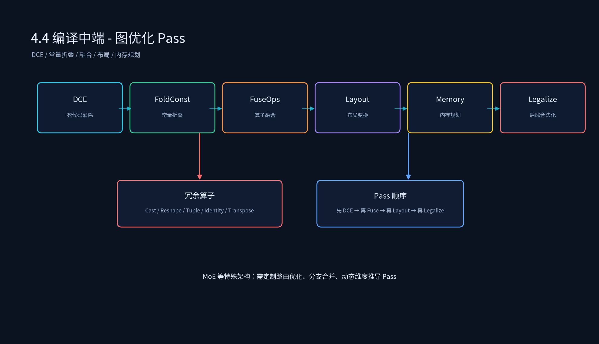

# 3.4 编译中端 - 图优化 Pass

## 课程概述

编译中端是大模型编译链路的核心枢纽，承接前端模型解析生成的高阶计算图，在不改变模型推理逻辑与计算精度的前提下，完成计算图结构梳理、冗余算子剔除、算子融合、内存排布优化与计算逻辑简化。

相较于前端侧重格式解析、后端侧重硬件指令生成，中端图优化 Pass 聚焦计算图本身的拓扑结构与算子逻辑，通过一系列结构化改写规则，消除图中无效、冗余、低效的计算节点，为后端代码生成降低调度压力、减少显存读写开销、提升硬件计算密度。

在大语言模型，尤其是 MoE 混合架构模型的推理场景中，模型原生导出的计算图普遍存在大量人工冗余算子：包括成对精度转换 Cast、无维度变换意义的 Reshape、反复嵌套的 Tuple 打包与解包、未被调用的死代码节点，以及可合并的链式激活算子。此类冗余算子不会改变推理结果，但会增加数据搬运、内存读写与算子调度耗时，是制约模型推理吞吐、拉高推理延迟的关键因素。

学完本节后，你应该能够：

- 解释中端在 AI 编译器链路中的核心作用。
- 列出 TVM 常见图优化 Pass 的名称、原理和作用。
- 手写一个自定义 Relay/Relax 图优化 Pass。
- 识别 ONNX 模型中的冗余算子并用 Pass 化简。
- 说明算子融合、布局变换、内存规划、常量折叠的执行流程和收益。

---

## 1. 中端在编译链路中的角色

```text
前端输出的高层 IR
  → 中端图优化 Pass
        ├── 冗余消除：DeadCodeElimination、SimplifyExpr、FoldConstant
        ├── 结构优化：FuseOps、CombineParallel*、DefuseOps
        ├── 数值/布局优化：FoldScaleAxis、AlterOpLayout、ConvertLayout
        ├── 推理特化：SimplifyInference、DynamicToStatic
        ├── 内存优化：AnnotateUsedMemory
        └── 后端适配：Legalize、PartitionGraph
  → 优化后的高层 IR
  → 后端代码生成
```

中端的核心原则：

> **在不改变模型推理逻辑与计算精度的前提下，精简图结构，为后端生成更高质量的代码。**



---

## 2. TVM 图优化 Pass 一览

| Pass 名称 | 通俗释义 | 核心工作原理 |
| --------- | -------- | ------------ |
| DeadCodeElimination | 死代码消除 | UsageVisitor 统计引用次数，EliminatorMutator 移除引用计数为 0 的节点。 |
| LazyGradientInit | 梯度延迟初始化 | 对 ones/zeros 等初始化算子，延迟创建梯度张量，降低常驻内存。 |
| FoldConstant / FoldConstantExpr | 常量折叠 | 编译期完成权重、固定超参的运算，减少运行期计算量。 |
| FuseOps / DefuseOps | 算子融合/拆分 | 把相邻简单算子合并为复合算子，减少 kernel 调度开销。 |
| SimplifyInference | 推理流程化简 | 重写 BN、Dropout、LN、IN、GN、L2Norm 等，去除推理冗余分支。 |
| FastMath | 快速数学计算 | 用近似算法替换 exp、erf、tanh、softmax 等非线性算子。 |
| DynamicToStatic | 动态算子静态化 | 若动态算子输入维度固定，则转为静态算子并重新推导类型。 |
| InferType | 类型推导 | 遍历 IR 表达式，补全张量类型、维度、存储空间信息。 |
| EliminateCommonSubexpr | 公共子表达式消除 | 合并重复表达式，仅计算一次，多处引用。 |
| CombineParallelConv2D | 并行卷积合并 | 拼接输入相同、超参一致、输出通道不同的卷积权重。 |
| CombineParallelBatchMatmul | 并行 BMM 合并 | 合并输入一致的多个批量矩阵乘分支。 |
| CombineParallelDense | 并行全连接合并 | 合并输入一致的多条 Dense 分支，统一为单次批量矩阵乘。 |
| FoldScaleAxis | 轴向缩放折叠 | 把缩放/偏移系数合并进 Conv2d、Dense 权重。 |
| CanonicalizeOps | 算子规范化 | 统一特殊算子表达，如 bias_add → expand_dims + broadcast_add。 |
| AlterOpLayout / ConvertLayout | 布局转换 | 修改 NCHW↔NHWC 等存储布局，适配硬件最优格式。 |
| Legalize | 算子合法化 | 面向后端做等价替换，如 QNN/NPU 原生指令。 |
| PartitionGraph | 计算图划分 | 按标注切分子图，卸载到不同硬件。 |
| SimplifyExpr | 表达式化简 | 基于模式匹配重写冗余 Relay 表达式。 |
| AnnotateUsedMemory | 内存占用标注 | 静态分析张量生命周期，统计最小内存占用。 |
| FlattenAtrousConv | 空洞卷积展平 | 把 space_to_batch + conv + batch_to_space 重构为标准空洞卷积。 |

---

## 3. 死代码消除（Dead Code Elimination）

死代码 = 做了没用、不影响输出、浪费算力的代码。DCE 直接把这些垃圾删掉，让模型变干净。

在大模型中主要关注的死代码/冗余算子：

- 成对 Cast：`fp16 → fp32 → fp16` 可直接删除。
- 无用 Reshape / Squeeze / Unsqueeze：shape 不变或最终维度一致。
- 空 TupleGetItem + Tuple：Tuple 解包后无实际使用。
- 恒等变换 Identity：`x = identity(x)` 可直接替换为 x。
- 可融合的 Split + Concat、Silu = Sigmoid + Mul。
- 无意义 Transpose：permute 后又转回去。
- 未使用的输出节点。

### 3.1 DCE 工作原理

```text
1. UsageVisitor 遍历 IR 图，统计每个节点被引用次数。
2. 找出引用计数为 0 的孤立节点。
3. EliminatorMutator 移除这些节点，并递归清理新产生的孤立节点。
4. 重复直到没有死代码为止。
```

### 3.2 TVM DCE 实现骨架

```python
from tvm import relay
from tvm.relay import transform as T

# 入口：调用 TVM 内置 DCE
mod = T.DeadCodeElimination()(mod)

# 等价于手动实现：遍历引用计数，删除引用为 0 的节点
class UsageVisitor(relay.ExprVisitor):
    def __init__(self):
        super().__init__()
        self.ref_count = {}

    def visit(self, expr):
        if isinstance(expr, relay.Var):
            self.ref_count[expr] = self.ref_count.get(expr, 0) + 1
        super().visit(expr)

class EliminatorMutator(relay.ExprMutator):
    def visit_let(self, let):
        # 若 var 引用计数为 0，则跳过 value，直接返回 body
        if self.ref_count.get(let.var, 0) == 0:
            return self.visit(let.body)
        return relay.Let(let.var, self.visit(let.value), self.visit(let.body))
```

### 3.3 实际案例：词表 permute 冗余

某模型词表 2GB，经过两个 permute 后存储从 2GB 变成 6GB。事实上这两个 permute 完全可以省掉。通过布局折叠 + DCE，可以把中间拷贝全部消除。

原始链路：

```text
weights(2GB) → permute → permute_out(2GB) → permute → final(2GB)
                              ↓ 死分支
                         unused_node(2GB)
```

优化后：

```text
weights(2GB) → 直接参与计算
```

---

## 4. 常量折叠（Constant Folding）

对权重、固定超参、静态输入等编译期已知数据，提前完成运算，将可静态求解的表达式直接固化为常量。

### 4.1 执行流程

```text
1. 遍历图，识别所有输入为常量的子图。
2. 用 TVM 解释器执行该子图，得到常量结果。
3. 把原计算节点替换为常量节点。
4. 触发 DCE 删除已被替换的节点。
```

### 4.2 代码示例

```python
from tvm import relay
from tvm.relay import transform as T

mod = T.FoldConstant()(mod)
```

例如：

```text
x = constant([1, 2, 3])
y = x + 2
z = y * 3
```

常量折叠后：

```text
z = constant([3, 6, 9])  # 直接在编译期算出
```

---

## 5. 算子融合（FuseOps）

把多个相邻的简单算子合并为一个复合算子，减少中间结果的显存读写和 kernel launch 次数。

### 5.1 TVM 融合策略

```python
from tvm import relay
from tvm.relay import transform as T

mod = T.FuseOps(fuse_opt_level=2)(mod)
```

TVM 的融合策略基于算子类型：

- `ElemWise`：逐元素算子（relu、add、mul）可以互相融合。
- `Broadcast`：广播算子可以融合到 elemwise 中。
- `Injective`：一对一映射，如 reshape、transpose。
- `CommReduce`：归约算子，如 sum、max。
- `OutEwiseFusable`：可以与输出 elemwise 融合。

### 5.2 典型融合模式

```text
Conv2D → BiasAdd → ReLU      →  fused_conv2d_bias_relu
MatMul → Add → Softmax       →  fused_matmul_add_softmax
Dense  → BiasAdd → ReLU      →  fused_dense_bias_relu
```

### 5.3 融合收益与代价

收益：

- 减少中间张量读写，降低显存带宽压力。
- 减少 kernel launch 次数，降低 CPU 发射开销。
- 增大算子粒度，便于后端调度。

代价：

- 融合后算子变复杂，可能无法调用高度优化的库 kernel。
- 某些硬件对融合后 shape 不友好，需要 DefuseOps 拆分调试。

---

## 6. 布局转换（Layout Transform）

修改卷积、矩阵乘权重的数据存储布局（如 NCHW ↔ NHWC），适配硬件最优计算格式。

### 6.1 ConvertLayout vs AlterOpLayout

- `ConvertLayout`：强制把整个模型转换为指定布局。
- `AlterOpLayout`：根据后端偏好选择性地调整算子布局。

```python
from tvm import relay
from tvm.relay import transform as T

# 转换为目标布局 NHWC
mod = T.ConvertLayout({"nn.conv2d": ["NHWC", "OHWI"]})(mod)
mod = T.AlterOpLayout()(mod)
```

### 6.2 布局转换的收益

- 硬件计算单元对特定布局更友好（如 Tensor Core 偏好 NHWC）。
- 减少运行时 transpose 开销，提前在编译期完成权重维度变换。

### 6.3 布局转换的风险

- 某些算子只支持特定布局，转换后可能引入额外 transpose。
- 需要与后端对齐，否则可能产生错误结果。

---

## 7. 内存规划（Memory Planning）

静态分析各算子输入输出张量生命周期，统计最小内存占用并标注，用于后续内存分配优化。

```python
from tvm import relay
from tvm.relay import transform as T

mod = T.AnnotateUsedMemory()(mod)
```

注意：该 Pass 主要针对静态 shape；动态 shape 场景下，内存规划需要 Runtime 配合动态分配。

---

## 8. 自定义 Pass 实战：简化冗余 Cast + Reshape

下面是一个自定义 Relay Pass，用于删除成对 Cast 和无 reshape 的 Reshape。

```python
from tvm import relay
from tvm.relay import transform as T
from tvm.relay.dataflow_pattern import (
    is_op, wildcard, rewrite, DFPatternCallback
)

class SimplifyRedundantCast(DFPatternCallback):
    def __init__(self):
        super().__init__()
        # 匹配 pattern: cast(x, fp32) -> cast(x, fp16)
        self.pattern = (
            is_op("cast")(is_op("cast")(wildcard()).has_attr({"dtype": "float32"}))
            .has_attr({"dtype": "float16"})
        )

    def callback(self, pre, post, node_map):
        x = node_map[self.pattern][0].args[0].args[0]
        return x  # 直接返回原始输入

class SimplifyIdentityReshape(DFPatternCallback):
    def __init__(self):
        super().__init__()
        self.pattern = is_op("reshape")(wildcard())

    def callback(self, pre, post, node_map):
        x = node_map[self.pattern][0]
        # 若 shape 实际未改变，则返回 x
        if list(pre.args[0].checked_type.shape) == list(pre.checked_type.shape):
            return x
        return post

mod = T.MergeComposite([])(mod)
mod = rewrite.SimplifyRedundantCast()(mod)
mod = rewrite.SimplifyIdentityReshape()(mod)
mod = T.DeadCodeElimination()(mod)
mod = T.InferType()(mod)
```

---

## 9. MoE 专属优化 Pass 思路

针对 Qwen3.5 MoE 这类含 Gated Delta 混合注意力、超大专家集群的架构，可以定制：

- **MoE 路由优化**：合并 topk 路由与专家选择，减少动态分支。
- **分支算子合并**：把 gate + up + down 的专家分支合并为一个复合算子。
- **动态维度推导**：对可变专家数量、动态 token 数做符号推导。

这些 Pass 通常需要结合具体模型结构，基于 Relax 的 BlockBuilder 或 Relay 的 DFPattern 实现。

---

## 10. 代码实践

### 10.1 运行示例

代码文件：`3.4_编译中端-图优化Pass/pass_pipeline_demo.py`

```bash
cd /data/liyangyang/ai_infra/03_AI编译器
/data/liyangyang/qwen35_env/bin/python 3.4_编译中端-图优化Pass/pass_pipeline_demo.py
```

运行后会先打印解析后的 Relax IR，再打印经过 `LegalizeOps -> FoldConstant -> FuseOps -> DCE -> RemoveUnusedOutputs` 后的 IR。

> 环境说明：示例基于 Relax Transform 编写。TVM 0.25.0 的 pip wheel 中，Relay 已被移除，Relax 是主推 IR。

### 10.2 实验建议

- 给模型添加冗余 Cast/Reshape，观察 DCE + SimplifyExpr 是否化简。
- 改变 conv 布局（NCHW → NHWC），对比前后 kernel 数量。
- 对比 FuseOps 前后的算子数量和运行延迟。

---

## 11. 常见误区

### 11.1 “Pass 越多越好”

Pass 有副作用顺序。例如先 FuseOps 再 AlterOpLayout 与先 AlterOpLayout 再 FuseOps 可能得到完全不同的结果。Pass pipeline 需要精心设计并通过单测验证。

### 11.2 “DCE 只删除死节点”

DCE 还会触发连锁反应：删除一个节点后，其输入可能变成新的死节点，需要迭代执行。

### 11.3 “融合一定能提升性能”

融合后算子可能变复杂，后端无法生成高效 kernel。某些场景下需要 DefuseOps 拆分或限制融合粒度。

---

## 12. 本节小结

1. 编译中端聚焦计算图本身的拓扑结构与算子逻辑，目标是为后端生成更高质量代码。
2. 常见 Pass 包括：DCE、常量折叠、算子融合、布局变换、内存规划、推理化简、后端合法化等。
3. DCE 通过引用计数移除无用节点，是大模型冗余算子清理的基础。
4. FuseOps 能减少 kernel launch 和显存读写，但需要注意顺序和融合粒度。
5. MoE 等特殊架构需要定制专属 Pass，如路由优化、分支合并、动态维度推导。

---

## 13. 课后思考

1. 为什么 DCE 通常要迭代执行？一次遍历能否完全清理？
2. 算子融合的收益和代价分别是什么？哪些情况下不应该融合？
3. 布局转换可能引入哪些额外开销？如何评估是否值得转换？
4. 如果要为一个 MoE 模型写一个路由优化 Pass，你会基于 Relay 还是 Relax？为什么？
5. 常量折叠后的数值精度是否会改变？如何控制精度损失？
