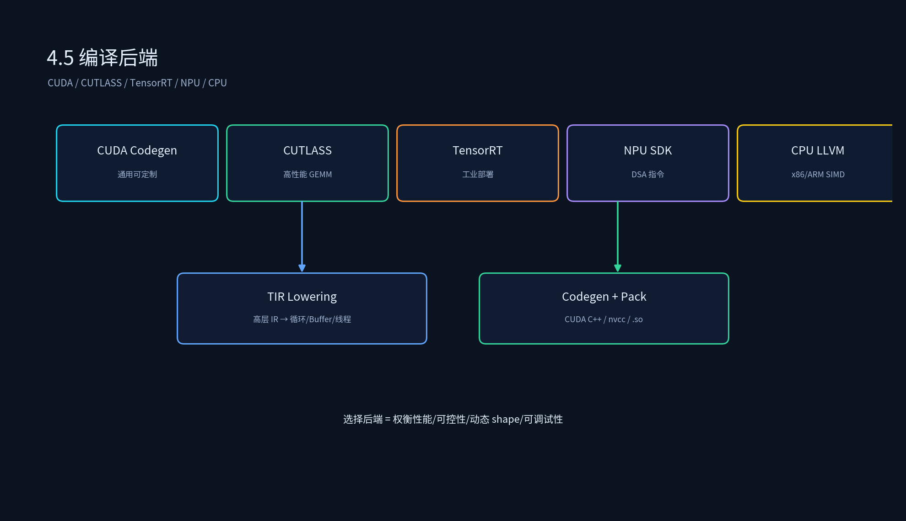

# 3.5 编译后端

## 课程概述

编译后端是 AI 编译器的最后一环，负责把优化后的高层 IR 转换为可以在硬件上高效执行的代码。它涉及 TIR lowering、调度优化、代码生成、runtime 打包等多个步骤。

TVM 后端选择很多：CUDA Codegen 通用、CUTLASS 接入高性能模板、TensorRT 提供工业级优化。Relax 与 Relay 在后端支持上也有差异。本节把后端拆成四块：CUDA Codegen、CUTLASS 接入、TensorRT Plugin、多后端性能对比。

学完本节后，你应该能够：

- 解释 TVM 后端从 TIR 到 .so 的完整流程。
- 用 TVM 生成 CUDA Codegen 产物并部署。
- 把子图 partition 到 CUTLASS 和 TensorRT。
- 比较 Relax（Dlight/Cutlass）与 Relay（Cutlass/Ansor）的后端差异。

---

## 1. 后端在编译 Pipeline 中的位置

```text
优化后的高层 IR（Relay/Relax）
  → Lower 到 TIR
  → 后端选择
        ├── CUDA Codegen：TIR → CUDA C++ → nvcc → .so
        ├── CUTLASS：匹配 MatMul/Conv 模式 → CUTLASS kernel
        ├── TensorRT：partition 子图 → TensorRT engine
        ├── NPU SDK：Legalize → 硬件指令
        └── CPU：LLVM → SIMD
  → 生成 runtime 产物
  → 加载执行
```



---

## 2. CUDA Codegen

### 2.1 流程

```text
1. TIR 传入 BuildModule
2. 通过 CodegenCUDA 把 TIR printer 成 CUDA C++
3. 调用 nvcc 编译 .cu 为 .cubin
4. 打包进 TVM runtime module
```

### 2.2 代码示例

```python
from tvm import relay, autotvm
from tvm.contrib import nvcc

target = tvm.target.cuda(model="a100")
lib = relay.build(mod, target=target, params=params)
lib.export_library("model.so")
```

### 2.3 TIR 到 CUDA C++ 的映射

| TIR 抽象 | CUDA 概念 |
| -------- | --------- |
| Loop with `threadIdx.x` | CUDA 线程 |
| Loop with `blockIdx.x` | CUDA block |
| Buffer | CUDA 全局/共享/寄存器内存 |
| Ramp / Vectorize | CUDA vector load/store |

---

## 3. CUTLASS 接入

CUTLASS 是 NVIDIA 的高性能 CUDA 模板库，TVM 可以识别 Matmul/Conv 模式并 offload 到 CUTLASS。

### 3.1 为什么用 CUTLASS

- 手写 level 的 GEMM/CONV 性能。
- 支持多种数据类型（FP16/INT8/BF16）和 epilogue 融合。
- 与 TVM Codegen 互补：TVM 处理复杂融合子图，CUTLASS 处理核心 GEMM。

### 3.2 代码示例

```python
from tvm import relay
from tvm.relay.backend import Executor, Runtime
from tvm.contrib.cutlass import partition_for_cutlass

mod = partition_for_cutlass(mod, params)
with tvm.target.cuda(model="a100"):
    lib = relay.build(mod, target="cuda", params=params)
```

### 3.3 CUTLASS Partition 原理

```text
1. 遍历 Relay 图，识别 MatMul、Conv、BMM 等可 offload 算子。
2. 用 annotate 标记这些算子为 CUTLASS 子图。
3. 通过 PartitionGraph 把标记子图切分出来。
4. 后端为 CUTLASS 子图生成调用代码，其余子图走 TVM Codegen。
```

---

## 4. TensorRT Plugin

TensorRT 是 NVIDIA 的推理优化库，TVM 可以把子图卸载到 TensorRT 执行。

### 4.1 代码示例

```python
from tvm import relay
from tvm.relay.transform import ToMixedPrecision
from tvm.contrib.tensorrt import partition_for_tensorrt

mod = partition_for_tensorrt(mod, params)
with tvm.target.cuda():
    lib = relay.build(mod, target="cuda", params=params)
```

### 4.2 TensorRT 的优势与劣势

优势：

- 极致性能， especially for CNN/Transformer。
- 丰富的 plugin 生态。
- 支持 INT8/FP16 量化。

劣势：

- 黑盒，可调试性弱。
- 对动态 shape 支持有限，需要 explicit batch/profile。
- 某些算子不支持，需要 fallback 到 TVM。

---

## 5. 多后端性能对比

| 后端 | 定位 | 优势 | 劣势 |
| ---- | ---- | ---- | ---- |
| Relay + Cutlass/Ansor | 成熟静态图 | 优化充分、社区成熟 | 动态 shape 支持弱 |
| Relax + Dlight/Cutlass | 新一代动态图 | 原生动态 shape、modern IR | 生态仍在完善 |
| TensorRT | 工业部署 | 极致性能、plugin 丰富 | 黑盒、可调试性弱 |
| CUDA Codegen | 通用 | 可定制、开源 | 性能依赖 Schedule |

### 5.1 Ansor vs Dlight

- **Ansor**：基于搜索的自动调度，适合静态图，搜索时间长但性能高。
- **Dlight**：基于规则的默认调度，适合 Relax 动态图，编译快、性能可预期。

### 5.2 选择建议

- 静态 CNN/BERT：Relay + Ansor/Cutlass。
- 动态 LLM/MoE：Relax + Dlight/Cutlass。
- 极致性能且可接受黑盒：TensorRT。
- 需要自定义算子或调试：CUDA Codegen。

---

## 6. 后端编译产物结构

```text
model.so
  ├── tvm::runtime::Module（CUDA/CPU 模块）
  ├── 参数序列化（params）
  ├── 函数表（PackedFunc）
  └── 权重常量
```

```python
import tvm

mod = tvm.runtime.load_module("model.so")
ex = mod.get_function("main")
out = ex(input_ndarray)
```

---

## 7. 代码实践

### 7.1 运行示例

代码文件：`3.5_编译后端/backend_compare.py`

```bash
cd /data/liyangyang/ai_infra/03_AI编译器
/data/liyangyang/qwen35_env/bin/python 3.5_编译后端/backend_compare.py
```

运行后会尝试为 `llvm` 和 `cuda` 两个 target 分别 build 并导出产物。

> 环境说明：当前 pip 版 TVM 0.25.0 可以生成 CUDA 目标代码，但 wheel 未链接 CUDA runtime，因此不能加载运行 CUDA 产物。真实部署环境需使用源码编译并启用 `USE_CUDA=ON` 的 TVM。

### 7.2 实验建议

- 对同一个模型用三种后端编译，对比延迟和吞吐。
- 观察 TensorRT partition 后哪些子图被卸载，哪些 fallback 到 TVM。
- 用 nsys 或 Nsight 分析 CUTLASS 和 CUDA Codegen 的 kernel 差异。

---

## 8. 常见误区

### 8.1 “后端只需要生成 kernel”

后端还要处理 runtime 打包、内存对齐、多 stream、符号解析、权重序列化。产物必须能被 Runtime 正确加载。

### 8.2 “TensorRT 一定最快”

TensorRT 在 CNN 和标准 Transformer 上通常最快，但对某些自定义算子、动态 shape、复杂控制流支持有限，可能 fallback 到 TVM 后反而更慢。

### 8.3 “Relax 后端已经完全成熟”

Relax 是 TVM 新一代 IR，Dlight/Cutlass 后端仍在快速迭代。生产部署需要评估版本兼容性和算子覆盖度。

---

## 9. 本节小结

1. 后端负责把优化后的 IR 转换为硬件可执行代码，核心是 TIR lowering + Codegen + runtime 打包。
2. CUDA Codegen 通用可定制，但性能依赖 Schedule。
3. CUTLASS 提供手写级别 GEMM/CONV 性能，适合核心算子 offload。
4. TensorRT 工业部署性能强，但黑盒、动态 shape 支持有限。
5. Relax + Dlight 适合动态图，Relay + Ansor/Cutlass 适合静态图。

---

## 10. 课后思考

1. CUDA Codegen 中，TIR 的 Loop 如何映射到 CUDA 的 block/thread？
2. CUTLASS 的 epilogue 融合可以融合哪些算子？为什么比 TVM 自己生成的 kernel 快？
3. TensorRT 的 explicit batch 和 implicit batch 有什么区别？对动态 shape 支持有何影响？
4. 你会在什么场景下选择 Relax + Dlight 而不是 Relay + Ansor？
5. 如果某个模型在 TensorRT 中大量算子 fallback，应该如何决策？
