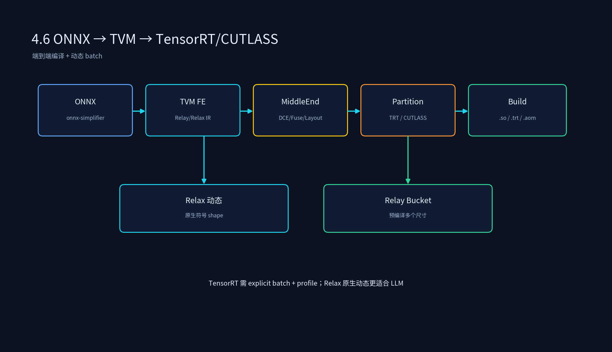

# 3.6 ONNX 到 TensorRT 到 TVM 编译流程

## 课程概述

ONNX、TensorRT、TVM 是工业部署中最常用的三个工具。ONNX 是模型交换格式，TensorRT 是 NVIDIA 推理优化引擎，TVM 是通用 AI 编译器。它们可以单独使用，也可以串联使用：ONNX 作为输入，TVM 作为中端优化和平台扩展，TensorRT 作为 GPU 后端之一。

本节把端到端编译链路拆开：从 ONNX 解析，经过 TVM 中端 Pass，再选择 CUDA Codegen、CUTLASS 或 TensorRT 后端，最终生成可部署产物。同时会覆盖动态 batch 推理支持。

学完本节后，你应该能够：

- 画出 ONNX → TVM → TensorRT/CUTLASS/CUDA 的端到端链路。
- 用 TVM 解析 ONNX 并选择 TensorRT 后端编译。
- 解释动态 batch 在 TVM 中的两种实现方式。
- 比较直接 TensorRT 与 TVM+TensorRT 的优劣。

---

## 1. 端到端编译链路

```text
ONNX model
  → onnx-simplifier 化简（eliminate 冗余 node）
  → TVM frontend 解析为 Relay/Relax
  → 中端 Pass：DCE + FoldConstant + FuseOps + Layout Transform
  → 后端选择：
      ├── TVM CUDA Codegen
      ├── TVM + CUTLASS partition
      └── TensorRT partition
  → 生成 runtime artifacts
  → 部署运行
```



---

## 2. ONNX 化简与导入

### 2.1 为什么先用 onnx-simplifier

ONNX 模型导出时常带冗余节点：

- 无意义的 `Identity`。
- 常量 shape 的 `Reshape`/`Squeeze`。
- 成对的 `Cast`。

onnx-simplifier 可以在 ONNX 层先做一轮常量折叠和化简，减轻 TVM 前端压力。

```bash
python -m onnxsim model.onnx model_sim.onnx
```

### 2.2 TVM 导入 ONNX

```python
import onnx
from tvm import relay

onnx_model = onnx.load("model_sim.onnx")
mod, params = relay.frontend.from_onnx(
    onnx_model,
    shape={"input": [1, 3, 224, 224]},
    dtype={"input": "float32"},
)
mod = relay.transform.InferType()(mod)
```

---

## 3. 中端优化

### 3.1 标准 Pass pipeline

```python
from tvm import relay
from tvm.relay import transform as T

mod = T.DynamicToStatic()(mod)
mod = T.FoldConstant()(mod)
mod = T.SimplifyInference()(mod)
mod = T.FuseOps(fuse_opt_level=2)(mod)
mod = T.DeadCodeElimination()(mod)
mod = T.InferType()(mod)
```

### 3.2 布局适配

如果后端是 TensorRT 或 CUTLASS，需要根据后端偏好选择布局：

```python
mod = T.ConvertLayout({"nn.conv2d": ["NCHW", "OIHW"]})(mod)
```

注意：TensorRT 默认偏好 NCHW，某些版本支持 NHWC。需要与后端对齐。

---

## 4. TensorRT 后端

### 4.1 代码示例

```python
from tvm import relay, runtime
from tvm.contrib import tensorrt

# 把可支持子图 partition 到 TensorRT
mod = tensorrt.partition_for_tensorrt(mod, params)

with tvm.transform.PassContext(opt_level=3):
    lib = relay.build(mod, target="cuda", params=params)

lib.export_library("model_tensorrt.so")
```

### 4.2 Partition 原理

```text
1. 遍历 Relay 图，检查每个算子是否被 TensorRT 支持。
2. 把连续支持的子图标记为 TensorRT 子图。
3. 用 PartitionGraph 切分出来。
4. TensorRT 子图调用 TensorRT engine，其余 fallback 到 TVM CUDA Codegen。
```

### 4.3 直接 TensorRT vs TVM + TensorRT

| 方式 | 优点 | 缺点 |
| ---- | ---- | ---- |
| 直接 TensorRT | 完整图优化，性能通常最高 | 只支持 NVIDIA，黑盒，自定义算子困难 |
| TVM + TensorRT | 可跨平台，可自定义算子，可调试 | 子图切分可能引入 overhead，部分算子 fallback |

---

## 5. CUTLASS 后端

```python
from tvm import relay
from tvm.contrib import cutlass

mod = cutlass.partition_for_cutlass(mod, params)

with tvm.target.cuda(model="a100"):
    lib = relay.build(mod, target="cuda", params=params)

lib.export_library("model_cutlass.so")
```

CUTLASS 适合核心 GEMM/Conv 算子，其余子图走 TVM Codegen。

---

## 6. 动态 Batch 推理支持

大模型推理中 batch size 是动态变化的。TVM 中主要有两种实现方式：

### 6.1 Relax 原生动态 shape

编译期生成动态调度代码，运行期根据输入 shape 直接执行。

```python
from tvm import relax
from tvm.relax.frontend import nn

class Model(nn.Module):
    def forward(self, x: nn.Tensor):
        return nn.matmul(x, self.w)

model = Model()
mod, params = model.export_tvm(
    spec={"forward": {"x": nn.spec.Tensor(["batch", 768], "float32")}}
)
```

### 6.2 Relay bucket 编译

预编译多个 bucket 尺寸，运行期根据实际 batch 选择最近 bucket。

```python
buckets = [1, 4, 8, 16]
libs = {}
for b in buckets:
    mod_b = relay.frontend.from_onnx(onnx_model, shape={"input": [b, 3, 224, 224]})
    libs[b] = relay.build(mod_b, target="cuda")
```

### 6.3 TensorRT 动态 batch

TensorRT 需要 explicit batch + optimization profile：

```python
from tvm.contrib import tensorrt

trt_config = {
    "use_explicit_batch": True,
    "max_batch_size": 16,
}
mod = tensorrt.partition_for_tensorrt(mod, params, **trt_config)
```

---

## 7. 代码实践

### 7.1 运行示例

代码文件：`3.6_ONNX到TensorRT到TVM编译流程/onnx_tensorrt_tvm.py`

```bash
cd /data/ai_infra/03_AI编译器
/data/qwen35_env/bin/python 3.6_ONNX到TensorRT到TVM编译流程/onnx_tensorrt_tvm.py
```

运行后会演示 ONNX 解析 → 中端优化 → Relax build 的完整链路，并生成 `3.6_ONNX到TensorRT到TVM编译流程/model.so`。

TensorRT 后端接入需要在真实 NVIDIA 环境中安装 `tensorrt` 包并启用 Relax 的 TensorRT 后端，示例代码中已用注释说明接入点。

### 7.2 实验建议

- 同一个 ONNX 模型分别走 TVM CUDA、TVM+CUTLASS、TVM+TensorRT，对比延迟和吞吐。
- 用 `tensorrt.GetSupportedOperators()` 查看哪些算子被 TensorRT 支持。
- 改变 batch size，观察动态 shape 和 bucket 编译的差异。

---

## 8. 常见误区

### 8.1 “ONNX 是万能的中间格式”

ONNX 只能表达静态图的算子连接关系，动态控制流、自定义算子、某些 PyTorch 特性转换时会丢失信息。复杂模型需要额外处理。

### 8.2 “TensorRT 子图越多越好”

TensorRT 子图和 TVM 子图之间切换有数据搬运 overhead。如果子图太小或切分太碎，整体性能可能反而下降。

### 8.3 “动态 batch 只需要 Relax”

Relax 原生动态 shape 编译灵活，但某些后端（如 TensorRT）对动态 shape 支持有限。实际部署中可能需要 Relax + bucket + profile 组合方案。

---

## 9. 本节小结

1. ONNX → TVM → TensorRT/CUTLASS/CUDA 是工业部署的常见链路。
2. onnx-simplifier 可先在 ONNX 层做一轮化简，减轻 TVM 前端压力。
3. 中端 Pass 需要与后端对齐，尤其是布局转换和融合策略。
4. TensorRT 适合作为 GPU 子图加速器，但需注意 fallback 和动态 batch。
5. 动态 batch 可用 Relax 原生动态 shape 或 Relay bucket 编译实现。

---

## 10. 课后思考

1. 为什么 TVM 前端解析 ONNX 后，还要在中端做 DCE 和常量折叠？ONNX 层不已经做过吗？
2. TensorRT partition 后，fallback 子图通常由谁执行？如何避免频繁切换 overhead？
3. 动态 batch 的 bucket 编译有哪些优缺点？什么场景下不如 Relax 原生动态？
4. 你会如何设计一个 TVM 配置，使得同一 ONNX 模型既能编译到 TensorRT，又能编译到 CPU？
5. 直接 TensorRT 和 TVM+TensorRT 在调试和可维护性上有什么差异？
