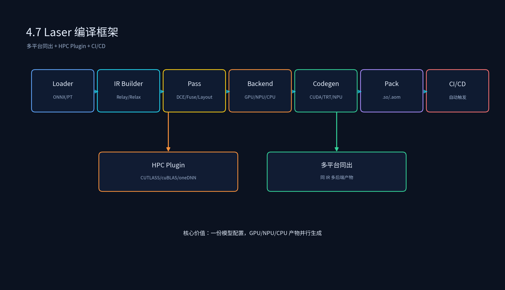

# 3.7 Laser 编译框架与自动化编译

## 课程概述

Laser 是一个面向多平台自动化部署的编译框架，串联模型解析、图优化、后端编译、产物打包全流程。它的核心价值是**一份模型，多平台同出**，通过统一的 IR 和不同的后端插件，自动生成 GPU/NPU/CPU 产物。

本节把 Laser 的编译 Pipeline 拆开：架构解析、模型自动化编译、多平台同出流程、HPC Plugin 机制开发、CI/CD 自动化编译集成。

学完本节后，你应该能够：

- 画出 Laser 编译 Pipeline 的架构图。
- 解释 Laser 如何实现多平台同出。
- 开发一个 Laser HPC Plugin 接入自定义算子库。
- 设计 CI/CD 流程实现自动化编译与产物管理。

---

## 1. Laser 编译 Pipeline 架构

```text
┌─────────────────────────────────────────────────────┐
│                  Laser Build Pipeline                │
├─────────────────────────────────────────────────────┤
│  1. Model Loader: ONNX / TorchScript / native model  │
│  2. IR Builder: 生成 Relax / Relay 计算图            │
│  3. Pass Pipeline: DCE / Fuse / Layout / Legalize   │
│  4. Backend Selector: GPU / NPU / CPU                 │
│  5. Codegen: CUDA / CUTLASS / TensorRT / NPU SDK      │
│  6. Artifact Packager: .so / .aom / .trt              │
│  7. CI/CD Integration: 多平台一键出包                 │
└─────────────────────────────────────────────────────┘
```



### 1.1 各阶段职责

| 阶段 | 输入 | 输出 | 核心职责 |
| ---- | ---- | ---- | -------- |
| Model Loader | 原始模型文件 | 框架特定模型对象 | 格式检查、版本校验、权重加载 |
| IR Builder | 模型对象 | Relax/Relay IRModule | 前端解析、算子映射、动态 shape |
| Pass Pipeline | 原始 IR | 优化后 IR | 图优化、量化、布局、合法化 |
| Backend Selector | 优化后 IR | 后端配置 | 根据目标硬件选择 CUDA/CUTLASS/TensorRT/NPU |
| Codegen | 后端配置 + IR | 硬件代码 + 元数据 | 生成 kernel、调度、编译 |
| Artifact Packager | 编译产物 | .so / .aom / .trt | 打包、签名、版本管理 |
| CI/CD | 源码 + 配置 | 多平台产物 | 自动化触发、并行编译、产物上传 |

---

## 2. 模型自动化编译

Laser 通过配置文件定义输入模型、目标后端和输出产物，一键触发编译。

### 2.1 配置文件示例

```yaml
# laser_config.yaml
model: model.onnx
inputs:
  - name: input
    shape: [1, 3, 224, 224]
    dtype: float32

backends:
  - cuda
  - cutlass
  - tensorrt
  - npu

output_dir: ./artifacts

passes:
  - InferType
  - FoldConstant
  - FuseOps
  - ConvertLayout:
      nn.conv2d: [NHWC, OHWI]
  - DeadCodeElimination
```

### 2.2 编译脚本

```python
# 4.7_laser_build.py
from laser import build

build("laser_config.yaml")
```

### 2.3 自动化编译流程

```text
读取 config
  → 加载模型
  → 选择前端解析器（ONNX/TorchScript/...）
  → 构建 IRModule
  → 按配置执行 Pass pipeline
  → 对每个 backend 执行后端编译
  → 打包产物到 output_dir
  → 输出编译报告（算子数量、kernel 数量、耗时、产物路径）
```

---

## 3. 多平台同出流程

Laser 的核心价值是**同一模型，多平台并行编译**。实现方式：

```text
IRModule
  ├── GPU backend: CUDA Codegen + CUTLASS + TensorRT
  ├── NPU backend: Legalize + NPU SDK
  └── CPU backend: LLVM + SIMD
```

### 3.1 多平台配置

```yaml
backends:
  cuda:
    target: cuda
    arch: sm_80
  cutlass:
    target: cuda
    arch: sm_80
    use_cutlass: true
  tensorrt:
    target: cuda
    use_tensorrt: true
  npu:
    target: npu_xyz
    sdk: /path/to/npu_sdk
  cpu:
    target: llvm
    mcpu: cascadelake
```

### 3.2 多平台产物管理

```text
artifacts/
  ├── model_cuda.so
  ├── model_cutlass.so
  ├── model_trt.trt
  ├── model_npu.bin
  └── model_cpu.so
```

---

## 4. Laser HPC Plugin 机制开发

Laser 支持通过 plugin 机制接入自定义 HPC 算子库，如 CUTLASS、cuBLAS、oneDNN 等。

### 4.1 Plugin 接口

```python
# laser_hpc_plugin.py
from laser.hpc import HpcBackend, register_hpc_plugin

class MyCutlassPlugin(HpcBackend):
    def __init__(self):
        super().__init__("cutlass")

    def match(self, node):
        """判断当前节点是否可被该 HPC 后端处理"""
        return node.op == "nn.matmul" and node.dtype == "float16"

    def codegen(self, node, schedule):
        """生成 HPC kernel 调用代码"""
        return generate_cutlass_kernel(node)

# 注册 plugin
register_hpc_plugin("my_cutlass", MyCutlassPlugin)
```

### 4.2 Plugin 注册到 Pipeline

```yaml
hpc_plugins:
  - name: my_cutlass
    priority: 100
    match_dtypes: [float16]
```

### 4.3 Plugin 匹配与执行流程

```text
1. 中端优化后的 IR 进入后端。
2. 按 priority 遍历 HPC plugin。
3. 每个 plugin 调用 match() 判断可处理节点。
4. 匹配的节点被切分为 HPC 子图。
5. 未匹配节点走默认 Codegen。
6. 合并所有产物，打包 artifact。
```

---

## 5. CI/CD 自动化编译集成

### 5.1 GitHub Actions 示例

```yaml
# .github/workflows/laser_build.yml
name: Laser Multi-Backend Build
on:
  push:
    branches: [main]
  pull_request:
    branches: [main]

jobs:
  build:
    runs-on: gpu-runner
    steps:
      - uses: actions/checkout@v3

      - name: Setup Laser
        run: |
          pip install -r requirements.txt
          laser --version

      - name: Run Laser Build
        run: |
          laser build --config models/config.yaml --output artifacts/

      - name: Benchmark
        run: |
          laser bench --artifacts artifacts/ --report benchmark.json

      - name: Upload artifacts
        uses: actions/upload-artifact@v3
        with:
          name: compiled-models
          path: artifacts/

      - name: Upload benchmark report
        uses: actions/upload-artifact@v3
        with:
          name: benchmark-report
          path: benchmark.json
```

### 5.2 多编译任务并行

对于大型模型（如 BEV、MoE），多个 aom 或子图可以并行编译。CI 中需要控制并发资源，避免 CPU/内存抢占。

```yaml
strategy:
  matrix:
    backend: [cuda, cutlass, tensorrt, npu]
    max-parallel: 4
```

---

## 6. 代码实践

### 6.1 运行示例

代码文件：`3.7_Laser编译框架与自动化编译/laser_minimal.py`

配置文件：`3.7_Laser编译框架与自动化编译/laser_config.yaml`

```bash
cd /data/liyangyang/ai_infra/03_AI编译器
/data/liyangyang/qwen35_env/bin/python 3.7_Laser编译框架与自动化编译/laser_minimal.py
```

运行后会解析 `laser_config.yaml` 并打印模拟的 Laser 编译流水线信息（真实项目需替换为内部 `laser` 包调用）。

### 6.2 HPC Plugin 示例

代码文件：`3.7_Laser编译框架与自动化编译/laser_hpc_plugin.py`

```bash
/data/liyangyang/qwen35_env/bin/python 3.7_Laser编译框架与自动化编译/laser_hpc_plugin.py
```

运行后会演示 mock 的 HPC Plugin 注册、匹配与分发逻辑。

> 环境说明：`laser` 是项目内部框架，未在 `qwen35_env` 中安装。示例代码用 mock 实现保留 plugin 机制的核心思想，便于本地直接运行验证。真实项目接入时请替换为 `from laser.hpc import HpcBackend, register_hpc_plugin`。

### 6.3 实验建议

- 为同一个模型配置多个 backend，对比产物大小和性能。
- 编写一个 HPC Plugin，把 `nn.conv2d` 映射到 mock 的 HPC kernel。
- 在 CI 中实现并行编译，观察资源抢占对编译耗时的影响。

---

## 7. 常见误区

### 7.1 “Laser 只是一个包装脚本”

Laser 的价值在于统一 IR、Pass pipeline、多后端插件、产物管理、CI 集成。如果只是一层壳，没有统一抽象，多平台同出仍然会很乱。

### 7.2 “多平台同出就是复制同一份产物”

不同硬件的算子支持、布局、内存模型不同。真正的多平台同出需要在中端做 Legalize、Layout 适配，在后端做 Codegen 选择，而不是简单复制。

### 7.3 “CI 编译越并行越好”

大模型编译时峰值内存和 CPU 占用很高。盲目并行会导致资源抢占、编译失败或耗时反而增加。需要根据单任务资源占用控制并发度。

---

## 8. 本节小结

1. Laser 是一个面向多平台自动化部署的编译框架，核心能力是统一 IR + 多后端插件 + 自动化打包。
2. 编译 Pipeline 分为七阶段：Model Loader、IR Builder、Pass Pipeline、Backend Selector、Codegen、Artifact Packager、CI/CD。
3. 多平台同出需要同一 IR 经过不同后端适配，不是简单复制产物。
4. HPC Plugin 机制允许接入 CUTLASS、cuBLAS 等高性能算子库。
5. CI/CD 集成需要控制并发资源，避免 CPU/内存抢占导致编译失败或耗时爆炸。

---

## 9. 课后思考

1. Laser 的 HPC Plugin 与 TVM 的 partition_for_cutlass 有什么区别？各自适合什么场景？
2. 多平台同出时，如何处理不同硬件的算子支持差异？
3. CI 中如何根据单任务资源占用动态调整并发度？
4. 如果要新增一个 NPU 后端，Laser 的哪些阶段需要改动？
5. 自动化编译失败后，如何快速定位是前端解析、中端 Pass 还是后端 Codegen 的问题？
