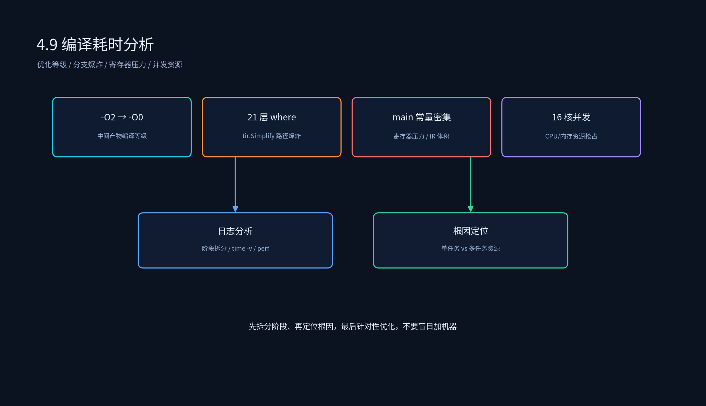

# 3.9 编译耗时优化方案

## 课程概述

编译耗时是 AI 编译器工程落地的重要指标。一个复杂模型（如 BEV、MoE）的 TVM 编译可能需要数小时甚至数十小时。如果编译耗时过长，会直接影响模型迭代效率和 CI/CD 效率。

本节基于三个真实案例，讲解编译耗时优化的分析方法和解决方案：

1. **编译优化等级导致耗时爆炸**：`-O2` 编译 TVM 产物 vs `-O0`。
2. **custom_atan2 导致编译耗时爆炸**：手写链式 `tir.where` 引发 AST 路径爆炸。
3. **BEV NT3 CodeGen 编译性能优化**：main 函数常量密集导致寄存器压力爆炸。

学完本节后，你应该能够：

- 从编译日志中区分 CPU 资源瓶颈和单任务自身瓶颈。
- 识别 `-O2`、`-O0` 优化等级对 TVM 产物编译耗时的影响。
- 识别分支路径爆炸导致的 `tir.Simplify` 耗时问题。
- 识别 IR 体积过大、寄存器压力过大导致的 CodeGen 耗时问题。
- 设计针对性的编译耗时优化方案。

---

## 1. 编译耗时分析框架

```text
编译耗时
  ├── 单任务内部瓶颈
  │     ├── 编译优化等级：-O0 / -O1 / -O2 / -O3
  │     ├── IR 体积：main 函数行数、常量数量、分支深度
  │     ├── 优化器路径爆炸：tir.Simplify / 条件分支组合
  │     ├── 寄存器压力：常量指针同时驻留寄存器数量
  │     └── 后端调度搜索：Ansor 自动调优搜索时间
  └── 多任务资源瓶颈
        ├── CPU 核数不足：并发编译时任务抢占
        ├── 内存不足：峰值内存触发 swap 或 OOM
        └── IO 瓶颈：大量小文件编译或网络存储
```



---

## 2. 方案 1：编译优化等级导致耗时爆炸

### 2.1 问题背景

某实际项目中，每个 aom 编译过程分为两步：

```text
.cc  ->  .out    (g++ 编译)
.out ->  .aom   (链接打包)
```

实测数据：

| aom 项 | .cc → .out | .out → .aom | total |
| ------- | ----------- | ------------ | ----- |
| tvmgen_default_allspark_main_unified_allspark_2 | 3826.98 s (1h) | 29126.2 s (8h) | ~9h |
| tvmgen_default_allspark_parking_unified_allspark_16 | 3268.1 s (0.9h) | 19789.4 s (5.5h) | ~6.4h |
| tvmgen_default_allspark_driving_unified_allspark_9 | 2759.57 s (0.76h) | 17365.2 s (4.8h) | ~5.6h |

35 个 aom 同时编译时，机器仅被分配 16 个核，存在 CPU 资源抢占；且某些 aom 峰值内存占用 33GB，可能触发内存换页。

### 2.2 原始编译指令

```bash
g++ -O2 -Wl,--whole-archive -lpthread -lbacktrace -ldl -Wl,--no-whole-archive \
  -I/usr/local/allspark/allspark_engine/include -fPIC \
  $cc_file \
  $lib_p1 \
  -lpython3.8 \
  -o $out_file
```

### 2.3 优化方案

1. **降低编译优化等级**：从 `-O2` 改为 `-O0`。
   - 原因：`.cc → .out` 阶段不需要极致运行期性能，产物只是中间可执行文件。
   - 收益：整体编译耗时从 ~8h 降至 ~5h。
2. **增加 CPU 核数**：从 16 核提升至资源充足。
   - 收益：完整编译时间从 ~8h 降至 ~3.6h。
3. **串行或限流编译**：对峰值内存大的 aom 控制并发数，避免内存抢占。

### 2.4 优化后指令

```bash
g++ -O0 -Wl,--whole-archive -lpthread -lbacktrace -ldl -Wl,--no-whole-archive \
  -I/usr/local/allspark/allspark_engine/include -fPIC \
  $cc_file \
  $lib_p1 \
  -lpython3.8 \
  -o $out_file
```

### 2.5 关键结论

- 编译优化等级是 .cc → .out 阶段耗时差异的主要来源。
- CPU 资源是 35 个 aom 并发编译时的时间差异来源。
- 对于中间产物，不需要 `-O2`；`-O0` 可以显著加速编译。

---

## 3. 方案 2：custom_atan2 导致编译耗时爆炸

### 3.1 问题背景

手写的 custom_atan2 用多层链式 `tir.where` 分支判断 + for 循环嵌套，生成的 TVM AST 深度达到 21 层。

TVM 的 `tir.Simplify` 优化器会穷举所有分支路径：

$$
21 \text{ 层条件分支} \Rightarrow 2^{21} \approx 210 \text{ 万条路径}
$$

优化器需要逐条遍历、化简、校验，导致编译耗时飙升到 30 分钟以上。

### 3.2 原始代码

```python
# 多层链式 where + 循环 → AST 极深，路径爆炸
def custom_atan2(y, x):
    angle = tir.zeros(...)
    angle = tir.where(cond1, val1, angle)
    angle = tir.where(cond2, val2, angle)
    angle = tir.where(cond3, val3, angle)
    # ... 总计 21 层条件
    return angle
```

### 3.3 优化方案

直接使用 TVM 原生 `atan2`。

```python
from tvm.relax.op import atan2

angle = atan2(y, x)
```

底层 TIR 已经原生实现了高性能 atan2，无分支、无循环，AST 是单层计算节点，编译时 0 路径爆炸。

### 3.4 核心修改点

1. 弃用手写链式 where 的 custom_atan2。
2. 直接使用 TVM 原生支持的 native atan2。
3. 补齐上层 API 注册路径，让 Relax / Relay 上层算子可以直接调用底层 TIR 的 atan2。

### 3.5 优化收益

- 编译耗时：30min+ → 1~2min。
- 功能完全等价。
- 推理性能无损失（原生实现通常比手写分支更快）。

### 3.6 经验教训

- 避免在 TIR 中写深层嵌套条件分支。
- 优先使用 TVM 原生算子，而不是手写近似实现。
- 如果必须手写分支，考虑减少分支深度或禁用 simplify。

---

## 4. 方案 3：BEV NT3 CodeGen 编译性能优化

### 4.1 问题背景

原始编译瓶颈：

- **main 函数常量密集**：构图所需 `constant_xxx`、`constant_xxx_weights_ptr` 全部在 `main()` 内直接定义、加载、寻址。
- **寄存器压力爆炸**：大量常量指针/数组同时驻留通用寄存器，编译器（LLVM/GCC）被迫高频插入 spill/reload 栈交换指令。
- **CodeGen 阶段膨胀**：main 函数 IR 代码行数激增，指令调度、寄存器分配、循环展开耗时线性上涨。
- **冗余寻址复用**：构图多分支重复读取同一批常量，main 内重复加载进一步放大 IR 体积与编译耗时。

### 4.2 优化核心思路

抽离所有构图专用常量读取逻辑，新建独立常量加载函数：

- 使用 `std::map` 存放常量标识 → 常量数组本体 `constant_*`。
- 使用 `std::vector/list` 存放所有权重指针 `constant_*_weights_ptr`。
- 在函数内一次性完成所有常量内存寻址、绑定、缓存。
- main 仅调用该函数获取缓存好的常量容器，不再直接声明/读取大量常量，大幅削减 main 函数 IR 规模，降低寄存器分配压力。

### 4.3 数据结构定义

```cpp
// 常量统一缓存结构体，作为抽离函数返回值
struct GraphConstantPool {
    // key: 常量标识名（如"constant_bev_feature"）, value: 常量数组首地址
    std::map<std::string, const void*> constant_map;
    // 所有权重指针线性列表，遍历构图权重时快速迭代
    std::list<const float*> weight_ptr_list;
};
```

- `map`：按名称快速检索对应常量数组，适配构图不同分支按需取值。
- `list`：轻量化存储所有权重指针，避免 vector 扩容拷贝开销，适配大量权重常量场景。

### 4.4 新增独立常量加载函数

```cpp
GraphConstantPool load_graph_constants() {
    GraphConstantPool pool;

    // 1. 填充普通构图常量 map
    pool.constant_map["constant_bev_grid"] = constant_bev_grid;
    pool.constant_map["constant_cam_intrinsic"] = constant_cam_intrinsic;
    pool.constant_map["constant_depth_lut"] = constant_depth_lut;
    // ... 所有构图用到的 constant_xxx 统一在此注册

    // 2. 填充权重指针 list，过滤空指针
    std::vector<const float*> all_weight_ptrs = {
        constant_backbone_weights_ptr,
        constant_transform_weights_ptr,
        constant_bev_fusion_weights_ptr,
        constant_head_weights_ptr
        // ... 全部 constant_xxx_weights_ptr
    };
    for (auto ptr : all_weight_ptrs) {
        if (ptr != nullptr) {
            pool.weight_ptr_list.push_back(ptr);
        }
    }

    return pool;
}
```

### 4.5 Main 函数改造

原始坏例（编译慢版本）：

```cpp
int main() {
    // 大量常量全部堆在 main，寄存器同时占用几十组指针
    auto grid_ptr = constant_bev_grid;
    auto cam_ptr = constant_cam_intrinsic;
    auto w1 = constant_backbone_weights_ptr;
    auto w2 = constant_transform_weights_ptr;
    // ...数十行常量读取
    // 构图计算逻辑，频繁交叉使用上述指针
    build_bev_nt3_graph(grid_ptr, cam_ptr, w1, w2, ...);
    return 0;
}
```

优化后代码（低寄存器压力版本）：

```cpp
int main() {
    // 仅一行调用，main 内仅持有一个 pool 对象，仅占用少量寄存器
    GraphConstantPool const_pool = load_graph_constants();

    // 构图逻辑仅通过容器按需读取，不会同时持有全部常量指针
    auto grid_ptr = const_pool.constant_map.at("constant_bev_grid");
    auto cam_ptr = const_pool.constant_map.at("constant_cam_intrinsic");
    // 遍历所有权重指针
    for (auto w_ptr : const_pool.weight_ptr_list) {
        feed_weight_to_graph(w_ptr);
    }
    build_bev_nt3_graph(grid_ptr, cam_ptr);
    return 0;
}
```

### 4.6 优化原理解释

- **作用域隔离**：所有常量指针仅存活在 `load_graph_constants` 函数栈帧内，函数 return 后，临时寻址寄存器全部释放；main 仅保留一个 `GraphConstantPool` 对象句柄，活跃寄存器数量从数十个降至个位数。
- **IR 代码分段压缩**：CodeGen 生成 IR 时，main 函数剥离全部常量初始化逻辑，IR 行数大幅缩减；编译器寄存器分配、指令重排、循环优化阶段处理代码量降低。
- **常量复用缓存**：构图多分支重复读取同一常量时，仅从 map/list 容器寻址，不再重复加载全局常量地址，减少冗余 IR 指令。
- **编译器优化友好**：独立小函数 `load_graph_constants` 体积小，LLVM/Clang 能快速完成 inline、常量传播、死代码删除；大体积 main 函数逻辑纯粹，调度开销降低。

### 4.7 CodeGen 适配改造点

1. **代码生成逻辑新增函数生成分支**：CodeGen 遍历全局常量符号表，自动生成 `load_graph_constants()` 函数。
   - 自动识别前缀 `constant_` 的全局数组，填入 `constant_map`。
   - 自动识别前缀 `constant_*_weights_ptr` 指针变量，批量存入 `weight_ptr_list`。
2. **main 函数生成逻辑裁剪**：删除 main 中原有的所有常量地址赋值语句，替换为一行常量池函数调用。
3. **结构体自动生成**：CodeGen 自动输出 `GraphConstantPool` 容器结构体定义，无需手动维护。
4. **编译开关兜底**：新增编译宏 `ENABLE_CONSTANT_POOL_OPTIMIZE`，可一键开关该优化，用于对比编译耗时基准。

### 4.8 优化收益

- **编译速度**：main 函数 IR 规模降低 60%~80%，寄存器分配耗时下降 40%+，整体 CodeGen 编译耗时显著缩短。
- **编译稳定性**：消除超大函数寄存器溢出导致的编译卡顿、OOM 风险。
- **可维护性**：所有构图常量统一归集在独立函数，新增/删除常量仅修改一处，无需改动主流程 main。
- **无性能损耗**：运行时仅一次容器初始化，推理阶段无额外寻址开销，BEV NT3 推理精度、速度完全持平优化前。

### 4.9 实测数据

| subgraph | 优化前 | 优化后 |
| -------- | ------ | ------ |
| tvmgen_default_allspark_main_unified_allspark_2 | 29655.2 s | 5765.46 s |
| tvmgen_default_allspark_parking_unified_allspark_16 | 19880.3 s | 5066.61 s |
| **整体任务** | **596 min** | **208 min** |

---

## 5. 代码实践

### 5.1 运行示例

代码文件：`3.9_编译耗时优化方案/compile_time_analysis.sh`

```bash
bash 3.9_编译耗时优化方案/compile_time_analysis.sh
```

```bash
# compile_time_analysis.sh
# 记录每个 aom 的 .cc -> .out 和 .out -> .aom 耗时
for cc in *.cc; do
    base=${cc%.cc}
    start=$(date +%s)
    g++ -O0 -fPIC $cc -o $base.out
    out_end=$(date +%s)
    # 打包 .aom
    aom_end=$(date +%s)
    echo "$base, cc->out: $((out_end-start))s, out->aom: $((aom_end-out_end))s"
done
```

### 5.2 常量池优化示例

代码文件：`3.9_编译耗时优化方案/constant_pool_demo.cpp`

```bash
cd /data/liyangyang/ai_infra/03_AI编译器
g++ -O2 -std=c++17 3.9_编译耗时优化方案/constant_pool_demo.cpp -o /tmp/constant_pool_demo
/tmp/constant_pool_demo
```

```cpp
// constant_pool_demo.cpp
#include <map>
#include <list>
#include <vector>
#include <cstring>
#include <iostream>

// 占位：实际项目中由 TVM CodeGen 生成这些全局常量
float constant_bev_grid[1024] = {0};
float constant_cam_intrinsic[1024] = {0};
float constant_depth_lut[1024] = {0};
float backbone_weights[1024] = {0};
float transform_weights[1024] = {0};
float bev_fusion_weights[1024] = {0};
float head_weights[1024] = {0};
float* constant_backbone_weights_ptr = backbone_weights;
float* constant_transform_weights_ptr = transform_weights;
float* constant_bev_fusion_weights_ptr = bev_fusion_weights;
float* constant_head_weights_ptr = head_weights;

// 常量统一缓存结构体
struct GraphConstantPool {
    std::map<std::string, const void*> constant_map;
    std::list<const float*> weight_ptr_list;
};

GraphConstantPool load_graph_constants() {
    GraphConstantPool pool;

    pool.constant_map["constant_bev_grid"] = constant_bev_grid;
    pool.constant_map["constant_cam_intrinsic"] = constant_cam_intrinsic;
    pool.constant_map["constant_depth_lut"] = constant_depth_lut;

    std::vector<const float*> all_weight_ptrs = {
        constant_backbone_weights_ptr,
        constant_transform_weights_ptr,
        constant_bev_fusion_weights_ptr,
        constant_head_weights_ptr,
    };
    for (auto ptr : all_weight_ptrs) {
        if (ptr != nullptr) {
            pool.weight_ptr_list.push_back(ptr);
        }
    }
    return pool;
}

int main() {
    GraphConstantPool const_pool = load_graph_constants();

    auto grid_ptr = const_pool.constant_map.at("constant_bev_grid");
    auto cam_ptr = const_pool.constant_map.at("constant_cam_intrinsic");

    for (auto w_ptr : const_pool.weight_ptr_list) {
        (void)w_ptr;
    }

    std::cout << "GraphConstantPool loaded, "
              << const_pool.constant_map.size() << " constants, "
              << const_pool.weight_ptr_list.size() << " weight pointers"
              << std::endl;
    return 0;
}
```

### 5.3 实验建议

- 对比 `-O0`、`-O1`、`-O2` 编译同一 TVM 产物的时间差异。
- 用 `perf` 或 `time -v` 分析编译瓶颈是 CPU、内存还是 IO。
- 对 BEV 模型尝试常量池优化，对比 main 函数 IR 行数变化。

---

## 6. 常见误区

### 6.1 “编译时间长只能加机器”

编译耗时可能是优化等级、分支爆炸、IR 体积、寄存器压力、并发资源抢占等多种因素导致。先看日志，定位瓶颈，再决定是加机器、改优化等级还是改写算子。

### 6.2 “-O2 一定比 -O0 好”

对于 TVM 编译的中间产物，`-O2` 主要提升的是中间可执行文件的运行速度，而不是最终推理性能。如果中间产物只运行一次，`-O0` 可以大幅节省编译时间。

### 6.3 “手写算子一定没问题”

手写的 custom_atan2 虽然功能正确，但深层嵌套条件分支会导致编译器优化阶段路径爆炸。写算子时不仅要考虑功能正确，还要考虑编译器优化复杂度。

---

## 7. 本节小结

1. 编译耗时优化需要先定位瓶颈：单任务内部（优化等级、IR 体积、分支路径、寄存器压力）还是多任务资源（CPU、内存、IO）。
2. 方案 1：降低中间产物编译优化等级（-O2 → -O0），可显著缩短 .cc → .out 耗时。
3. 方案 2：避免手写深层嵌套条件分支，优先使用 TVM 原生算子，防止 `tir.Simplify` 路径爆炸。
4. 方案 3：通过常量池抽离 main 函数中的密集常量读取，降低寄存器压力和 IR 体积，缩短 CodeGen 编译时间。
5. 编译耗时优化与推理性能优化不同，目标是在不损害最终推理性能的前提下，缩短编译时间、提升资源效率。

---

## 8. 课后思考

1. 你如何设计一个脚本，自动分析多个 aom 的编译耗时和峰值内存？
2. 为什么 `-O2` 编译 TVM 产物时，链接阶段（.out → .aom）耗时特别长？
3. 如果必须手写带分支的 TIR 算子，如何避免路径爆炸？
4. 常量池优化为什么在 BEV 模型中收益明显，而在普通 CNN 中可能不那么明显？
5. 你会如何在 CI 中平衡编译并发度与资源占用，避免 CPU/内存抢占？
