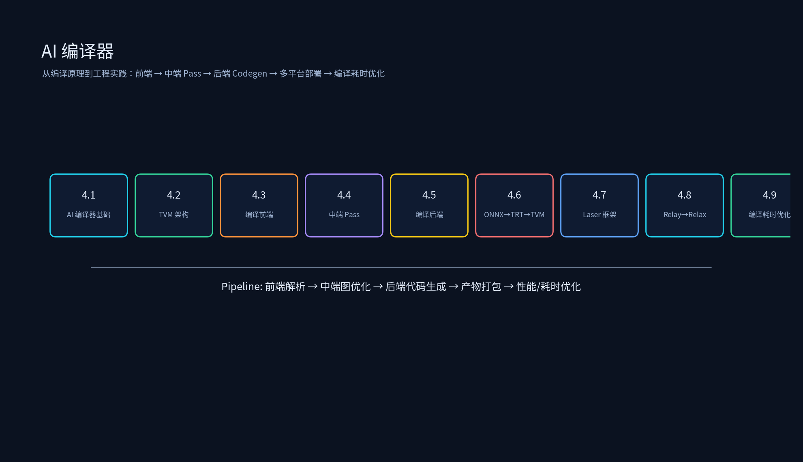

# 第三章：AI 编译器



本专题从编译原理到工程实践，覆盖模型到可执行代码的完整链路：AI 编译器基础、TVM 架构拆解、编译前端、中端图优化 Pass、编译后端、ONNX→TensorRT→TVM 端到端流程、Laser 编译框架与自动化编译、Relay→Relax Pass 迁移实战，以及真实编译耗时优化案例。

## 目录结构

```
AI编译器/
├── 3.1_AI编译器基础/
│   ├── 3.1_AI编译器基础.md
│   └── ai_compiler_pipeline_demo.py
├── 3.2_TVM架构拆解/
│   ├── 3.2_TVM架构拆解.md
│   └── tvm_ir_compare.py
├── 3.3_编译前端/
│   ├── 3.3_编译前端.md
│   ├── frontend_onnx_inspect.py
│   └── custom_op_registration.py
├── 3.4_编译中端-图优化Pass/
│   ├── 3.4_编译中端-图优化Pass.md
│   └── pass_pipeline_demo.py
├── 3.5_编译后端/
│   ├── 3.5_编译后端.md
│   └── backend_compare.py
├── 3.6_ONNX到TensorRT到TVM编译流程/
│   ├── 3.6_ONNX到TensorRT到TVM编译流程.md
│   └── onnx_tensorrt_tvm.py
├── 3.7_Laser编译框架与自动化编译/
│   ├── 3.7_Laser编译框架与自动化编译.md
│   ├── laser_config.yaml
│   ├── laser_hpc_plugin.py
│   └── laser_minimal.py
├── 3.8_Relay到Relax_Pass迁移实战/
│   ├── 3.8_Relay到Relax_Pass迁移实战.md
│   └── relay_relax_pass_compare.py
├── 3.9_编译耗时优化方案/
│   ├── 3.9_编译耗时优化方案.md
│   ├── compile_time_analysis.sh
│   └── constant_pool_demo.cpp
└── 简历项目/
    ├── 简历项目.md
    └── images/ai_compiler_project_stack.png

每个子专题目录下都有 `images/` 演示图；如需重新生成或改配色，运行：

```bash
python tools/generate_ai_compiler_diagrams.py
```
```

## 运行环境

已在 `qwen35_env` 中安装/验证：

- `apache-tvm==0.25.0`（官方 pip 版，仅含 Relax）
- `onnx==1.22.0`
- `matplotlib==3.10.9`
- `numpy==2.2.6`

激活环境：

```bash
source /data/qwen35_env/bin/activate
```

⚠️ 注意：当前安装的 `apache-tvm-ffi==0.1.12` 与环境中 `vllm==0.25.0` 要求的 `apache-tvm-ffi==0.1.9` 存在冲突。若需运行 vllm，请先执行 `pip install apache-tvm-ffi==0.1.9` 降级；运行本专题代码时再升级回 `0.1.12`。

## 运行示例

```bash
source /data/qwen35_env/bin/activate
cd /data/ai_infra/03_AI编译器

python 3.1_AI编译器基础/ai_compiler_pipeline_demo.py
python 3.2_TVM架构拆解/tvm_ir_compare.py
python 3.3_编译前端/frontend_onnx_inspect.py
python 3.3_编译前端/custom_op_registration.py
python 3.4_编译中端-图优化Pass/pass_pipeline_demo.py
python 3.5_编译后端/backend_compare.py
python 3.6_ONNX到TensorRT到TVM编译流程/onnx_tensorrt_tvm.py
python 3.7_Laser编译框架与自动化编译/laser_minimal.py
python 3.7_Laser编译框架与自动化编译/laser_hpc_plugin.py
python 3.8_Relay到Relax_Pass迁移实战/relay_relax_pass_compare.py

# 编译耗时分析（需要先有 .cc 源文件）
bash 3.9_编译耗时优化方案/compile_time_analysis.sh /path/to/cc_sources

# C++ 常量池 demo
g++ -O2 -std=c++17 3.9_编译耗时优化方案/constant_pool_demo.cpp -o /tmp/constant_pool_demo
/tmp/constant_pool_demo

# 重新生成图片
python tools/generate_ai_compiler_diagrams.py
```

## 课程目标

1. 能画出 AI 编译器三段式 Pipeline（前端 → 中端 → 后端），并说明每个阶段的核心职责。
2. 能解释 TVM 四层架构：Relay（静态图）、Relax（动态图）、TIR（底层 IR）、Runtime（执行引擎）。
3. 能完成 ONNX/TorchScript 解析、动态 shape 处理、自定义算子注册。
4. 能手写 TVM 图优化 Pass（如 DCE、常量折叠、算子融合），并理解 Pass 顺序对结果的影响。
5. 能比较 CUDA Codegen、CUTLASS、TensorRT 三种后端的适用场景，并完成接入。
6. 能完成 ONNX → TVM → TensorRT/CUTLASS 端到端编译链路，支持动态 batch。
7. 能理解 Laser 编译框架的多平台同出、HPC plugin、CI/CD 集成。
8. 能把 Relay Pass 迁移到 Relax，处理 call_tir、BlockBuilder、动态 shape 等新机制。
9. 能从真实编译日志中定位编译耗时瓶颈：优化等级、CPU 资源、分支路径爆炸、寄存器压力。
10. 能把 AI 编译器项目写成有分层、有指标、有证据的简历 bullet。
