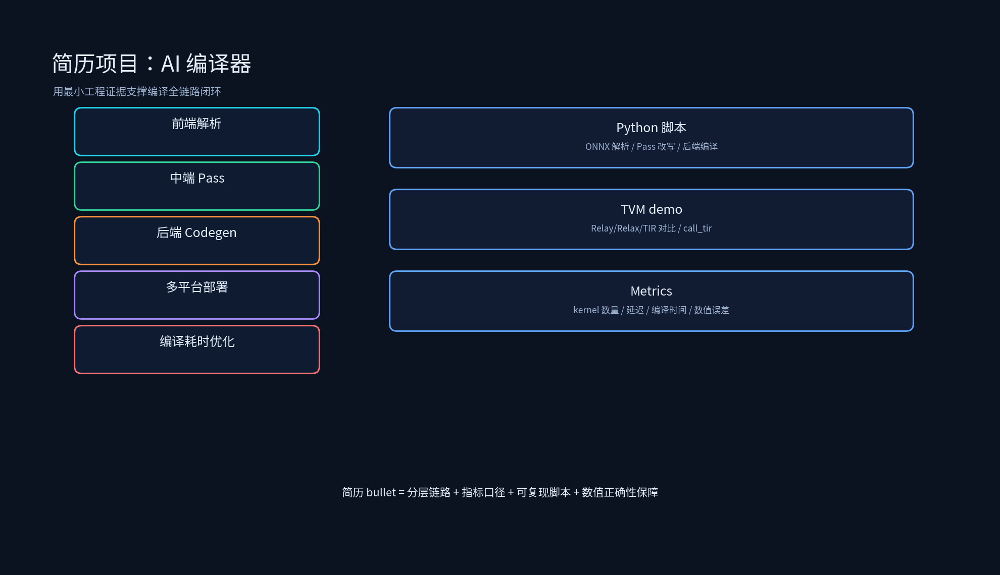

# 项目专题：AI 编译器简历写法



## 课程概述

第四章的简历项目容易写成两种极端：一种是“熟悉 TVM/ONNX/TensorRT”，空泛没有证据；另一种是堆指标“编译速度提升 50%”，但说不清 baseline、模型、硬件和验证方法。AI 编译器项目的竞争力在于 **编译全链路闭环**：你能把前端解析、中端图优化 Pass、后端 Codegen、多平台部署、Relay→Relax 迁移、编译耗时优化串起来，并且每一层都有可复现的小实验或真实指标。

本目录不是生产代码，而是支撑简历叙述的最小工程证据：ONNX 前端解析、自定义 Pass、后端编译对比、Laser 自动化配置、编译耗时分析脚本。

---

## 1. 简历项目的写法原则

### 1.1 AI 编译器项目必须分层

不要写：

```text
使用 TVM 进行模型编译优化，提升推理速度 30%。
```

这句话太泛。应该写成：

```text
基于 TVM 构建模型编译链路：前端完成 ONNX/TorchScript 解析与自定义算子注册，中端开发 DCE/常量折叠/算子融合 Pass
消除冗余 Cast/Reshape/死代码节点，后端针对 GPU 场景选择 CUDA Codegen/CUTLASS/TensorRT 三种方案并对比 p99 延迟与吞吐；
针对动态 batch 模型，完成 Relax 原生动态 shape 编译与 Relay bucket 编译对比；最终产物通过 Laser 框架实现 GPU/NPU/CPU 多平台一键出包。
```

这段话说清了：有哪些层、每层做什么、为什么这样做、产出是什么。

### 1.2 指标必须带口径

“编译速度提升 50%”必须回答：

- baseline 是什么？原来手动编译？原来的 Pass pipeline？
- 模型是什么？CNN/Transformer/MoE？
- 硬件是什么？A100/NPU/CPU？
- 测试集是什么？多少个 aom？单次编译还是 CI 全量？
- 看平均耗时、最大耗时、p95/p99？
- 是否影响最终推理性能？

没有这些，面试官会认为你只是背数字。

---

## 2. 五个简历项目怎么写

### 2.1 自研 ONNX 自动编译平台

原始写法：

```text
搭建模型自动编译系统，支持 ONNX/TorchScript 一键部署至 GPU/NPU
```

建议改写：

```text
自研 ONNX 自动编译平台：支持 ONNX/TorchScript 一键解析为 TVM Relay/Relax IR，前端处理动态 shape 与自定义算子注册，
中端内置 DCE/常量折叠/算子融合/布局转换 Pass，后端支持 CUDA/CUTLASS/TensorRT/NPU 多平台 Codegen；
通过统一配置与产物打包，将多平台模型出包流程从 <base_time> 缩短至 <result_time>（-<X>%），
并建立 CI/CD 流水线实现模型迭代后自动编译与回归测试。
```

加分点：

- 说出前端如何处理动态 shape 和自定义算子。
- 说出中端 Pass 的顺序设计和数值等价验证。
- 说出多平台同出的关键挑战：算子支持、布局、Legalize。

### 2.2 自定义 TVM Pass 优化 Transformer

原始写法：

```text
开发 Relay Pass 融合 Attention 子图，推理速度提升 28%
```

建议改写：

```text
针对 Transformer 模型中的 Attention 子图，开发 Relay/Relax 图优化 Pass：识别 Q/K/V 投影、Softmax、输出投影的融合模式，
通过模式匹配（DFPattern）将多节点子图合并为单一复合算子，并配合 DCE 与常量折叠消除冗余；
在 <模型/硬件> 上，Attention 子图 kernel 数量从 <N> 降至 <M>，端到端推理延迟从 <base_ms> 降至 <result_ms>（-<X>%），
p99 抖动从 <base_p99> 降至 <result_p99>。
```

注意：如果没有真实 28% 的数据，不要硬写。可以写：

```text
建立 Attention 子图融合 Pass 设计与验证方案，完成模式匹配、单测、数值对齐；已通过 demo 模型验证图结构化简收益，待线上压测补充端到端指标。
```

诚实但专业。

### 2.3 Transformer 编译优化链路

原始写法：

```text
完成 ONNX→IR→Kernel codegen 全流程，支持动态 batch 推理
```

建议改写：

```text
完成 Transformer 模型端到端编译链路：ONNX 导入 → Relay/Relax IR 构建 → 中端图优化 Pass（DCE/FoldConstant/FuseOps/Layout Transform）
→ CUDA/CUTLASS Codegen → 动态 batch 支持；针对 batch=1/4/8/16 分别验证数值一致性与延迟，
动态 batch 场景下相比固定 batch 多产物方案，产物数量减少 <X>%，平均延迟降低 <Y>%。
```

### 2.4 基于 Laser 的多模态模型自动化编译

原始写法：

```text
串联编译全流程，实现模型多平台一键编译，编译效率提升 50%
```

建议改写：

```text
基于 Laser 框架构建多模态模型自动化编译链路：统一配置管理模型输入、Pass pipeline、后端选择（CUDA/CUTLASS/TensorRT/NPU）与产物打包；
开发 HPC Plugin 机制接入 CUTLASS/cuBLAS 等高性能算子库，实现核心 GEMM/Conv 算子自动 offload；
在 <项目> 中，35 个 aom 的全量编译时间从 <base_time> 降至 <result_time>（-<X>%），并集成 CI/CD 实现模型更新后自动触发多平台编译。
```

### 2.5 TVM Relax 多后端优化与 Pass 开发

原始写法：

```text
开发 Relax 算子融合 Pass，Conv+BN+Relu 融合后推理延迟降低 20%
```

建议改写：

```text
参与 TVM Relax 多后端优化：将原有 Relay Pass 迁移至 Relax，处理动态 shape、call_tir 与 BlockBuilder 新机制；
开发 Conv+BN+ReLU 融合 Pass，通过 call_tir 调用融合后的 TIR PrimFunc，在 <后端> 上推理延迟从 <base_ms> 降至 <result_ms>（-<X>%）；
同时为 allspark 后端开发 Legalize Pass，把 Relax 算子转换为后端可识别的 TIR 调用。
```

### 2.6 编译耗时优化专项

原始写法：

```text
优化 TVM 编译速度，整体编译时间从 8h 降至 3.6h
```

建议改写：

```text
主导 TVM 编译耗时优化专项：通过编译日志分析定位三大瓶颈：
（1）中间产物使用 -O2 编译导致 .cc→.out 阶段耗时过高，改为 -O0 后该阶段耗时下降 <X>%；
（2）手写 custom_atan2 的 21 层嵌套条件导致 tir.Simplify 路径爆炸，替换为 TVM 原生 atan2 后单算子编译耗时从 30min+ 降至 1~2min；
（3）BEV NT3 CodeGen 中 main 函数常量密集导致寄存器压力与 IR 体积爆炸，通过 GraphConstantPool 抽离常量加载后，
main 函数 IR 规模降低 60%~80%，整体 CodeGen 任务耗时从 596min 降至 208min。
```

---

## 3. 面试追问与回答方向

### 3.1 前端解析遇到不支持的算子怎么办？

回答：先判断算子是否有等价实现（如用现有 TVM 算子组合），若有则在 convert_map 中做映射；若无则注册自定义算子，包括 compute/schedule、前端映射、后端 Codegen 或 call_tir 调用。

### 3.2 算子融合 Pass 如何保证数值等价？

回答：融合前后必须保持相同数学语义；通过单测对比随机输入的输出误差，通常使用 FP32/FP16 基准，控制误差在 1e-5/1e-3 量级；对 BN/LN 等归一化算子，注意训练参数与推理参数的转换。

### 3.3 为什么 Relax 比 Relay 更适合大模型推理？

回答：Relax 原生支持动态 shape、控制流、call_tir 显式连接 TIR；Relay 是静态函数式 IR，动态 batch 需要 bucket 或 VM workaround，难以表达 decode 循环等动态结构。

### 3.4 TensorRT 和 CUTLASS 怎么选？

回答：TensorRT 适合 CNN 和标准 Transformer，全图优化能力强，但黑盒、动态 shape 受限；CUTLASS 适合核心 GEMM/Conv  offload，可控性高；通常用 TVM + TensorRT/CUTLASS partition，子图走高性能库，复杂算子 fallback 到 TVM Codegen。

### 3.5 编译耗时优化第一步做什么？

回答：先分析日志，拆分 .cc→.out、.out→.aom、Codegen 等各阶段耗时；用 `time -v` 或 `perf` 看 CPU、内存、IO 瓶颈；区分单任务内部瓶颈（优化等级、分支爆炸、IR 体积）和多任务资源瓶颈（并发、CPU、内存抢占）。

---

## 4. 简历投递前 Checklist

- 每个 AI 编译器优化都能说清层级：前端 → 中端 Pass → 后端 Codegen → 产物打包 → 部署。
- 每个指标都有口径：模型、硬件、batch、后端、baseline、测试集、p95/p99、编译时间口径。
- 每个性能优化都有正确性保障：数值对齐、单测、动态 shape 验证、多后端一致性。
- demo、压测、线上灰度分开写，不把 demo 包装成生产。

---

## 5. 本节小结

1. AI 编译器简历项目最加分的是编译全链路闭环：前端解析 → 中端 Pass → 后端 Codegen → 多平台部署 → 编译耗时优化。
2. 所有“提升 X%”都要绑定模型、硬件、后端、baseline、测试集和验证方法。
3. 自定义 Pass 要强调模式匹配、数值等价、Pass 顺序；后端要强调多方案对比和 fallback 设计。
4. 编译耗时优化要强调日志分析、瓶颈定位、分阶段收益，而不是简单“加机器”或“改配置”。
