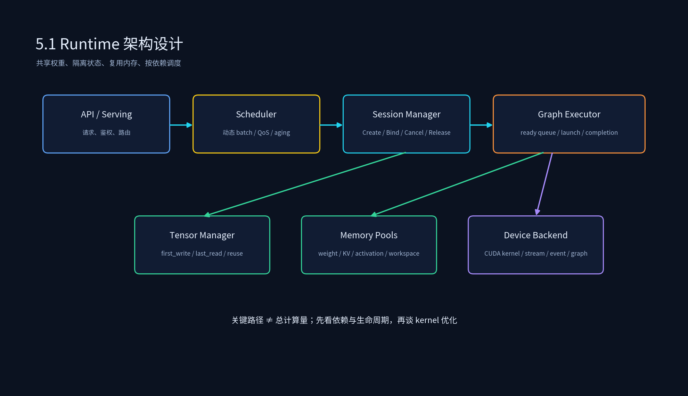
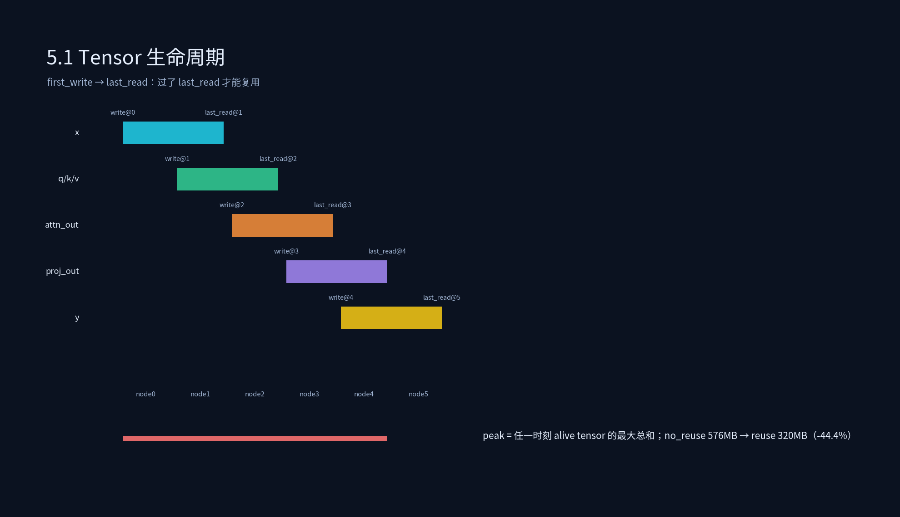

# 4.1 Runtime 架构设计





## 课程概述

Runtime 是推理系统里最靠近硬件的一层。上面的训练框架、图优化器、量化工具、Serving 框架，最终都要回答一个问题：**给定一个模型和一批请求，如何在这台机器上稳定、低延迟、高吞吐地执行完？** 这就是 Runtime 的职责。

很多初学者把 Runtime 理解成“调用 kernel 的 for 循环”，这只对了一半。生产级 Runtime 至少要同时处理四件事：

1. **正确性**：输入输出契约、shape/dtype/layout、数值一致性、异常路径。
2. **资源管理**：权重、KV Cache、activation、workspace、stream、event、内存池。
3. **并发与调度**：多 Session、多请求、动态 batch、优先级、取消与超时。
4. **性能优化**：关键路径、kernel launch overhead、显存带宽、同步开销、CUDA Graph。

本节先把 Runtime 的架构骨架搭起来：Session 管理、Graph Executor、Tensor 生命周期、调度流程与瓶颈分析。后面的内存池、CUDA Graph、多流、动态 batch，都是在这个骨架上继续深化。

学完本节后，你应该能够：

- 画出一个推理 Runtime 的核心组件图，并说明每个组件的职责。
- 解释为什么 Session 要“共享权重、隔离状态”。
- 用依赖图计算关键路径，判断优化应该偏向并行化还是偏向单点 kernel。
- 用 Tensor 生命周期做内存复用，估算峰值显存下降空间。
- 说出 Runtime 常见性能瓶颈分别对应哪一层。

---

## 1. Runtime 在推理系统中的位置

可以把一个推理系统粗略分成五层：

```text
业务层：API、鉴权、限流、计费、prompt/response 处理
调度层：请求路由、动态 batch、优先级、负载均衡
执行层：Graph Executor、Session、Scheduler、Stream/Event
内存层：权重加载、KV Cache、activation、workspace、内存池
硬件层：CUDA kernel、Tensor Core、显存带宽、驱动、NCCL
```

Runtime 主要覆盖 **执行层 + 内存层**，并向上给调度层提供能力接口，向下管理硬件执行。

一个典型请求在 Runtime 中的路径：

```text
Request arrives
  → 创建/复用 Session
  → 绑定模型权重与 IO info
  → Prefill：执行 prompt 子图，写 KV Cache
  → Decode：循环执行 decode step 子图，写新 token KV
  → 输出 token，更新 Session 状态
  → Finish/Cancel：回收 stream、event、workspace、KV blocks
```

注意：如果任何一步的资源没有回收，长时间运行后就会出现显存泄漏、碎片、event 泄漏、stream 卡死。这也是 Runtime 比单次 demo 难很多的原因。

---

## 2. Session 管理

### 2.1 Session 到底是什么？

Session 不是“一个请求”这么简单，它是请求在 Runtime 中的执行上下文。一个 Session 通常包含：

```cpp
struct Session {
  SessionId id;
  std::shared_ptr<ModelWeights> weights;   // 多 Session 共享
  std::unique_ptr<KVCache> kv;             // Session 独占
  std::unique_ptr<Workspace> workspace;    // 可独占，也可按 scope 从池分配
  cudaStream_t stream;                     // 执行流
  cudaEvent_t done_event;                  // 完成事件
  RequestState state;                      // waiting/prefill/decode/done/canceled
  Deadline deadline;                       // 超时与取消
  QosClass qos;                            // 优先级
};
```

设计 Session 时，最重要的原则是：

> **共享只读数据，隔离可变状态。**

权重是只读的，应该共享；KV Cache、采样状态、中间激活、输出 buffer 是可变的，必须隔离。Prefix Cache 看起来是共享 KV，但它共享的是“只读的历史前缀 KV”，当前 Session 新生成的 KV 仍然要隔离或 copy-on-write。

### 2.2 Session 生命周期

一个完整生命周期通常是：

```text
Create
  → BindModelAndIO
  → AcquireResources(stream, workspace, kv blocks)
  → Prefill
  → Decode loop
  → Finish / Cancel / Timeout
  → ReleaseResources
  → Destroy
```

工程上要特别设计异常路径：

- 客户端断开：Session 要能从 waiting/running 安全取消。
- 超时：watchdog 触发 cancel，不能无限等待 kernel。
- OOM：不能只是 crash，要有降级策略，如降 batch、缩短 max_seq_len、拒绝新 Session。
- kernel 失败：要记录是哪个 graph、哪个 node、哪个 Session、哪组 IO。

### 2.3 Session 池化

创建/销毁 Session 也有成本：stream/event 创建、workspace 分配、KV block 初始化。生产上常用 Session pool：

- 空闲 Session 不销毁，只 Reset 状态。
- KV blocks 归还 block pool，但 Session 对象复用。
- stream/event 可以复用，但必须确保上一次 work 已完成或已取消。

Session 池化的风险是状态残留。所有复用前必须显式 Reset：token 状态、采样状态、deadline、QoS、错误码、事件状态。

---

## 3. Graph Executor 执行引擎

### 3.1 Graph Executor 的输入

Graph Executor 接收的一般是一个已经优化过的计算图，例如：

```text
input x
  → qkv_proj(x) -> q,k,v
  → attention(q,k,v) -> attn_out
  → out_proj(attn_out) -> proj_out
  → layernorm(proj_out) -> norm_out
  → mlp(norm_out) -> y
output y
```

每个节点至少需要：

```cpp
struct Node {
  std::string name;
  OpType op;
  std::vector<TensorId> inputs;
  std::vector<TensorId> outputs;
  KernelFn kernel;
  WorkspaceSpec workspace;
  CostModel cost;          // 可选：估计耗时/显存带宽
};
```

Graph Executor 不负责“模型是什么”，它负责“这个图按什么顺序、在什么 stream、用哪些 buffer 执行”。

### 3.2 拓扑执行与 ready queue

最基础的执行方式是拓扑序：

```cpp
while (!done) {
  auto ready = graph.nodes_where_all_inputs_ready();
  for (auto node : ready) {
    executor.launch(node, session.stream, session.allocator);
  }
}
```

但生产 Runtime 不会这么简单。它还要处理：

- 多 Session 的 ready node 竞争同一 GPU。
- 某些 node 可以进 CUDA Graph，某些必须 eager。
- 某些 node 是 memory-bound，某些是 compute-bound，调度顺序会影响显存峰值。
- prefill node 和 decode node 的调度目标不同。

### 3.3 关键路径分析

总计算量：

$$
total\_compute = \sum node.compute\_time
$$

关键路径：

$$
critical\_path = \max_{\text{all paths}} \left( \sum node.compute\_time \right)
$$

如果 `critical_path << total_compute`，说明图中有并行空间：可以通过多 stream、算子并行、batch 内并行提升利用率。
如果 `critical_path ≈ total_compute`，说明图基本是串行的：优化重点应该是单点 kernel、融合、量化，而不是盲目开更多 stream。

示例脚本 `runtime_scheduler_simulator.py` 中的图是串行链，所以关键路径等于总计算量。真实模型里，attention 的 q/k/v 计算、MLP 的 gate/up 可能存在并行分支，关键路径会小于总计算量。

---

## 4. Tensor 生命周期管理

### 4.1 生命周期怎么计算？

对每个 tensor，我们关心两个时间点：

```text
first_write：哪个节点第一次写它
last_read：哪个节点最后一次读它
```

tensor 必须在 `[first_write, last_read]` 内存活；过了 `last_read`，它的内存可以复用。

示例：

```text
node0: write x
node1: read x, write q,k,v
node2: read q,k,v, write attn_out
node3: read attn_out, write proj_out
```

生命周期：

```text
x: [0,1]
q,k,v: [1,2]
attn_out: [2,3]
proj_out: [3,...]
```

### 4.2 不复用 vs 复用

不复用时，峰值显存近似是所有 tensor 大小求和。复用时，峰值显存是任意时刻仍然 alive 的 tensor 大小之和的最大值。

脚本输出中：

```text
peak activation memory (no reuse): 576.0 MB
peak activation memory (with reuse): 320.0 MB
memory saved: 44.4%
```

这说明生命周期复用能显著降低峰值显存。但它也带来风险：如果某个 tensor 的 last_read 标错，后续节点可能读到被覆盖的数据。生产上必须配合：

- 静态图生命周期分析。
- refcount 或 scope-based 释放。
- debug 模式下的 tensor poisoning：释放后填特殊值，尽早发现 use-after-free。

### 4.3 KV Cache 与 activation 的区别

activation 通常在一个 graph 执行内有明确生命周期；KV Cache 跨 decode step、跨 Session 存在。不要混在一个池里：

- activation/workspace：短生命周期，适合 Arena Reset。
- KV Cache：长生命周期，适合 block pool，按 Session/请求归还。

这也是 5.2 内存池要分池的原因。

---

## 5. 调度流程与性能瓶颈分析

### 5.1 一个更真实的调度循环

```cpp
while (runtime.alive()) {
  // 1. 接收新请求，创建或复用 Session
  auto new_sessions = session_manager.poll_new_requests();

  // 2. 处理取消/超时
  watchdog.cancel_expired_sessions();

  // 3. 动态 batch：决定本轮哪些 Session 进入执行
  auto batch = scheduler.form_batch(session_manager.runnable_sessions());

  // 4. 为 batch 选择 graph：prefill graph / decode graph / bucket graph
  auto executable = graph_selector.select(batch);

  // 5. 分配 workspace/KV blocks
  if (!allocator.try_allocate(executable)) {
    scheduler.defer_or_preempt(batch);
    continue;
  }

  // 6. 发射：eager 或 cudaGraph replay
  executor.launch(executable, batch.stream);

  // 7. 异步完成：更新 Session 状态，回收可复用 tensor
  completion_queue.poll();
}
```

### 5.2 瓶颈类型对照表


| 瓶颈               | 典型现象                            | 先看哪层       | 常用手段                          |
| ------------------ | ----------------------------------- | -------------- | --------------------------------- |
| 依赖链长           | GPU 利用率低，但单 kernel 很快      | Graph Executor | 图重写、融合、并行分支            |
| launch overhead 高 | 小 kernel 多，p99 抖动              | Executor/CPU   | CUDA Graph、融合、批量发射        |
| 显存分配抖动       | 偶发卡顿，cudaMalloc 出现在 profile | Memory         | Arena/SizeClassPool、预分配       |
| 同步过多           | stream synchronize 频繁             | Stream/Event   | event、callback、completion queue |
| 显存带宽不足       | kernel 时间长但 SM 利用率低         | Kernel/Memory  | 量化、layout、融合、减少搬运      |
| 调度不公平         | 短请求等待长，p95 差                | Scheduler      | 动态 batch、aging、抢占           |
| Session 泄漏       | 长时间运行显存上涨                  | Session/Memory | 回收审计、Reset、泄漏扫描         |

### 5.3 性能分析顺序

建议不要一上来就写自定义 kernel。顺序应该是：

1. 先确认正确性和资源回收：没有泄漏、没有错误复用。
2. 再看调度：batch 是否填满，queue wait 是否过长。
3. 再看执行：关键路径、launch overhead、同步点。
4. 最后才是 kernel：量化、融合、自定义算子、CUDA Graph。

---

## 6. 代码实践

```bash
python 4.1_Runtime架构设计/runtime_scheduler_simulator.py
```

重点看四组输出：

1. **Graph nodes**：每个节点的 compute 与 memory。
2. **Tensor lifetimes**：每个 tensor 的 first_write 与 last_read。
3. **critical path vs total compute**：判断是否有并行空间。
4. **Session scaling**：Session 增加时，权重不变但 activation 线性增长。

建议改参数做实验：

- 给 attention 增加两个并行分支，看 critical path 是否下降。
- 把某个 tensor 的 last_read 改长，看峰值显存如何上升。
- 把 Session 数从 8 调到 32，看 activation 何时超过权重。

---

## 7. 常见误区

### 7.1 “Runtime 就是调 kernel”

错。Runtime 还要管理资源生命周期、并发、取消、异常、指标。只调 kernel 的 demo 跑几小时就可能泄漏或抖动。

### 7.2 “Session 越多越好”

Session 多能提高并发，但 KV Cache/activation 也线性增长。超过显存后，吞吐会崩，不是缓慢下降。

### 7.3 “只要平均快就行”

Runtime 更看 p95/p99 和最坏情况。一次 cudaMalloc、一次 stream sync、一次长 prefill，都可能把 p99 打爆。

---

## 8. 本节小结

1. Runtime 的架构核心：**Session 管状态，Graph Executor 管执行，Tensor Manager 管显存，Scheduler 管顺序与公平**。
2. Session 要共享权重、隔离状态，并设计好 Create/Bind/Prefill/Decode/Cancel/Release 全生命周期。
3. 优化前先做关键路径与生命周期分析：依赖链、并行空间、峰值显存、可复用 tensor。
4. 性能瓶颈要分层定位：调度、执行、内存、同步、kernel，不要一开始就陷入自定义算子。

---

## 9. 课后思考

1. 如果多个 Session 共享同一个 prefix cache，如何避免 copy-on-write 带来的同步？
2. Session pool 复用 stream/event 时，为什么必须等上一个 work 完成或取消？
3. 一个 graph 的 total compute 很大但 critical path 很短，你会优先加 stream 还是优先融合？为什么？
4. Tensor 生命周期复用如何用 refcount 实现？refcount 为 0 时还应该检查什么？
5. 设计一个 Runtime 健康指标：哪些信号能提前发现“Session 泄漏”而不是等 OOM？
