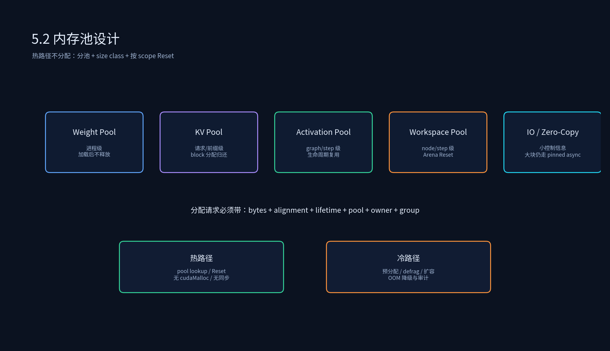
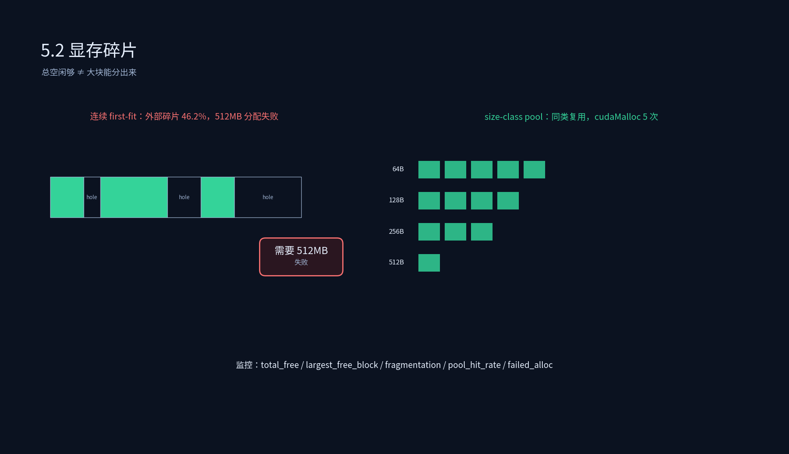

# 4.2 内存池设计





## 课程概述

内存管理是 Runtime 最容易被低估、也最容易决定线上稳定性的部分。很多推理事故表面是“kernel 慢”或“模型 OOM”，根因却是：热路径调用了 `cudaMalloc/cudaFree`、长短生命周期的 tensor 混在一个池里、显存碎片慢慢积累直到某天大块分不出来。

一个好的内存池不是简单的“缓存几块显存”，它要同时回答：

- 分配有多快？热路径是否零 cudaMalloc？
- 峰值是否可控？Session 增加时显存怎么涨？
- 碎片是否可观测？总显存够但大块分不出来怎么办？
- 生命周期是否清晰？Session 结束时哪些内存必须归还？
- 是否服务 CUDA Graph？graph 内地址是否固定？

本节从 Arena Allocator、Zero Copy、动态内存池与显存碎片四个角度，把 Runtime 内存层讲清楚。

---

## 1. 为什么不能热路径 cudaMalloc/cudaFree？

### 1.1 性能问题

`cudaMalloc` 不是普通 malloc。它可能涉及驱动、页表、显存映射，延迟高且不稳定。一次几百微秒到毫秒级的分配，发生在 decode 热路径上，会直接打爆 p99。

`cudaFree` 更危险：在某些路径上它可能引入同步语义，让正在异步执行的 stream 被迫等待。你以为只是释放内存，实际上把整个异步流水线卡住了。

### 1.2 碎片问题

频繁分配/释放不同大小的块，会在显存里留下空洞。过一段时间可能出现：

```text
总空闲显存：6 GB
最大连续空闲块：300 MB
一个 512 MB 请求：失败
```

这就是典型外部碎片：总量够，连续大块不够。

### 1.3 并发问题

多 Session 同时分配时，如果没有统一池化，峰值显存不可控。一个 Session 的大 workspace 与另一个 Session 的 KV Cache 叠加，就可能瞬间 OOM。

---

## 2. Arena Allocator：最快的分配器

### 2.1 基本思想

Arena Allocator 一次性申请一大块内存，之后分配只是移动偏移量：

```cpp
class ArenaAllocator {
 public:
  void* Alloc(size_t bytes, size_t alignment) {
    size_t aligned = AlignUp(offset_, alignment);
    if (aligned + bytes > capacity_) return nullptr;
    offset_ = aligned + bytes;
    return base_ + aligned;
  }

  void Reset() { offset_ = 0; }
};
```

优点：

- 分配是 O(1)，热路径极快。
- 没有碎片，因为一次 Reset 全部回收。
- 非常适合短生命周期 workspace：一个 graph/一次 prefill/一个 decode step 内使用的临时 tensor。

缺点：

- 不能精细释放单个 tensor，只能按 scope Reset。
- 如果生命周期估计错误，要么内存不够，要么浪费。

### 2.2 适用边界

Arena 适合：

- graph 内临时 activation。
- 一次请求内的 workspace。
- 生命周期严格小于 Session/Graph scope 的 buffer。

不适合：

- KV Cache：跨 decode step、跨请求存活。
- 长生命周期 cache：prefix cache、模型权重、跨 Session 共享结构。
- 多 Session 不同生命周期的混合分配。

---

## 3. Size-Class Free List：碎片与速度的平衡

长期在线服务不能只靠 Arena Reset，需要能分配/释放不同生命周期的块。常见做法是 size-class pool：

```text
64B, 128B, 256B, 512B, 1KB, 2KB, ...
```

分配时向上取整到 size class；释放时挂回对应 free list。这样会浪费一些内部空间（internal fragmentation），但换来：

- 分配/释放接近 O(1)。
- 复用率高，热路径几乎不 cudaMalloc。
- 外部碎片大幅降低，因为同类块反复使用。

脚本 `memory_pool_simulator.py` 中，连续 first-fit 在一个交错分配序列里出现了 `f` 分配失败和 `46.2%` 最大外部碎片；size-class pool 只用了 5 次 cudaMalloc。这个对比就是内存池价值的直观体现。

### 3.1 size class 怎么定？

不要盲目 2 的幂。要根据 profile 的分配分布：

- KV block：固定大小，单独池。
- workspace：少数几种大尺寸，单独池。
- 小 tensor/metadata：64B-4KB，密集 size class。
- 大 activation：按模型图静态分析预分配。

原则：

> 高频小块用密集 size class；低频大块用少量大尺寸 class；固定大小的关键资源单独池。

---

## 4. 分池：比“一个池子”更重要

Runtime 里不同内存的生命周期差异巨大，混在一个池里一定出问题。建议至少分四池：

| 池 | 内容 | 生命周期 | 分配策略 |
|----|------|----------|----------|
| weight pool | 模型权重、量化 scale | 进程级 | 启动加载，基本不释放 |
| kv pool | KV Cache blocks | 请求级/前缀级 | block pool，按 Session 归还 |
| activation pool | graph 中间激活 | graph/step 级 | 生命周期复用或 Arena |
| workspace pool | kernel 临时空间 | node/step 级 | Arena Reset 或 size class |

分池的好处：

- 长生命周期权重不被短生命周期 workspace 切碎。
- KV pool 可以单独做 block 管理、prefix cache、swap。
- workspace 可以大胆 Reset，不影响 KV。
- OOM 时能知道是哪类内存爆了，而不是只看到总显存。

---

## 5. Zero Copy 技术

### 5.1 Zero Copy 是什么？

Zero Copy 通常指 host memory 映射到 device 地址空间，CPU/GPU 都能访问，不需要显式 `cudaMemcpy`。常见形式：

- `cudaHostAllocMapped` + `cudaHostGetDevicePointer`
- unified memory / managed memory
- 某些平台上的 pinned host memory 直接映射

### 5.2 适合与不适合

适合：

- 小控制信息：flags、counter、seed、shape params。
- CPU 频繁写、GPU 偶尔读的 metadata。
- 需要避免一次同步 copy 的低延迟路径。

不适合：

- 大块输入：pinned staging + `cudaMemcpyAsync` 更稳定。
- GPU 高频访问的大 tensor：放 device memory。
- 多 GPU 共享：一致性和带宽成本很高。

脚本中的对比：

```text
pageable H2D 256MB ≈ 16 ms
pinned H2D 256MB ≈ 5.12 ms
zero-copy mapped ≈ 0 explicit copy + access cost
```

注意“≈0”只是没有显式拷贝，不代表访问免费。GPU 反复读 host memory 可能比一次 copy 更慢。

---

## 6. 显存碎片：指标与治理

### 6.1 碎片指标

不要只看 `nvidia-smi`。Runtime 内部要记录：

```text
total_free
largest_free_block
external_fragmentation = 1 - largest_free_block / total_free
pool_hit_rate = pool_alloc_hits / total_allocs
failed_alloc_count
```

### 6.2 治理手段

1. **分池**：长短生命周期分开。
2. **size class**：减少不同大小交错造成的洞。
3. **生命周期排序**：先分配长生命周期 tensor，再放短生命周期。
4. **预分配**：启动时按最坏情况预留 KV/workspace。
5. **低峰整理**：在非热路径做 pool defrag；热路径绝不整理。
6. **OOM 降级**：failed alloc 触发降 batch、缩 max_seq_len、拒绝低优先级 Session。

---

## 7. 生产内存池接口建议

```cpp
enum class Lifetime { kStep, kGraph, kSession, kPrefix, kProcess };
enum class PoolKind { kWeight, kKV, kActivation, kWorkspace, kIO };

struct AllocReq {
  size_t bytes;
  size_t alignment;
  Lifetime lifetime;
  PoolKind pool;
  SessionId owner;
  GroupId group;
};

class MemoryPool {
 public:
  void* Alloc(const AllocReq& req);
  void Free(void* p, const AllocReq& req);
  void Reset(Scope scope, SessionId owner);
  double Fragmentation(PoolKind pool) const;
  size_t PeakBytes(PoolKind pool) const;
};
```

关键是把 `lifetime`、`pool`、`owner`、`group` 放进分配请求。没有这些信息，后续回收、隔离、CUDA Graph、group quota 都做不稳。

---

## 8. 代码实践

```bash
python 4.2_内存池设计/memory_pool_simulator.py
```

建议改三个地方做实验：

1. 把分配序列改成“长生命周期 KV + 短生命周期 workspace 交错”，看 first-fit 失败是否更早出现。
2. 把 size class 从 2 的幂改成 1.5 倍增长，看内部浪费与失败率变化。
3. 把 `f` 改成 256MB，看碎片指标是否仍然导致失败。

---

## 9. 本节小结

1. 内存池的目标不是“少调几次 malloc”，而是让 Runtime 的热路径 **可预测**：无 cudaMalloc、无同步、峰值可控、碎片可观测。
2. Arena 适合短生命周期 workspace；size-class pool 适合长期在线复用；KV/权重/activation/workspace 必须分池。
3. Zero Copy 适合小控制信息，不适合大块高频数据；大块输入优先考虑 pinned + async copy 或 device memory。
4. 碎片要靠指标治理：total_free、largest_free_block、fragmentation、pool_hit_rate、failed_alloc_count。

---

## 10. 课后思考

1. 为什么 `cudaFree` 有时比 `cudaMalloc` 更危险？
2. KV Cache 为什么不适合和 workspace 放在同一个 Arena 里 Reset？
3. size-class pool 的内部浪费和 first-fit 的外部碎片，在线服务更应该怕哪个？
4. 设计一个 OOM 降级策略：failed alloc 发生后，先降 batch、先缩 max_seq_len，还是先拒绝低优先级 Session？
5. 如果要做 CUDA Graph，内存池必须额外保证哪两个条件？
