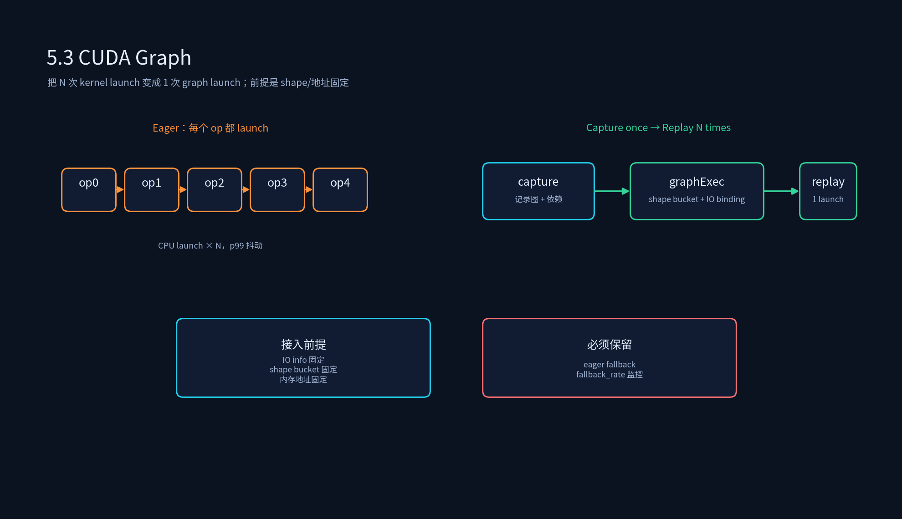
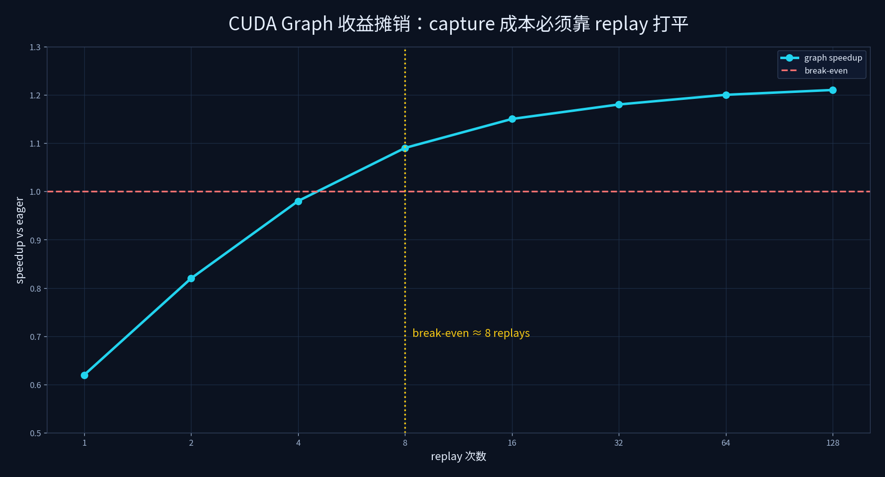

# 4.3 CUDA Graph





## 课程概述

在推理 Runtime 里，GPU kernel 本身往往不是唯一成本。对每个 kernel，CPU 还要做参数准备、驱动调用、stream 提交。当模型由大量小 kernel 组成，或者业务要求很低 p99 延迟时，**Kernel Launch Overhead** 会成为明显瓶颈。

CUDA Graph 的价值在于：把一串固定 kernel 调用捕获成一张图，后续用一次 `cudaGraphLaunch` 重放。它本质上是把“CPU 每次都发射一串命令”改成“CPU 发射一次命令，GPU 按图执行”。

但 CUDA Graph 也很容易被误用：shape 变了、内存地址变了、只执行一次、capture 成本没摊销，都会让收益变负。本节把原理、捕获、重放、静态 shape、bucket、fallback 和收益估算讲清楚。

---

## 1. Kernel Launch Overhead 从哪里来？

一次 kernel launch 不只是 `kernel<<<>>>` 这一行。CPU 侧通常还要：

- 准备参数 buffer/常量。
- 检查 stream、event、依赖。
- 调用驱动提交命令。
- 处理错误码与同步点。

如果一个大模型 decode step 有几十到几百个小 kernel，每个 kernel 只有几微秒，launch overhead 就会显著占比。表现通常是：

- 平均耗时还可以，但 p95/p99 抖动大。
- Nsight 里看到 GPU 有很多小空隙，CPU launch 很密。
- batch 小或输出短时，吞吐上不去。

---

## 2. CUDA Graph 原理

### 2.1 捕获与重放

传统执行：

```cpp
for (auto& op : ops) {
  Launch(op, stream);
}
cudaStreamSynchronize(stream);
```

CUDA Graph：

```cpp
cudaStreamBeginCapture(stream, mode);
for (auto& op : ops) {
  LaunchWithoutImmediateExec(op, stream);
}
cudaGraphExec_t exec;
cudaStreamEndCapture(stream, &exec);

// later
cudaGraphLaunch(exec, stream);
cudaStreamSynchronize(stream);
```

捕获时，CUDA 记录图中的节点与依赖；重放时，整图作为一次提交执行。收益来自：

- launch 次数从 N 个 kernel 降为 1 次 graph launch。
- 驱动可以提前看到依赖，减少调度空隙。
- 减少 CPU 参与，降低 p99 抖动。

### 2.2 图内固定性

CUDA Graph 的核心限制是：**图一旦捕获，结构、shape、内存地址就固定了。**

具体来说，replay 时通常不能改变：

- kernel 参数中的 device pointer。
- batch size、seq length、hidden size 等影响 launch 配置的 shape。
- 节点数量和依赖关系。
- workspace 地址与大小。

所以 CUDA Graph 不是“把模型 capture 一次就完事”，而是要设计 shape bucket、内存池和 fallback。

---

## 3. 静态图捕获与重放

### 3.1 Capture 前检查清单

在 capture 之前，必须确认：

1. **IO 契约固定**：输入/输出 shape、dtype、layout、device 固定或由 bucket 固定。
2. **地址固定**：输入、输出、workspace 都来自内存池，并且生命周期覆盖 replay。
3. **无动态分配**：图内不能有运行期 `cudaMalloc`。
4. **无动态控制流**：没有根据输入值改变 kernel 序列的分支。
5. **可回退**：shape 不匹配或 capture 失败时能回退 eager。

### 3.2 Replay 的关键：IO Binding

很多框架并不是把输入地址写死，而是在 replay 前绑定 IO：

```cpp
struct GraphKey {
  GraphName name;
  IOInfo io;
  int batch_bucket;
  int seq_bucket;
  DataType dtype;
};

exec = graph_manager.GetOrCapture(key, builder);
graph_manager.BindInput(exec, "input", input_ptr);
graph_manager.BindOutput(exec, "output", output_ptr);
graph_manager.Replay(exec, stream);
```

要点：`input_ptr/output_ptr` 也必须来自固定池。如果每次请求都从临时 cudaMalloc 拿地址，graph 就失去意义。

---

## 4. 减少 Kernel Launch Overhead：收益怎么估？

脚本 `cuda_graph_benefit_estimator.py` 使用简化模型：

```text
no_graph_iter = Σ kernel_time + num_ops × launch_overhead + sync_overhead

graph_total = capture_cost + replays × (Σ kernel_time + replay_launch + sync_overhead)
graph_per_iter = graph_total / replays
speedup = no_graph_iter / graph_per_iter
```

当前脚本输出里：

```text
no graph per iteration: 153 us
replays=1: 0.62x
replays=4: 0.98x
replays=8: 1.09x
replays=64: 1.20x
break-even: 8 replays
```

解读：

- 只 replay 1 次，CUDA Graph 反而更慢，因为 capture 成本没摊销。
- replay 到 8 次左右才打平。
- 超过后收益趋缓，因为 kernel time 仍占主导。

这就是 CUDA Graph 的真实世界：**不是所有图都值得 capture，也不是 capture 后立刻变快。**

---

## 5. 动态请求怎么用 CUDA Graph？

### 5.1 Bucket 策略

动态 batch/seq 不等于不能用 graph，但要分桶：

| bucket 维度 | 示例 | 代价 |
|-------------|------|------|
| batch size | 1, 4, 8, 16, 32 | 多 capture 几张图，显存按最大 bucket 预留 |
| seq length | 128, 512, 1024, 4096 | prompt 长度差异大时 bucket 增多 |
| decode step | 固定每步 1 token | 最适合 capture |
| dtype/quant | fp16/int8/fp8 | 不同 dtype 要不同 graph key |

经验：

- **decode step 最适合 CUDA Graph**：每步输入 token 数固定，replay 次数极多。
- **prefill 更难**：prompt 长度变化大，可按长度 bucket 或只用 chunked prefill。
- **不要为每个 shape 都 capture**：bucket 太多会导致 capture 成本和显存预留失控。

### 5.2 Graph Key 设计

一个安全的 graph key 至少包含：

```text
graph_name + io_info_hash + batch_bucket + seq_bucket + dtype + device + quant_config + allocator_id
```

如果 key 少算了 dtype 或 allocator_id，就可能 replay 到错误 graph，产生数值错误或非法地址。

---

## 6. 与算子融合、多流的关系

- **算子融合**：减少 kernel 数量，从源头降低 launch overhead，但需要改 kernel/图。
- **CUDA Graph**：不改数学，只把固定 kernel 串打包，风险在于固定性。
- **多流**：解决不同工作之间的 overlap；CUDA Graph 解决一串固定 work 的发射开销。

生产上常见组合：

```text
图优化/融合减少 op 数
  → 内存池固定地址
  → decode step capture 成 CUDA Graph
  → 多 stream 处理 H2D/D2H 与不同 Session overlap
  → eager fallback 处理 shape 不匹配
```

---

## 7. 生产风险与监控

| 风险 | 表现 | 处理 |
|------|------|------|
| shape 不匹配 | replay 报错或结果错 | bucket + IO info 校验 + eager fallback |
| 地址变化 | 非法访问/结果错 | 固定池，禁止热路径 cudaMalloc |
| capture 成本未摊销 | 平均更慢 | 只 capture 高频 graph，记录 replay count |
| 调试困难 | 错误只显示 graph failed | 保留 eager 对照、per-op profile 开关 |
| 版本升级 | 性能回退或行为变化 | CUDA/driver/框架升级后回归 graph |

必须监控：

- capture_time、replay_time、replay_count。
- fallback_rate：多少请求没走 graph。
- p50/p95/p99，尤其 p99 是否下降。
- 显存预留：bucket 导致的额外 workspace/KV 预留。

---

## 8. 代码实践

```bash
python 4.3_CUDA_Graph/cuda_graph_benefit_estimator.py
```

建议改参数：

1. 把 `LAUNCH_OVERHEAD_US` 从 5 调到 15，观察 break-even 提前还是延后。
2. 把 `GRAPH_CAPTURE_US` 从 120 调到 500，观察 break-even 变化。
3. 给 `OPS` 增加更多 1-3us 的小 kernel，观察 speedup 上限变化。

---

## 9. 本节小结

1. CUDA Graph 解决的是 **一串固定 kernel 的 CPU 发射开销与 p99 抖动**，不是让单个 kernel 数学更快。
2. 接入前提是：IO info 固定、shape bucket 固定、内存地址固定、无动态分配、有 eager fallback。
3. decode step 通常最适合；prefill 要谨慎 bucket。capture 成本必须靠 replay 摊销。
4. 评价 CUDA Graph 不只看平均耗时，要看 p99、fallback rate、显存预留和 replay count。

---

## 10. 课后思考

1. 为什么 decode step 比 prefill 更容易从 CUDA Graph 受益？
2. 如果 batch size 在 1-64 连续变化，你会设计多少个 batch bucket？如何避免 bucket 爆炸？
3. CUDA Graph 与算子融合都能减少 launch overhead，什么时候应该先融合，什么时候应该先接 graph？
4. 生产上发现 CUDA Graph 结果偶发错误，你会按什么顺序排查：IO binding、内存池生命周期、graph key、driver 版本？
5. 如果一个 graph 每天只 replay 2 次，但 capture 要 2 秒，值得接吗？为什么？
