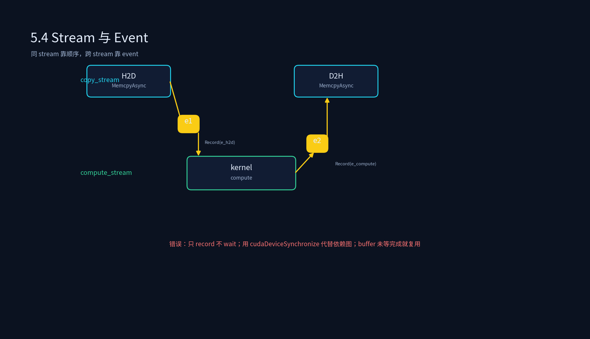
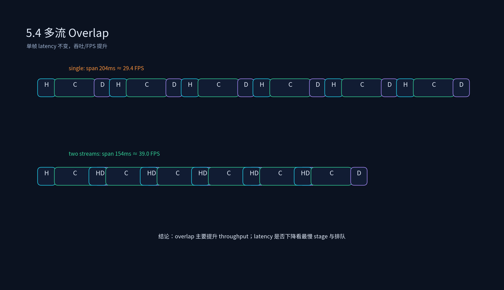

# 4.4 多流并发执行





## 课程概述

推理执行不是只有“算 kernel”。一次完整请求通常还有：host 预处理、H2D copy、device compute、D2H copy、host 后处理。单 stream 会把这些阶段串成一条线，GPU 在 copy、同步、预处理时经常空闲。多流并发执行的目标是：**用 CUDA Stream + Event 把依赖关系画清楚，让可重叠的工作真正重叠起来**。

但多流也是事故高发区：看起来并行了，实际上依赖没建对，结果偶发错误；或者 stream 开太多，调度开销反而更高。本节把 CUDA Stream、异步执行、计算/通信重叠、流同步与事件机制讲透。

---

## 1. CUDA Stream 到底是什么？

CUDA Stream 是一串按顺序提交到 GPU 的命令：kernel、memcpy、memset、event record 等。同一个 stream 内命令按顺序执行；不同 stream 之间默认没有顺序。

```cpp
cudaMemcpyAsync(d_x, h_x, bytes, cudaMemcpyH2D, copy_stream);
kernel<<<grid, block, 0, compute_stream>>>(d_x);
cudaMemcpyAsync(h_y, d_y, bytes, cudaMemcpyD2H, copy_stream);
```

这段代码的问题：`compute_stream` 和 `copy_stream` 没有建立依赖，kernel 可能在 H2D 完成前执行，D2H 也可能在 kernel 完成前执行。要正确，必须用 event 建边。

---

## 2. 异步执行与事件机制

### 2.1 Event 的正确模型

Event 是 stream 上的一个“点”。两个基本操作：

```cpp
cudaEventRecord(event, stream);       // 在 stream 上打一个点
cudaStreamWaitEvent(stream, event);   // stream 后续命令等这个点完成
```

正确写法：

```cpp
// H2D on copy_stream
cudaMemcpyAsync(d_x, h_x, bytes, H2D, copy_stream);
cudaEventRecord(e_h2d, copy_stream);

// compute waits H2D
cudaStreamWaitEvent(compute_stream, e_h2d);
kernel<<<..., compute_stream>>>(d_x);
cudaEventRecord(e_compute, compute_stream);

// D2H waits compute
cudaStreamWaitEvent(copy_stream, e_compute);
cudaMemcpyAsync(h_y, d_y, bytes, D2H, copy_stream);
```

原则：

> 同 stream 靠顺序，跨 stream 靠 event。不要用 `cudaDeviceSynchronize` 代替依赖图。

### 2.2 同步方式对比

| 方式 | 语义 | 热路径建议 |
|------|------|------------|
| `cudaDeviceSynchronize` | 等整个 device | 只在初始化/调试 |
| `cudaStreamSynchronize` | 阻塞 host 等一个 stream | 热路径少用 |
| `cudaEventSynchronize` | 阻塞 host 等一个 event | 可用，但尽量异步 |
| `cudaStreamWaitEvent` | GPU 侧等待 event | 推荐，用于建依赖 |
| callback/completion queue | 完成后异步通知 | 生产推荐 |

---

## 3. 多流重叠计算与通信

### 3.1 可重叠的场景

最常见的收益来自流水线：

```text
帧 N-1:        H2D   compute   D2H
帧 N:             H2D   compute   D2H
帧 N+1:               H2D   compute   D2H
```

如果 H2D/D2H 与 compute 在不同 stream，并且依赖正确，帧 N 的 compute 可以与帧 N+1 的 H2D、帧 N-1 的 D2H 重叠。

脚本 `multi_stream_overlap_simulator.py` 输出：

```text
Single Stream total span: 204 ms ≈ 29.41 FPS
Two Streams total span: 154 ms ≈ 38.96 FPS
```

注意：单帧 latency 仍然是 34ms，多流提升的是 **吞吐/FPS**，不一定降低单帧端到端延迟。这个结论很重要，很多简历把多流写成“降低延迟”，面试官会追问：降低的是 latency 还是提高 throughput？

### 3.2 什么时候 overlap 明显？

- H2D/D2H copy 时间不可忽略。
- 有多帧/多请求可以流水。
- compute 不是唯一瓶颈，GPU 在 copy 或预处理时会空转。
- buffer 足够做双缓冲/多缓冲。

什么时候不明显？

- compute 已经打满，copy 很小。
- 只有单请求，没有后续工作可重叠。
- 依赖复杂到 event 开销超过收益。

---

## 4. Buffer 设计：多流的前提

多流不是只开几个 stream 就行，还要有 buffer 支持：

```text
pinned input buffer[2]
device input buffer[2]
device output buffer[2]
pinned output buffer[2]
```

双 buffer 流程：

```text
帧 N 用 buffer[0]：H2D[0] → compute[0] → D2H[0]
帧 N+1 用 buffer[1]：H2D[1] 可在 compute[0] 时进行
帧 N+2 用 buffer[0]：必须等 D2H[0] 完成后才能复用
```

风险点：

- host buffer 复用前必须等对应 D2H/H2D 完成。
- device buffer 复用前必须等 compute 完成。
- 多 Session 不能共享未隔离的 buffer，否则串话。

---

## 5. 多 Session / 多模型下的多流

在 LLM Serving 或 AD 多模型中，多流还用于隔离不同类型工作：

- 高优先级 safety/control stream：不能被大模型 stream 饿死。
- prefill stream 与 decode stream：避免长 prefill 卡住 decode（也可结合 PD 解耦/chunked prefill）。
- copy engine 与 compute engine：让数据传输与计算重叠。

但要注意：stream 优先级不是万能的。真正保证高优先级，还需要：

- 限制低优先级 batch/token budget。
- 高优先级任务可抢占或走独立资源。
- watchdog 监控高优先级 deadline miss。

---

## 6. 常见错误

1. **只 record 不 wait**：event 创建了，但后续 stream 没等它，依赖丢失。
2. **event 复用错误**：上一个 event 还没完成就被 record 覆盖。
3. **host buffer 早读**：D2H 还没完成，CPU 就读输出。
4. **device buffer 早复用**：compute 还没完，就把输入 buffer 给下一帧。
5. **stream 过多**：几十个 stream 导致调度开销和调试困难。
6. **用全局同步兜底**：性能问题没解决，只是把异步全杀掉。

---

## 7. 代码实践

```bash
python 4.4_多流并发执行/multi_stream_overlap_simulator.py
```

建议做三个实验：

1. 把 `FRAME_INTERVAL_MS` 从 24 调到 10，看 two streams 是否还受益。
2. 把 H2D 从 6ms 调到 0.5ms，看 overlap 收益是否变小。
3. 增加一个 `postprocess_cpu` stage，并尝试用第三条 stream 建模。

---

## 8. 本节小结

1. 多流的核心不是“开 stream”，而是 **用 event 建依赖，让 H2D/compute/D2H/preprocess 的可重叠部分并行**。
2. 多流主要提升吞吐与资源利用率；单帧延迟是否下降取决于最慢 stage、排队和 buffer 复用。
3. `cudaStreamWaitEvent` 是热路径建依赖的方式；`cudaDeviceSynchronize` 不应出现在热路径。
4. 上线前检查：event 生命周期、buffer 复用条件、stream 优先级、completion callback 是否泄漏。

---

## 9. 课后思考

1. 如果 H2D 很小但 D2H 很大，应该如何调整 buffer 和 stream 数量？
2. 为什么 host buffer 复用前必须等 D2H 完成？如果用 pageable memory 会怎样？
3. 高优先级 safety stream 一定能保证 deadline 吗？还需要哪些调度配合？
4. 设计一个事件依赖图：两路相机 H2D、一个 BEV compute、一个规划 compute、一个 D2H，要求最大化 overlap 且结果正确。
5. 多流和 CUDA Graph 能一起用吗？如果可以，依赖边界应该放在 graph 内还是 graph 外？
