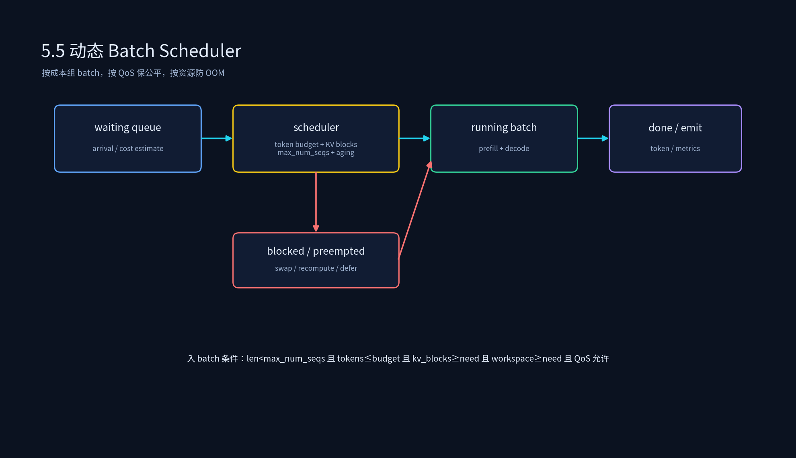
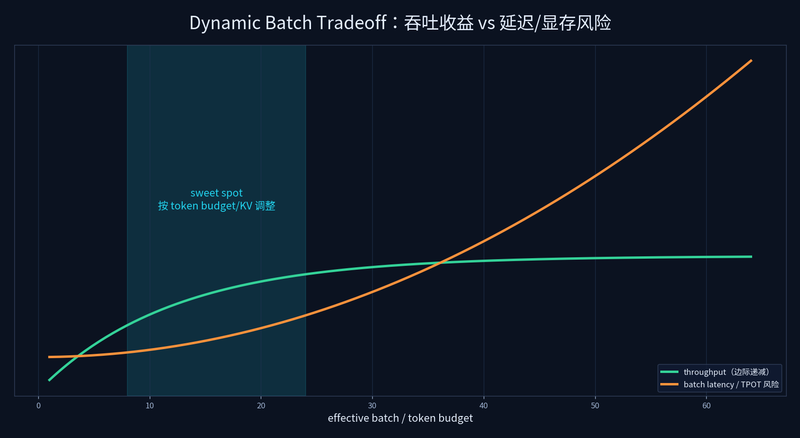

# 4.5 动态 Batch Scheduler





## 课程概述

Dynamic Batch Scheduler 是 Runtime 里最直接影响吞吐与延迟公平的组件。它决定：哪些请求进入同一个 batch、什么时候发射、batch 多大、长请求和短请求如何共处、显存不足时谁等待谁被抢占。

很多人把动态批处理理解成“把请求凑成 batch 就行”。这只说了表面。真正的难点在于：LLM/多模态请求的成本极不均匀，prompt 长度、输出长度、KV Cache、是否命中 prefix、是否走高优先级，都完全不同。只看请求数做 batch，线上一定会出现吞吐不稳定、p95 抖动、长请求拖死短请求。

本节从动态批处理策略、请求队列管理、负载均衡与资源利用率三个角度，把 Scheduler 讲清楚。

---

## 1. 为什么需要动态 Batch？

### 1.1 固定 batch 的问题

固定 batch 最简单：凑够 N 个请求或超时，就一起跑。问题是：

- 请求长度不同，要 padding 到最长，浪费计算。
- batch 内最短请求完成后仍占位置，拖尾严重。
- 新请求必须等当前 batch 完成，响应慢。

### 1.2 动态 batch 的收益

动态 batch/continuous batching 的核心是：

> 以 iteration/token 为粒度调度，而不是以 request 为粒度调度。

每个 iteration 结束后，完成的请求离开，新请求可以加入。这样 GPU 更容易保持高占用，短请求不被长请求拖死。

但动态 batch 不是没有代价：scheduler 复杂度、KV block 管理、抢占/重算、QoS 都上来了。

---

## 2. 动态批处理策略

### 2.1 FCFS：先到先服务

```text
按 arrival_time 排队，能进 batch 就进。
```

优点：公平、简单、无饥饿。  
缺点：长请求会占住 batch 位置，短请求等待变长；对 QoS 不敏感。

### 2.2 SJF：短请求优先

```text
优先处理预计成本低的请求。
```

优点：平均等待低。  
缺点：长请求可能永远进不了 batch，必须加 aging。

### 2.3 Priority/QoS

```text
高优先级请求优先进 batch，必要时抢占低优先级。
```

优点：满足业务 SLA。  
缺点：实现复杂，要处理抢占成本、低优先级饥饿、优先级反转。

### 2.4 Cost-aware

比 SJF 更通用：不按 arrival，也不只按 tokens，而是估计请求成本：

```text
cost ≈ prefill_tokens × prefill_cost + expected_decode_tokens × decode_cost + kv_blocks × kv_pressure
```

Cost-aware 更接近真实资源消耗，但估计误差会带来新问题。生产上常用“估计成本 + aging + deadline”折中。

---

## 3. 请求队列管理

Scheduler 至少要维护这些队列：

```text
waiting queue：已到达但还没进 batch
running queue：正在 batch 中执行
blocked queue：因显存/KV/优先级暂时不能执行
preempted queue：被抢占，等待恢复或重算
```

### 3.1 入 batch 条件

一个请求能进 batch，不应只看 `batch.size < max_batch_size`，还要看：

```text
len(batch) < max_num_seqs
Σ tokens(batch) + req.tokens <= token_budget
kv_blocks_free >= req.kv_blocks_needed
workspace_free >= req.workspace_needed
qos/deadline allows
```

这就是为什么 token budget 和 KV blocks 比 request count 更重要。8 个长 prompt 请求可能比 64 个短请求更耗资源。

### 3.2 Aging：防饥饿的关键

只要使用 SJF/priority/cost-aware，就必须考虑 aging：

```text
effective_priority = base_priority + α × wait_time
```

等待越久，优先级越高。否则长请求在短请求不断到达时会被饿死。

aging 参数不能拍脑袋：太小没效果，太大又会让高优先级新业务被老低优先级请求挤占。要用线上请求分布调。

---

## 4. 负载均衡与资源利用率优化

### 4.1 动态 batch 的收益模型

脚本中用一个简化模型：

```text
batch_time ≈ fixed_overhead + total_tokens × token_cost
throughput = total_tokens / total_time
```

fixed overhead 被 batch 内更多请求分摊，吞吐上升。当前脚本输出里，FCFS/SJF/Priority 吞吐相同，因为成本模型没有引入优先级对执行时间的影响；但平均等待不同：SJF 更低。真实系统里，优先级还会影响抢占、重算和资源分配，吞吐/延迟会进一步分化。

### 4.2 什么时候 batch 不是越大越好？

- batch 太大，单 iteration 时间变长，短请求 TPOT 变差。
- KV blocks 被大量请求占满，新请求进不来。
- 长 prompt 占比高时，prefill 时间长，decode 请求等待。
- GPU 已打满后，继续加 batch 只增加 queue，不增加吞吐。

所以 Scheduler 要同时看：

```text
batch_occupancy
queue_wait
kv_block_usage
gpu_idle_gap
p95_ttft / p95_tpot
```

### 4.3 抢占与重算

显存不足时，常见策略：

| 策略 | 做法 | 代价 |
|------|------|------|
| swap out | 把低优先级请求 KV 换到 CPU | CPU 内存占用，换回延迟 |
| recompute | 丢弃低优先级请求中间状态，恢复时重算 | 额外 GPU 计算 |
| defer | 不让新请求进 batch | 新请求等待变长 |
| reject | 拒绝低优先级/非 SLA 请求 | 业务可见失败 |

生产上不要只问“能不能抢占”，还要问“抢占后 p95 会不会更差”。

---

## 5. 代码实践

```bash
python 4.5_动态Batch_Scheduler/dynamic_batch_scheduler_simulator.py
```

建议改实验：

1. 把 `MAX_TOKENS_PER_BATCH` 从 4096 调到 1024，看 batch 数、等待和吞吐变化。
2. 给 SJF 加 aging：等待超过阈值后把成本折算降低，看长请求是否还能完成。
3. 把请求分布改成 90% 短请求 + 10% 超长请求，比较 FCFS 与 priority 的 p95 wait。

---

## 6. 生产调度器指标

一个可运维的 Dynamic Batch Scheduler 至少要暴露：

- `waiting_queue_len`、`running_batch_size`、`preempted_count`
- `batch_occupancy = running_seqs / max_num_seqs`
- `token_budget_usage`
- `kv_block_free / kv_block_used`
- `avg/p95 queue_wait`
- `avg/p95 ttft / tpot`
- `preemption_count / recompute_count / swap_bytes`
- `starvation_count`：等待超过阈值的请求数

没有这些指标，调度参数只能靠感觉调。

---

## 7. 本节小结

1. Dynamic Batch Scheduler 的核心不是“凑 batch”，而是 **按真实成本组织 batch，按 QoS 保公平，按资源防 OOM，按指标持续调参**。
2. token budget、KV blocks、workspace 比 request count 更能反映 batch 成本。
3. SJF/priority/cost-aware 都必须配 aging，否则长请求会饿死。
4. 抢占/重算/swap 是显存不足时的必要手段，但要把它们的成本计入 p95/p99，而不是只看吞吐。

---

## 8. 课后思考

1. 为什么长 prompt 请求多时，单纯提高 max_batch_size 可能让 TTFT 更差？
2. 设计一个 cost-aware 的成本公式：如何估计 expected_decode_tokens？
3. aging 的 α 太大或太小分别会导致什么线上现象？
4. KV blocks 不足时，swap、recompute、defer、reject 应该如何按业务优先级选择？
5. 如果高优先级请求到达时 batch 已满，你会插队、抢占，还是另走高优先级小 batch？为什么？
