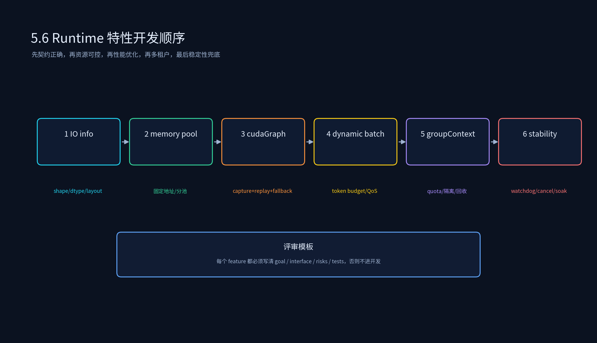
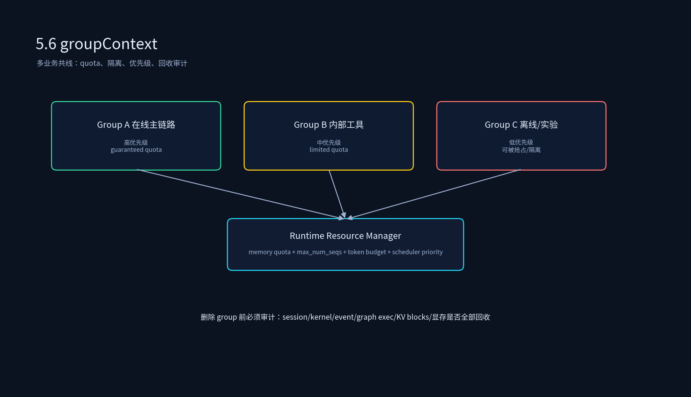

# 4.6 Relay/Relax Runtime 特性开发





## 课程概述

前五节讲的是 Runtime 的通用能力：架构、内存池、CUDA Graph、多流、动态 batch。这一节更贴近真实业务开发：在 Relay/Relax/自研 Runtime 中做特性落地，包括 auto IO info、cudaGraph、内存池优化、P1 allspark 配套 Runtime 的 groupContext，以及线上最重要的稳定性保障。

这一节的核心观点是：

> Runtime 特性开发不是堆功能，而是按顺序建立信任：先契约正确，再资源可控，再性能优化，再多租户隔离，最后稳定性兜底。

如果顺序反了——比如先接 cudaGraph 再做 IO info 和内存池——很容易出现“平均很快，但偶发结果错误，排查极难”。

---

## 1. auto IO info：先把输入输出契约定清楚

### 1.1 为什么 IO info 是第一优先级？

Runtime 的很多线上问题不是 kernel 不够快，而是输入输出契约错了：

- shape 推导错：把 `[B, S, H]` 当成 `[B, H, S]`。
- layout 错：kernel 要 NHWC，输入是 NCHW，产生隐式 transpose 或错误结果。
- dtype 错：FP16/BF16/INT8 混用，数值偏差偶发出现。
- alignment 错：vectorized kernel 需要 128/256B 对齐，输入没满足，性能或正确性出问题。
- device 错：某个中间 tensor 在 host，下游 kernel 期望 device。

auto IO info 的目标是把这些契约显式化、可校验、可缓存：

```cpp
struct TensorInfo {
  std::string name;
  std::vector<int64_t> shape;
  DataType dtype;
  DeviceType device;
  Layout layout;
  size_t alignment;
};

struct IOInfo {
  std::vector<TensorInfo> inputs;
  std::vector<TensorInfo> outputs;
};
```

### 1.2 auto IO info 应该做什么？

1. **注册**：graph 加载时声明 inputs/outputs 的 shape/dtype/layout/device/alignment。
2. **推导**：对动态 shape，用 symbolic dim 表达，如 `batch`、`seq_len`。
3. **校验**：Session 绑定输入时，检查是否满足 graph 的 IO contract。
4. **缓存**：把已推导的 shape 缓存起来，key 必须包含所有影响结果的 dim 值。
5. **报错**：给出可读错误：哪个 graph、哪个 tensor、期望什么、实际什么。

### 1.3 常见坑

- shape cache key 少了 dtype/layout，导致错误复用。
- 动态 shape 推导依赖 host 输入值，但 graph 已经在 device 上 capture。
- alignment 校验只检查首地址，没检查 stride。
- layout 转换被默默插入，性能掉了但没人发现。

---

## 2. cudaGraph：在契约和资源稳定后再接

cudaGraph 的接入顺序应该是：

```text
auto IO info → memory pool → shape bucket → cudaGraph capture/replay → eager fallback
```

原因很直接：cudaGraph 要求图内 shape 和地址固定。没有 IO info，你不知道 shape 是否匹配；没有内存池，你无法保证地址固定。

### 2.1 cudaGraph Manager 接口建议

```cpp
struct CudaGraphKey {
  GraphName graph;
  IOInfo io;
  int batch_bucket;
  int seq_bucket;
  DataType dtype;
  QuantConfig quant;
  AllocatorId allocator;
};

class CudaGraphManager {
 public:
  CudaGraphExec GetOrCapture(const CudaGraphKey& key, GraphBuilder builder);
  void BindInput(CudaGraphExec exec, const std::string& name, void* ptr);
  void BindOutput(CudaGraphExec exec, const std::string& name, void* ptr);
  void Replay(CudaGraphExec exec, cudaStream_t stream);
  bool CanReplay(const CudaGraphKey& key) const;
};
```

### 2.2 fallback 是一等公民

只要 shape 不在 bucket、内存池不足、capture 失败、IO 校验失败，就要回退 eager。fallback 不是异常，而是在线服务的常态。要监控：

```text
fallback_rate = fallback_requests / total_requests
```

fallback_rate 太高说明 bucket 设计不合理；fallback_rate 为 0 也要警惕，是否把不该进 graph 的请求硬塞进去了。

---

## 3. 内存池优化：不是独立 feature，而是基础设施

在 Relay/Relax/自研 Runtime 中，内存池至少服务四个对象：

1. **正确性**：防止 use-after-free、错误复用。
2. **性能**：热路径无 cudaMalloc，低抖动。
3. **cudaGraph**：固定地址。
4. **groupContext**：按 group 做配额与隔离。

接口建议：

```cpp
enum class PoolKind { kWeight, kKV, kActivation, kWorkspace, kIO, kPrefixCache };

struct AllocRequest {
  size_t bytes;
  size_t alignment;
  PoolKind pool;
  Lifetime lifetime;
  SessionId session;
  GroupId group;
};

class MemoryPool {
 public:
  void* Alloc(const AllocRequest& req);
  void Free(void* ptr, const AllocRequest& req);
  void Reset(Scope scope, SessionId session);
  PoolStats Stats(PoolKind pool, GroupId group) const;
};
```

关键指标：pool_hit_rate、peak、fragmentation、failed_alloc、OOM_fallback、leak_detected。

---

## 4. P1 allspark 配套 Runtime：groupContext

### 4.1 groupContext 解决什么？

当多个业务/多个模型/多个优先级共用一套 Runtime 时，只按 Session 管理是不够的。需要按 group 管理资源：

```text
group A：在线主链路，高优先级，保证 quota
group B：内部工具，中优先级，有限 quota
group C：离线批量/实验，低优先级，可被抢占
```

groupContext 要提供：

- group 级 memory quota、max_num_seqs、token budget。
- group 级调度优先级与抢占规则。
- group 级 IO registry 与模型版本管理。
- group 级 metrics 与回收审计。

本目录 `group_context.h` 只是一个最小骨架：`GroupContext` 保存 group_id、quota、IO registry。生产实现还要把 session、memory、scheduler、cudaGraph 都绑定到 group。

### 4.2 group 隔离原则

1. **高优先级 group 的 deadline 优先保证**，但不能无限抢占导致低优先级永远饥饿。
2. **低优先级 group 可以用剩余资源**，但必须能被降级、暂停或拒绝。
3. **实验 group 默认隔离**：不共享 prefix cache，不共享 KV blocks，不影响主链路指标。
4. **group 删除必须审计**：还有 session/kernel/event/graph exec/显存未释放时，不允许销毁。

### 4.3 group quota 的实现难点

- quota 是硬限制还是软限制？硬限制更安全，软限制利用率高。
- 被抢占的 group 是 swap、recompute，还是直接失败？
- quota 按显存、并发、token/s，还是三者都限制？
- group 指标如何避免被高优先级 group 的流量污染？

---

## 5. Runtime 稳定性保障

稳定性不是最后补一个 health check，而是贯穿设计：

### 5.1 Watchdog 与 Cancel

每个 Session 要有 deadline；watchdog 发现超时后触发 cancel。cancel 协议要回答：

- scheduler 是否停止给该 Session 发射新 work？
- 当前正在跑的 kernel 怎么处理：等待完成、抢占，还是标记丢弃？
- stream/event/workspace/KV blocks 如何回收？
- 客户端是否收到明确错误码？

### 5.2 异常注入

上线前必须主动注入异常：

- kernel hang / kernel error
- cudaMalloc failed / OOM
- shape mismatch / dtype mismatch
- event lost / stream deadlock
- group quota exceeded
- cudaGraph capture failed

没有异常注入，所谓的 fallback 大概率只是 PPT 上的 fallback。

### 5.3 回收审计与泄漏检测

Session/group 结束时，检查：

```text
stream 是否空闲/销毁
event 是否销毁
workspace 是否 Reset
KV blocks 是否归还
graph exec 引用计数是否为 0
显存是否回到基线
```

长时间 soak test 要看：显存是否缓慢上涨、fragmentation 是否上升、fallback_rate 是否漂移、p99 是否随时间变差。

---

## 6. 代码实践

```bash
python 4.6_Relay_Relax_Runtime特性开发/relax_runtime_feature_planner.py
```

脚本输出五个 feature 的 goal/interface/risks/tests，以及推荐开发顺序。建议你把 `Feature` 当成设计评审模板：每个 Runtime feature 都必须写清这四项，否则不要进开发。

---

## 7. 本节小结

1. Runtime 特性开发顺序：**IO info → memory pool → cudaGraph/多流 → dynamic batch → groupContext → stability**。
2. auto IO info 是信任基础：shape/dtype/layout/device/alignment 必须显式化、可校验、可缓存。
3. cudaGraph 依赖 IO info 与内存池；fallback 是一等公民，fallback_rate 必须监控。
4. groupContext 是多业务共线的资源合同：quota、优先级、隔离、回收审计。
5. 稳定性保障要包含 watchdog/cancel、异常注入、回收审计、soak test，而不是只加 health check。

---

## 8. 课后思考

1. auto IO info 的 shape cache key 应该包含哪些字段？少一个字段会发生什么？
2. 为什么 cudaGraph 的 fallback_rate 为 0 也可能是危险信号？
3. groupContext 中，高优先级 group 是否应该能抢低优先级 group 的 KV blocks？如何避免 p99 抖动？
4. 设计一个 Runtime soak test：请求分布、异常注入、指标断言分别是什么？
5. 如果让你评审一个 “Runtime 性能提升 40%” 的 feature，你会要求作者提供哪些证据？
