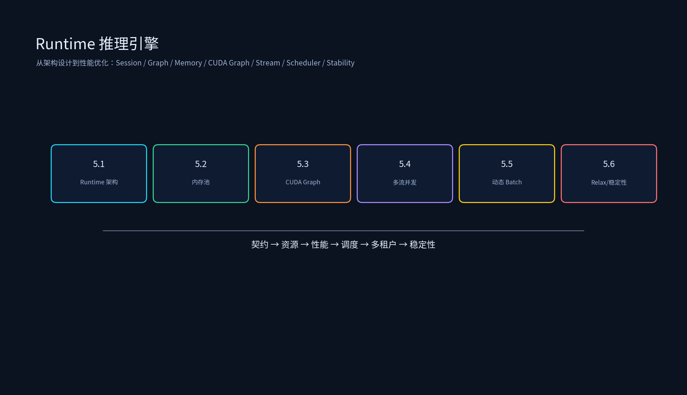

# 第四章：Runtime 推理引擎



本专题从 Runtime 架构设计到性能优化，覆盖推理执行层核心技术：Session/Graph Executor/Tensor 生命周期、内存池、CUDA Graph、多流并发、动态 Batch Scheduler，以及 Relay/Relax Runtime 特性开发与简历项目。

## 目录结构

```
Runtime推理引擎/
├── 4.1_Runtime架构设计/
│   ├── 4.1_Runtime架构设计.md
│   └── runtime_scheduler_simulator.py
├── 4.2_内存池设计/
│   ├── 4.2_内存池设计.md
│   └── memory_pool_simulator.py
├── 4.3_CUDA_Graph/
│   ├── 4.3_CUDA_Graph.md
│   └── cuda_graph_benefit_estimator.py
├── 4.4_多流并发执行/
│   ├── 4.4_多流并发执行.md
│   └── multi_stream_overlap_simulator.py
├── 4.5_动态Batch_Scheduler/
│   ├── 4.5_动态Batch_Scheduler.md
│   └── dynamic_batch_scheduler_simulator.py
├── 4.6_Relay_Relax_Runtime特性开发/
│   ├── 4.6_Relay_Relax_Runtime特性开发.md
│   ├── relax_runtime_feature_planner.py
│   └── group_context.h
└── 简历项目/
    ├── 08_Resume_Runtime.md
    ├── images/resume_runtime_stack.png
    └── RuntimeProject/
        ├── README.md
        ├── CMakeLists.txt
        ├── include/runtime/{common.h,allocator.h,graph.h}
        ├── src/runtime_demo.cpp
        ├── scripts/
        └── results/

每个子专题目录下都有 `images/` 演示图；如需重新生成或改配色，运行：

```bash
python tools/generate_runtime_diagrams.py
```
```

## 运行示例

```bash
cd /data/ai_infra/04_Runtime推理引擎

python 4.1_Runtime架构设计/runtime_scheduler_simulator.py
python 4.2_内存池设计/memory_pool_simulator.py
python 4.3_CUDA_Graph/cuda_graph_benefit_estimator.py
python 4.4_多流并发执行/multi_stream_overlap_simulator.py
python 4.5_动态Batch_Scheduler/dynamic_batch_scheduler_simulator.py
python 4.6_Relay_Relax_Runtime特性开发/relax_runtime_feature_planner.py

# 简历项目 C++ demo
cd 简历项目/RuntimeProject
cmake -S . -B build && cmake --build build -j
./build/runtime_demo
```

## 课程目标

1. 能从执行层拆解 Runtime：Session、Graph Executor、Tensor、Allocator、Stream、Scheduler。
2. 能用 Arena/SizeClassPool 降低热路径分配开销与显存碎片。
3. 能评估 CUDA Graph 的 capture 摊销与 shape bucket/fallback 设计。
4. 能用多流/Event 做 copy/compute overlap，用动态 batch 提升吞吐并控制公平性。
5. 能把 IO info、memory pool、cudaGraph、groupContext、stability 串成可落地的 Runtime 特性开发路线。
