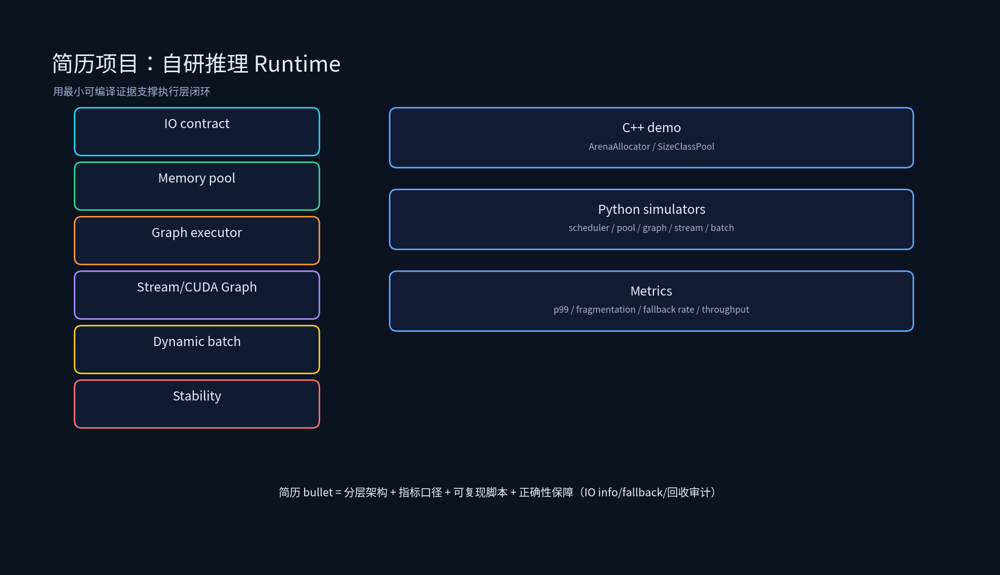

# 项目专题：Runtime 推理引擎简历写法



## 课程概述

第五章的简历项目容易写成两种极端：一种是“熟悉 C++/CUDA/Runtime”，空泛没有证据；另一种是堆指标“延迟降低 40%”，但说不清 baseline、负载和验证方法。Runtime 项目的竞争力在于 **执行层闭环**：你能把 IO contract、内存池、Graph Executor、Stream/Event、CUDA Graph、Scheduler、groupContext、稳定性串起来，并且每一层都有可复现的小实验或真实指标。

本目录包含一个可编译的 C++ skeleton：

```text
/data/ai_infra/04_Runtime推理引擎/简历项目/RuntimeProject/
```

它不是生产 Runtime，而是用来支撑简历叙述的最小工程证据：ArenaAllocator、SizeClassPool、Graph Executor 估算、CUDA Graph 摊销模型、Dynamic Batch Scheduler。

---

## 1. 简历项目的写法原则

### 1.1 Runtime 项目必须分层

不要写：

```text
设计 C++ 推理 Runtime，支持异步执行、内存池、动态 batch。
```

这句话太泛。应该写成：

```text
设计并实现 C++ 推理 Runtime skeleton：Session 负责请求状态与资源生命周期，Graph Executor 按依赖调度算子并分析关键路径，
Tensor Manager 基于 first_write/last_read 复用激活显存；内存层用 ArenaAllocator + SizeClassPool 替代热路径 cudaMalloc/cudaFree，
调度层用 token budget + max_num_seqs 做动态 batch，执行层用 stream/event 表达异步依赖，并评估固定 decode 子图的 CUDA Graph replay 收益。
```

这段话说清了：有哪些层、每层做什么、为什么这样做。

### 1.2 指标必须带口径

“延迟降低 40%”必须回答：

- baseline 是什么？eager？无内存池？无 CUDA Graph？
- 负载是什么？模型、batch、prompt 长度、输出长度、并发。
- 硬件是什么？GPU 型号、显存、NVLink/PCIe。
- 延迟看平均、p95 还是 p99？
- 是否有 fallback？fallback rate 多少？

没有这些，面试官会认为你只是背数字。

---

## 2. 三个简历项目怎么写

### 2.1 自研推理 Runtime

原始写法：

```text
设计 C++ 推理 Runtime，支持异步执行、内存池、动态 batch
```

建议改写：

```text
设计并实现 C++ 推理 Runtime skeleton：以 Session 管理请求状态，Graph Executor 按依赖调度算子并用关键路径判断优化方向；
Tensor Manager 基于生命周期复用 activation，内存层使用 ArenaAllocator + SizeClassPool 将热路径分配降为 pool lookup，
调度层实现动态 batch（token budget + max_num_seqs + aging），执行层用 stream/event 表达 H2D/compute/D2H 依赖。
项目包含可编译 demo、Python 模拟器与结果分析，能够复现内存复用、CUDA Graph 摊销和动态 batch 吞吐收益。
```

加分点：

- 说出 Session 如何共享权重、隔离状态。
- 说出 Tensor 生命周期如何降低峰值显存。
- 说出动态 batch 为什么不能只看请求数。

### 2.2 CUDA Graph 加速服务

原始写法：

```text
接入 cudaGraph，线上推理 P99 延迟降低 22%
```

建议改写：

```text
针对小 kernel 密集导致的 CPU launch overhead，在 decode 固定 shape 子图接入 CUDA Graph capture/replay；
设计 batch/seq bucket、固定内存池 IO binding 与 eager fallback，保证动态请求在 shape 不匹配时安全回退。
用 capture 摊销模型评估收益：在 <模型/硬件/并发> 下，replay <N> 次达到 break-even；
线上/压测 p99 延迟从 <base_ms> 降至 <result_ms>（-<X>%），fallback rate 控制在 <Y>% 以内。
```

注意：如果你还没有真实 22% 的数据，不要硬写“线上降低 22%”。可以写：

```text
建立 CUDA Graph 收益评估与接入方案，目标是在固定 decode 子图上降低 p99 抖动；已通过模型估算 replay 摊销点，
并完成 eager fallback 设计，待线上灰度验证。
```

诚实但专业。

### 2.3 Relax Runtime 内存池与 CUDA Graph 优化

原始写法：

```text
实现动态内存池减少显存碎片 30%，集成 CUDA Graph 推理延迟降低 40%
```

建议改写：

```text
在 Relax/自研 Runtime 中实现动态内存池：权重/KV/activation/workspace 分池，size-class free list 复用，
Session 结束按 scope Reset workspace；通过 pool hit rate、peak memory、largest free block、fragmentation 监控，
将显存碎片从 <base>% 降至 <result>%（目标/实测需注明）。进一步集成 CUDA Graph 固定 decode 子图，
端到端延迟从 <base_ms> 降至 <result_ms>（-<X>%），并用 IO info 校验与 eager fallback 保证正确性。
```

这里的关键是把“碎片 30%”和“延迟 40%”都挂上测量指标：fragmentation、pool hit、p99、fallback rate。

---

## 3. RuntimeProject 能证明什么

运行：

```bash
cd /data/ai_infra/04_Runtime推理引擎/简历项目/RuntimeProject
cmake -S . -B build && cmake --build build -j
./build/runtime_demo
```

当前 demo 输出示例：

```text
arena used: 4096 KiB, p1=1, p2=1
pool malloc_calls: 2, reuse c==a: 1
graph nodes: 5, no_graph: 140 us
cuda_graph replays=16 per_iter=130.50 us, speedup=1.07x
dynamic_batch: batches=6, total_tokens=17920, avg_wait=11.33 ms
```

你可以在面试中这样讲：

- `ArenaAllocator`：热路径分配变成指针偏移，Session/Graph 结束 `Reset()`，避免碎片。
- `SizeClassPool`：相同 size class 复用，`malloc_calls` 很少，说明热路径不再频繁分配。
- `EstimateGraphPerIterUs`：说明 CUDA Graph 不是免费，replay 次数少反而慢，必须摊销 capture。
- `RunDynamicBatch`：说明动态 batch 的吞吐来自 fixed overhead 被分摊，但要控制 token budget 与等待。

---

## 4. 面试追问与回答方向

### 4.1 为什么内存池是 CUDA Graph 的前提？

因为 CUDA Graph replay 时，图内 kernel 使用的 device pointer 必须固定。如果每次请求都临时 cudaMalloc，地址会变，graph 就失效或出错。内存池提供固定地址、固定生命周期和可复用 IO binding。

### 4.2 为什么 decode 比 prefill 更适合 CUDA Graph？

decode 每步通常只处理固定数量 token，shape 稳定，replay 次数极多；prefill 的 prompt 长度变化大，需要更多 bucket，否则 capture 成本和显存预留会失控。

### 4.3 动态 batch 为什么不能只看请求数？

因为请求成本差异大。8 个 2048-token prompt 可能比 64 个短请求更耗资源。Scheduler 必须看 token budget、KV blocks、workspace、deadline，而不只是 batch_size。

### 4.4 P99 降低怎么验证？

必须同模型、同硬件、同并发、同 prompt/输出分布，对比 before/after 的 p50/p95/p99，并记录 fallback rate。只看平均耗时无法证明 p99 改善。

---

## 5. 简历投递前 Checklist

- 每个 Runtime 优化都能说清层级：Session/Graph/Allocator/Stream/Scheduler/cudaGraph/groupContext。
- 每个指标都有口径：baseline、负载、硬件、并发、p95/p99、fallback rate。
- 每个性能优化都有正确性保障：IO info、数值对齐、地址固定、eager fallback、回收审计。
- demo、压测、线上灰度分开写，不把 demo 包装成生产。

---

## 6. 本节小结

1. Runtime 简历项目最加分的是执行层闭环：IO contract → memory pool → graph executor → stream/cudaGraph → scheduler → stability。
2. CUDA Graph 和内存池要一起写：内存池保证地址固定，cudaGraph 用 replay 摊销 capture。
3. 所有“降低 X%”都必须绑定 baseline、负载、硬件、并发和验证脚本；否则只是口号。
4. RuntimeProject 的价值是提供最小可编译证据，让你的叙述不只停留在概念层。
