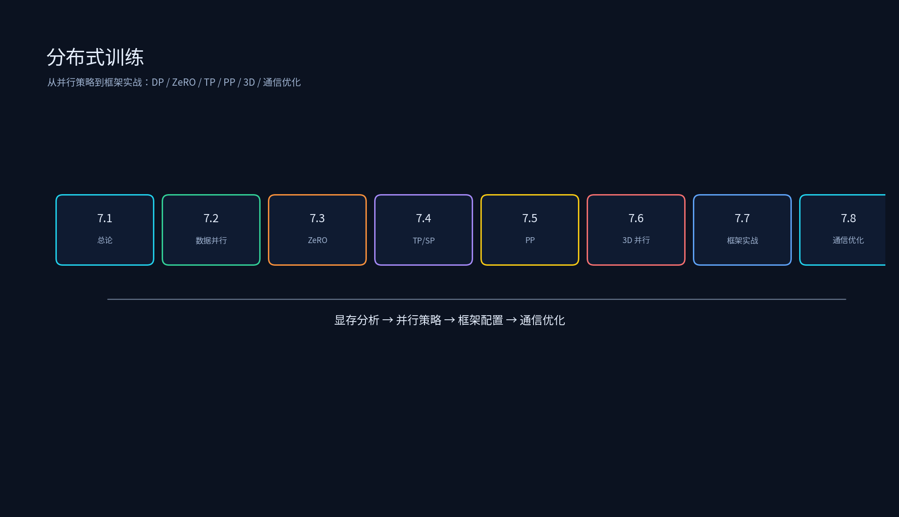

# 第六章：分布式训练



本专题从分布式训练总论到具体并行策略与框架实战，覆盖数据并行、ZeRO、张量并行、序列并行、流水线并行、3D 并行、混合训练策略、训练框架（Megatron/DeepSpeed/FSDP）以及多卡通信优化；另含 2024 年后主流专题：MoE 训练与专家并行（EP/DeepEP/DualPipe）、弹性训练与容错（万卡集群）、RLHF 与 Post-Training 系统（verl/OpenRLHF）。

## 目录结构

```
分布式训练/
├── 6.1_分布式训练总论/
│   ├── 6.1_分布式训练总论.md
│   └── memory_estimator.py
├── 6.2_数据并行/
│   ├── 6.2_数据并行.md
│   └── train_ddp.py
├── 6.3_ZeRO系列/
│   ├── 6.3_ZeRO系列.md
│   └── zero_memory_estimator.py
├── 6.4_张量并行与序列并行/
│   ├── 6.4_张量并行与序列并行.md
│   └── tp_column_row_sim.py
├── 6.5_流水线并行/
│   ├── 6.5_流水线并行.md
│   └── pipeline_bubble_calc.py
├── 6.6_3D并行与混合训练策略/
│   ├── 6.6_3D并行与混合训练策略.md
│   └── parallel_topo_design.py
├── 6.7_训练框架实战/
│   ├── 6.7_训练框架实战.md
│   ├── deepspeed_config_example.json
│   └── fsdp_example.py
├── 6.8_多卡训练通信优化/
│   ├── 6.8_多卡训练通信优化.md
│   └── ring_allreduce_sim.py
├── 6.9_MoE训练与专家并行/
│   ├── 6.9_MoE训练与专家并行.md
│   └── ep_alltoall_estimator.py
├── 6.10_弹性训练与容错/
│   ├── 6.10_弹性训练与容错.md
│   └── checkpoint_cost_model.py
├── 6.11_RLHF与PostTraining系统/
│   ├── 6.11_RLHF与PostTraining系统.md
│   └── rlhf_pipeline_sim.py
├── README.md
├── tools/
│   └── generate_distributed_training_diagrams.py
└── 简历项目/
    └── 简历项目.md
```

每个子专题目录下都有 `images/` 演示图；如需重新生成或改配色，运行：

```bash
source /data/qwen35_env/bin/activate
python /data/ai_infra/06_分布式训练/tools/generate_distributed_training_diagrams.py
```

## 运行环境

已在 `qwen35_env` 中安装/验证：

- `torch`
- `matplotlib==3.10.9`
- `numpy==2.2.6`

激活环境：

```bash
source /data/qwen35_env/bin/activate
```

## 运行示例

```bash
source /data/qwen35_env/bin/activate
cd /data/ai_infra/06_分布式训练

python 6.1_分布式训练总论/memory_estimator.py
python 6.2_数据并行/train_ddp.py
python 6.3_ZeRO系列/zero_memory_estimator.py
python 6.4_张量并行与序列并行/tp_column_row_sim.py
python 6.5_流水线并行/pipeline_bubble_calc.py
python 6.6_3D并行与混合训练策略/parallel_topo_design.py
cat 6.7_训练框架实战/deepspeed_config_example.json
# fsdp_example.py 需要多卡环境：
# python -m torchrun --nproc_per_node=2 6.7_训练框架实战/fsdp_example.py
python 6.8_多卡训练通信优化/ring_allreduce_sim.py
python 6.9_MoE训练与专家并行/ep_alltoall_estimator.py
python 6.10_弹性训练与容错/checkpoint_cost_model.py
python 6.11_RLHF与PostTraining系统/rlhf_pipeline_sim.py

# 重新生成图片
python tools/generate_distributed_training_diagrams.py
```

## 课程目标

1. 理解分布式训练的驱动力：单卡显存和算力限制。
2. 估算训练显存：参数 + 梯度 + 优化器状态 + 激活值。
3. 掌握数据并行：DP、DDP、FSDP 的原理与实现。
4. 理解 ZeRO 系列：ZeRO-1/2/3/Offload 的切分对象与通信代价。
5. 理解张量并行与序列并行：TP 切分、SP 激活分片、GQA/MQA 策略。
6. 理解流水线并行：GPipe、1F1B、气泡率分析。
7. 设计 3D 并行拓扑：TP + PP + DP 的组合。
8. 掌握混合训练策略：混合精度、梯度累积、Activation Checkpointing。
9. 使用 Megatron-LM、DeepSpeed、PyTorch FSDP 进行训练。
10. 优化多卡通信：NCCL、Ring AllReduce、通信与计算重叠、梯度压缩。
11. 掌握 MoE 训练：专家并行 EP、all-to-all 通信分析、负载均衡、DeepEP 与 DualPipe。
12. 理解大规模集群容错：故障类型谱、checkpoint 策略与 goodput、弹性训练与慢节点治理。
13. 理解 RLHF/Post-Training 系统：PPO/GRPO 四模型架构、rollout-训练-权重同步流水线、verl/OpenRLHF 框架。
14. 能把分布式训练项目写成有分层、有指标、有证据的简历 bullet。
