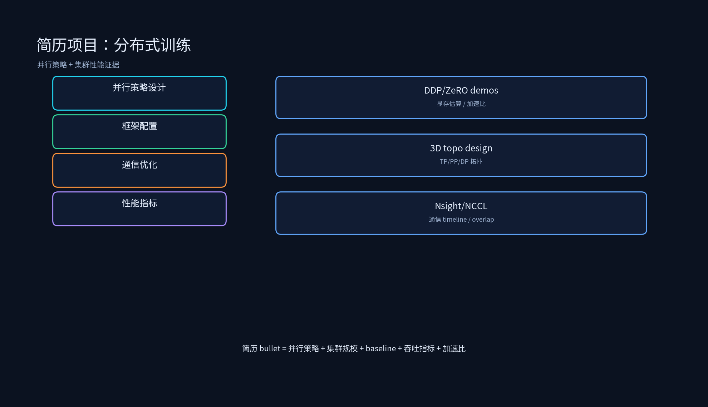

# 项目专题：分布式训练简历写法



## 课程概述

第六章的简历项目容易写成两种极端：一种是“熟悉 DDP/DeepSpeed/Megatron”，空泛没有证据；另一种是堆指标“4 卡线性加速比 3.8x”，但说不清模型、集群、baseline 和验证方法。分布式训练项目的竞争力在于 **“从并行策略到集群性能证据的闭环”**：你能说出为什么用 DDP 而不是 FSDP，为什么 TP=8/PP=4，以及每个指标是怎么测出来的。

本目录不是生产代码，而是支撑简历叙述的最小工程证据：显存估算、DDP 脚本、ZeRO 显存对比、Ring AllReduce 模拟、3D 并行拓扑设计、DeepSpeed/FSDP 配置示例。

---

## 1. 简历项目的写法原则

### 1.1 分布式项目必须分层

不要写：

```text
熟悉 PyTorch DDP 分布式训练，完成 4 卡训练改造，线性加速比 3.8x。
```

应该写成：

```text
将单卡 PyTorch 训练脚本改造为 DDP 多卡版本：使用 torchrun 启动多进程，配置 DistributedSampler 保证数据不重复，
在 backward 阶段通过 NCCL Ring AllReduce 同步梯度。在 <模型/数据集/硬件> 上，4 卡训练 throughput 从 <base_samples/s>
提升至 <result_samples/s>，线性加速比达 3.8x；同时分析并解决了由于 DataLoader  num_workers 不足导致的 CPU bottleneck，
使 GPU 利用率从 <base>% 提升至 <result>%。
```

### 1.2 指标必须带口径

“3.8x 加速比”必须回答：

- 模型是什么？参数量？
- 数据集和 batch size？
- 硬件是什么？单机 4 卡 A100？多机？
- 看 throughput 还是 wall-clock time？
- baseline 是单卡还是 DP？
- 通信后端是什么？NCCL？Gloo？

没有这些，面试官会认为你只是背数字。

---

## 2. 三个简历项目怎么写

### 2.1 DDP 多卡训练改造

原始写法：

```text
将单卡训练脚本改造为 DDP 多卡版本，4 卡线性加速比达 3.8x
```

建议改写：

```text
将 <模型> 单卡训练脚本改造为 PyTorch DDP 多卡版本：使用 torchrun 启动多进程，配置 DistributedSampler 与
gradient_as_bucket_view，在 backward 阶段通过 NCCL AllReduce 同步梯度。在 <数据集>、batch_size=<X>、
sequence_length=<Y>、4×A100 环境下，训练 throughput 从 <base_samples/s> 提升至 <result_samples/s>，
4 卡线性加速比达 3.8x；通过 Nsight Systems 定位并修复了 DataLoader 预取不足导致的 CPU-GPU 同步等待，
GPU 利用率从 <base>% 提升至 <result>%。
```

### 2.2 3D 并行训练部署

原始写法：

```text
在 64 卡集群上配置 TP=8/PP=4/DP=2 并行方案，完成 70B 模型训练，GPU 利用率达 55%
```

建议改写：

```text
负责 <70B> 模型在 64 卡 A100 集群上的 3D 并行训练部署：基于 <Megatron-LM/DeepSpeed> 配置 TP=8（节点内 NVLink）、
PP=4（跨节点 IB）、DP=2，结合 BF16 混合精度与 Activation Checkpointing，使单卡显存峰值控制在 <X>GB 以内；
通过 micro-batch 调优与 1F1B 调度将流水线气泡率从 <base>% 降至 <result>%，端到端 GPU 利用率从 <base>% 提升至 55%，
有效 throughput 达到 <Y> tokens/s/GPU。
```

### 2.3 训练通信优化

原始写法：

```text
实现梯度通信与计算重叠，训练吞吐量提升 25%
```

建议改写：

```text
优化 <模型> 多卡训练通信瓶颈：分析 NCCL AllReduce timeline 后发现梯度同步与 compute 存在大量串行等待，
通过增大 DDP bucket_cap_mb、启用 gradient_as_bucket_view、调整 CUDA stream 优先级实现通信与 backward 计算重叠；
在 <N> 卡 <A100> 集群上，AllReduce 等待时间从 <base_ms> 降至 <result_ms>，端到端训练 throughput 提升 25%。
进一步评估了 Top-k 梯度压缩方案，在跨集群慢速网络场景下将通信量压缩 <Z>%，但单节点 NVLink 环境下未启用。
```

---

## 3. 面试追问与回答方向

### 3.1 为什么用 DDP 而不是 DP？

回答：DP 是单进程多线程，受 GIL 限制，梯度同步在主进程串行；DDP 是多进程，避免 GIL，使用 AllReduce 并行同步梯度，扩展性更好。

### 3.2 3D 并行中 TP、PP、DP 怎么选择？

回答：TP 受 NVLink 限制，通常在节点内；PP 按层切分，跨节点通信但频率低；DP 扩展数据，在剩下的机器组之间。组合顺序：先定 TP，再定 PP，最后 DP。

### 3.3 ZeRO-3 和 TP 都能切分参数，有什么区别？

回答：ZeRO-3 是数据并行的分片，forward 时需要 all-gather 完整参数；TP 是模型并行，单层参数按维度切分，每层只做 AllGather/ReduceScatter，通信更频繁但数据搬运量小。

### 3.4 1F1B 和 GPipe 的核心区别？

回答：GPipe 先完成所有 forward 再做 backward，气泡大；1F1B 交错 forward 和 backward，减少气泡但增加激活显存。

### 3.5 为什么 Ring AllReduce 的通信量与节点数无关？

回答：每个节点只沿环传递数据块，总通信量约为 2B（B 为数据量），与 N 无关，因此具有很好的可扩展性。

---

## 4. 简历投递前 Checklist

- 每个分布式项目都能说清并行策略：DP/TP/PP/ZeRO 的选择原因。
- 每个指标都有口径：模型大小、batch、硬件、baseline、通信后端、测量工具。
- 每个性能优化都有证据：Nsight timeline、NCCL profile、throughput 曲线、加速比。
- demo、压测、真实集群指标分开写，不把 demo 包装成生产。

---

## 5. 本节小结

1. 分布式训练简历项目最加分的是并行策略到集群性能证据的闭环：显存估算 → 并行设计 → 框架配置 → 通信优化 → 吞吐指标。
2. 所有“加速比 X%”都要绑定模型、集群、baseline、测量方法。
3. 3D 并行项目要体现 TP/PP/DP 的拓扑设计和气泡/显存分析。
4. 通信优化项目要体现 AllReduce timeline 分析和 overlap 手段。
