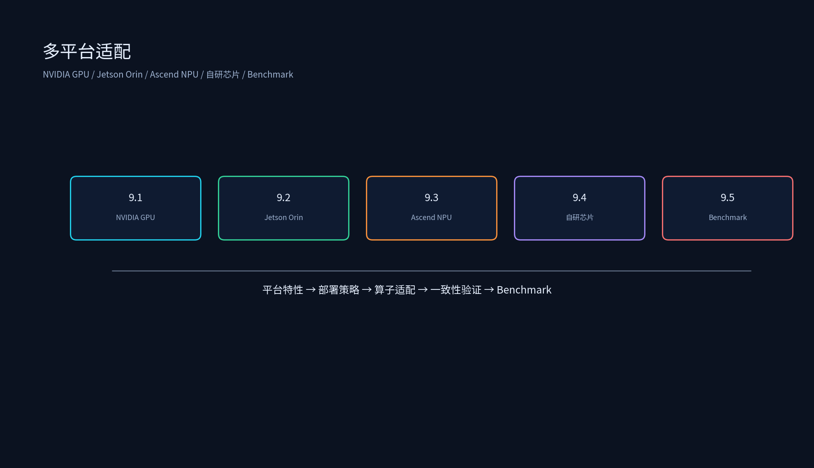

# 第八章：多平台适配



本专题覆盖模型在不同硬件平台上的部署与优化能力，包括 NVIDIA GPU（A100/H100 + TensorRT）、边缘 Jetson Orin、华为 Ascend NPU、自研芯片（PPU/P1X）算子适配，以及跨平台 Benchmark 方法论。

## 目录结构

```
多平台适配/
├── 8.1_NVIDIA_GPU部署/
│   ├── 8.1_NVIDIA_GPU部署.md
│   └── tensorrt_build_check.py
├── 8.2_边缘部署_Jetson_Orin/
│   ├── 8.2_边缘部署_Jetson_Orin.md
│   ├── jetson_power_latency_model.py
│   └── stream_decode_sim.py
├── 8.3_Ascend_NPU适配/
│   ├── 8.3_Ascend_NPU适配.md
│   ├── atc_checklist.py
│   └── operator_mapping_check.py
├── 8.4_自研芯片算子适配/
│   ├── 8.4_自研芯片算子适配.md
│   ├── op_interface_template.py
│   └── cross_platform_consistency.py
├── 8.5_Benchmark方法论/
│   ├── 8.5_Benchmark方法论.md
│   ├── benchmark_framework.py
│   └── generate_report.py
├── README.md
├── tools/
│   └── generate_multi_platform_diagrams.py
└── 简历项目/
    └── 简历项目.md
```

每个子专题目录下都有 `images/` 演示图；如需重新生成或改配色，运行：

```bash
source /data/liyangyang/qwen35_env/bin/activate
python /data/liyangyang/ai_infra/08_多平台适配/tools/generate_multi_platform_diagrams.py
```

## 运行环境

已在 `qwen35_env` 中安装/验证：

- `torch`
- `matplotlib==3.10.9`
- `numpy==2.2.6`

激活环境：

```bash
source /data/liyangyang/qwen35_env/bin/activate
```

## 运行示例

```bash
source /data/liyangyang/qwen35_env/bin/activate
cd /data/liyangyang/ai_infra/08_多平台适配

python 8.1_NVIDIA_GPU部署/tensorrt_build_check.py
python 8.2_边缘部署_Jetson_Orin/jetson_power_latency_model.py
python 8.2_边缘部署_Jetson_Orin/stream_decode_sim.py
python 8.3_Ascend_NPU适配/atc_checklist.py
python 8.3_Ascend_NPU适配/operator_mapping_check.py
python 8.4_自研芯片算子适配/op_interface_template.py
python 8.4_自研芯片算子适配/cross_platform_consistency.py
python 8.5_Benchmark方法论/benchmark_framework.py
python 8.5_Benchmark方法论/generate_report.py

# 重新生成图片
python tools/generate_multi_platform_diagrams.py
```

## 课程目标

1. 理解 NVIDIA A100/H100 硬件特性，掌握 TensorRT / TensorRT-LLM 部署优化。
2. 掌握在 Jetson Orin 上做大模型边缘部署与实时性保障的方法。
3. 理解 Ascend NPU 与 CANN 软件栈，能进行算子迁移与性能调优。
4. 掌握自研芯片算子适配流程、接口对齐与跨平台一致性验证。
5. 建立统一的跨平台 benchmark 框架，输出自动化对比报告。
6. 能把多平台适配项目写成有数据、有对比、有结论的简历 bullet。
