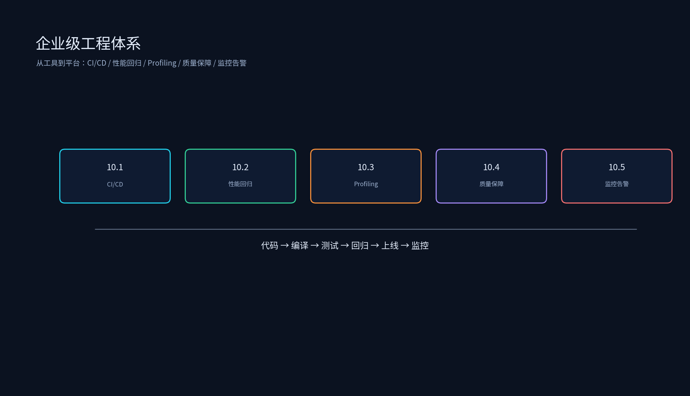

# 第九章：企业级工程体系



本专题从工具到平台，构建生产级 AI Infra 工程能力。覆盖 CI/CD 与自动化、性能回归平台、Profiling 平台、质量保障系统、监控与告警、GPU 集群调度与平台六大子系统。

## 目录结构

```
企业级工程体系/
├── 9.1_CI_CD与自动化/
│   ├── 9.1_CI_CD与自动化.md
│   ├── ci_pipeline_sim.py
│   └── version_manager.py
├── 9.2_性能回归平台/
│   ├── 9.2_性能回归平台.md
│   ├── regression_gate.py
│   └── git_bisect_helper.py
├── 9.3_Profiling平台/
│   ├── 9.3_Profiling平台.md
│   ├── profiling_data_schema.py
│   └── nsys_summary_parser.py
├── 9.4_质量保障系统/
│   ├── 9.4_质量保障系统.md
│   ├── structured_logger.py
│   └── tensor_diff_reporter.py
├── 9.5_监控与告警/
│   ├── 9.5_监控与告警.md
│   ├── gpu_monitor.py
│   └── slo_alert_rule.py
├── 9.6_GPU集群调度与平台/
│   ├── 9.6_GPU集群调度与平台.md
│   ├── gpu_scheduling_sim.py
│   └── mig_partition_planner.py
├── README.md
├── tools/
│   └── generate_enterprise_engineering_diagrams.py
└── 简历项目/
    └── 简历项目.md
```

每个子专题目录下都有 `images/` 演示图；如需重新生成或改配色，运行：

```bash
source /data/qwen35_env/bin/activate
python /data/ai_infra/09_企业级工程体系/tools/generate_enterprise_engineering_diagrams.py
```

## 运行环境

已在 `qwen35_env` 中安装/验证：

- `torch`
- `matplotlib==3.10.9`
- `numpy==2.2.6`
- `pynvml`（用于 GPU 监控示例）

激活环境：

```bash
source /data/qwen35_env/bin/activate
```

## 运行示例

```bash
source /data/qwen35_env/bin/activate
cd /data/ai_infra/09_企业级工程体系

python 9.1_CI_CD与自动化/ci_pipeline_sim.py
python 9.1_CI_CD与自动化/version_manager.py
python 9.2_性能回归平台/regression_gate.py
python 9.2_性能回归平台/git_bisect_helper.py
python 9.3_Profiling平台/profiling_data_schema.py
python 9.3_Profiling平台/nsys_summary_parser.py
python 9.4_质量保障系统/structured_logger.py
python 9.4_质量保障系统/tensor_diff_reporter.py
python 9.5_监控与告警/gpu_monitor.py
python 9.5_监控与告警/slo_alert_rule.py
python 9.6_GPU集群调度与平台/gpu_scheduling_sim.py
python 9.6_GPU集群调度与平台/mig_partition_planner.py

# 重新生成图片
python tools/generate_enterprise_engineering_diagrams.py
```

## 课程目标

1. 设计 AI Infra 的 CI/CD 流水线，实现模型编译、测试、发布自动化。
2. 构建性能回归平台，自动检测退化并用 git bisect + profiling 定位根因。
3. 搭建统一 Profiling 平台，整合 Nsight Systems / Nsight Compute / 自研 profiler。
4. 建设质量保障系统，包含结构化日志、Tensor Diff、多平台一致性验证。
5. 实现监控与告警，覆盖 GPU 基础设施与推理服务 SLO。
6. 理解 GPU 集群调度与平台：K8s device plugin、gang scheduling（Volcano/Kueue）、MIG 切分、拓扑感知 bin-packing、在线离线混部与利用率工程。
7. 能把企业级工程体系建设写成有平台、有指标、有业务价值的简历 bullet。
