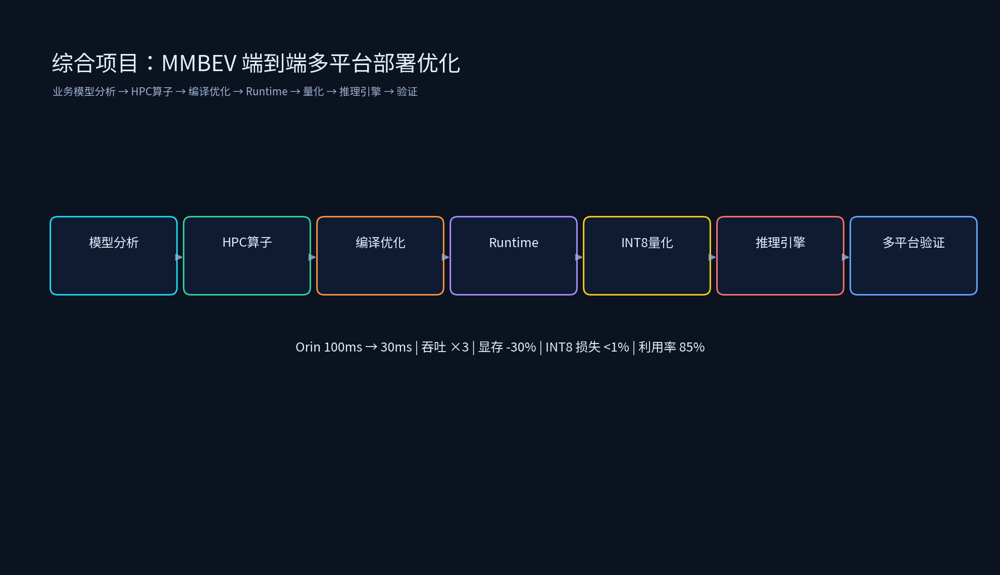

# 第三阶段：综合项目实战



本阶段为一个完整的端到端项目：**自动驾驶 MMBEV 模型端到端多平台部署优化**。项目把前面所有专题的知识点串成一条主线：业务模型分析 → HPC 算子开发 → 编译优化 → Runtime 优化 → 量化部署 → 推理引擎 → 多平台验证。

## 目录结构

```
第三阶段：综合项目实战/
├── 10.1_综合项目_MMBEV端到端多平台部署优化/
│   ├── 10.1_综合项目_MMBEV端到端多平台部署优化.md   # 完整项目文档（背景→分析→五模块→验证→成果）
│   ├── end_to_end_pipeline.py                  # 端到端优化流程模拟
│   ├── hpc_kernel_sim.py                       # HPC 算子优化收益
│   ├── compile_runtime_quant_sim.py            # 编译/Runtime/量化收益
│   ├── multi_platform_validation.py            # 多平台验证汇总
│   └── images/
├── README.md
├── tools/
│   └── generate_comprehensive_project_diagrams.py
└── 简历项目/
    └── 简历项目.md                              # 简历写法 + 面试常问点
```

生成演示图：

```bash
source /data/liyangyang/qwen35_env/bin/activate
python /data/liyangyang/ai_infra/10_第三阶段：综合项目实战/tools/generate_comprehensive_project_diagrams.py
```

## 运行环境

已在 `qwen35_env` 中验证：

- `numpy`
- `matplotlib==3.10.9`

## 运行示例

```bash
source /data/liyangyang/qwen35_env/bin/activate
cd /data/liyangyang/ai_infra/10_第三阶段：综合项目实战

python 10.1_综合项目_MMBEV端到端多平台部署优化/end_to_end_pipeline.py
python 10.1_综合项目_MMBEV端到端多平台部署优化/hpc_kernel_sim.py
python 10.1_综合项目_MMBEV端到端多平台部署优化/compile_runtime_quant_sim.py
python 10.1_综合项目_MMBEV端到端多平台部署优化/multi_platform_validation.py
```

## 项目成果

| 指标 | 优化前 | 优化后 |
|------|--------|--------|
| Orin 端到端延迟 | 100ms | 30ms |
| 吞吐量 | 10 FPS | 30 FPS（3 倍） |
| 显存占用 | 14GB | 9.8GB（-30%） |
| 单算子性能 | baseline | +65% |
| INT8 精度损失 | - | 0.4%（<1%） |
| GPU 利用率 | 60% | 85% |
| 量产验证 | - | 通过 |
