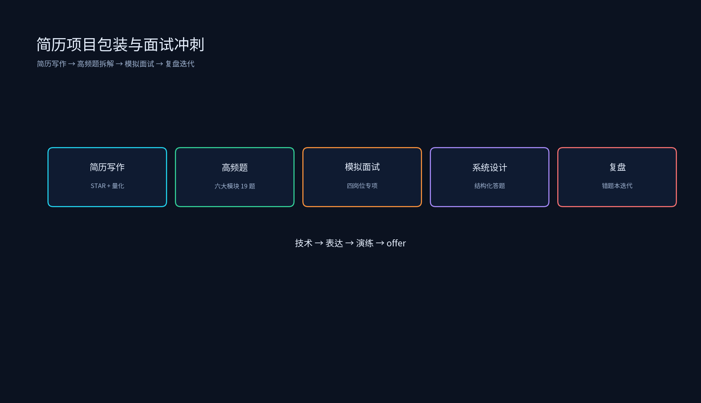

# 第十一章：简历项目包装与面试冲刺



本章把前面各章的技术积累转化为求职竞争力：简历写作指导（STAR + 量化 + 黄金法则）、各模块高频面试题拆解、分岗位模拟面试与系统设计演练。

## 目录结构

```
简历项目包装与面试冲刺/
├── 11.1_简历写作指导/
│   ├── 11.1_简历写作指导.md           # STAR 法则 / 量化表达 / 黄金法则 / 岗位侧重点
│   ├── star_bullet_generator.py    # STAR bullet 生成器
│   └── jd_keyword_matcher.py       # 简历-JD 关键词匹配
├── 11.2_高频面试题拆解/
│   ├── 11.2_高频面试题拆解.md         # 六大模块 19 道高频题拆解
│   └── interview_flashcards.py     # 面试题自测抽认卡
├── 11.3_模拟面试/
│   ├── 11.3_模拟面试.md               # 四岗位专项模拟 + 系统设计流程
│   └── mock_interview.py           # 按岗位抽题模拟面试
├── README.md
├── tools/
│   └── generate_interview_sprint_diagrams.py
└── 简历项目/
    └── 简历项目.md                  # 简历模板 + 自查清单
```

生成演示图：

```bash
source /data/qwen35_env/bin/activate
python /data/ai_infra/11_简历项目包装与面试冲刺/tools/generate_interview_sprint_diagrams.py
```

## 运行环境

仅需 Python 标准库 + `numpy` + `matplotlib`（`qwen35_env` 已验证）。

## 运行示例

```bash
source /data/qwen35_env/bin/activate
cd /data/ai_infra/11_简历项目包装与面试冲刺

python 11.1_简历写作指导/star_bullet_generator.py
python 11.1_简历写作指导/jd_keyword_matcher.py
python 11.2_高频面试题拆解/interview_flashcards.py
python 11.3_模拟面试/mock_interview.py
```

## 阶段目标

1. 用 STAR 法则 + 量化指标把项目写成有竞争力的简历 bullet。
2. 掌握简历项目写作四条黄金法则：量化、技术栈、业务价值、分层描述。
3. 掌握六大模块高频面试题的答题框架与追问应对。
4. 完成算子 / 编译器 / 推理框架 / 分布式训练四个方向的专项模拟面试。
5. 掌握系统设计面试的结构化答题流程。
6. 建立面试复盘机制，持续迭代题库与答案。

## 岗位方向速查

| 岗位方向 | 核心考察点 |
|----------|------------|
| CUDA / 算子优化 | GPU 架构、CUDA 编程、HPC、手写 Kernel |
| AI 编译器 | TVM 架构、图优化、Codegen、动态 Shape |
| 推理框架 / LLM Serving | vLLM、PagedAttention、KV Cache、Continuous Batching |
| 分布式训练 | ZeRO、3D 并行、Megatron-LM、通信优化 |
| 推理部署（车企/边缘） | TensorRT、TVM、量化、C++、实时性 |
| AI Infra（综合） | 项目深挖 + 系统设计 + 多方向组合 |
